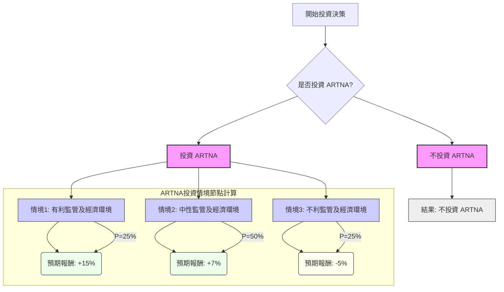

好的，這將根據決策樹分析（Decision Tree）與期望值分析（Expected Value Analysis）來評估美股公司 **ARTNA** (Artesian Resources Corporation) 目前是否適合投資。

ARTNA 是一家受監管的公用事業公司，主要提供水務服務，其業務性質通常較為穩定且具有防禦性。然而，其表現仍會受到監管環境、利率以及營運效率等因素影響。

---

## 美股公司 ARTNA 投資評估：決策樹與期望值分析

### 1. 核心假設

在進行決策樹分析之前，我們需要建立一些核心假設，這些假設將影響情境設定、機率分配以及預期報酬的估計。

*   **公司層面 (ARTNA 財務與營運):**
    *   **穩定性:** ARTNA 作為一家受監管的水務公用事業公司，其營收和現金流具有較高的可預測性和穩定性。
    *   **股息政策:** 預計公司將維持其長期以來穩定且略有增長的股息政策。
    *   **資本支出:** 公司將持續投資於基礎設施升級和擴張，以支持其資產基礎和未來的費率申請。
    *   **營運效率:** 管理層能有效控制成本，並維持良好的營運效率。
*   **產業層面 (公用事業):**
    *   **監管環境:** 州級公用事業委員會的費率審批是公司成長和盈利能力的關鍵。假設監管機構將繼續允許公用事業公司獲得合理的回報率。
    *   **需求穩定:** 水務服務的需求是基本且非彈性的，受經濟波動影響較小。
*   **宏觀經濟層面:**
    *   **利率環境:** 利率對公用事業公司影響顯著，因其通常依賴債務融資進行資本支出。假設未來1-2年內，利率將在高位穩定或有小幅下行壓力。
    *   **通膨:** 通貨膨脹可能增加營運成本，但也可能支持公司申請更高的費率。
    *   **經濟增長:** 區域經濟和人口的穩定增長將支持公司客戶基礎的擴大。

### 2. 決策樹分析與期望值計算

我們的投資決策為：**是否投資 ARTNA**。

**決策點 (Decision Node):** 投資 ARTNA 或 不投資 ARTNA。

**情境點 (Chance Node):** 假設投資 ARTNA 後，市場可能出現以下三種主要情境：

1.  **有利監管及經濟環境**
2.  **中性監管及經濟環境**
3.  **不利監管及經濟環境**

針對這些情境，我們分配主觀機率，並估計各自的預期報酬。預期報酬包含了股息收益和資本利得/損失。

---

#### 決策樹繪製 (Markdown)

---

#### 明確列出所有計算過程

**1. 不投資 ARTNA 的期望值：**

*   **預測情境名稱:** 不投資 ARTNA
*   **對應的機率:** N/A (這是直接的決策結果)
*   **預期報酬 / 期望值:** 0% (假設資金停留在現金或其他無風險資產，且不產生顯著報酬，或作為基準比較)
    *   **計算方式:** $EV_{不投資} = 0\%$

**2. 投資 ARTNA 的各情境期望值：**

*   **節點名稱：情境1: 有利監管及經濟環境**
    *   **描述:** 監管機構批復的費率增長超出預期，利率穩定或小幅下降，區域經濟和人口增長穩健，支持公司收益增長。
    *   **對應的機率 (P1):** 25%
    *   **預期報酬 (R1):** +15% (包含約3.2%股息收益 + 11.8%資本增值)
    *   **節點期望值計算:** $EV_1 = P1 \times R1 = 0.25 \times 0.15 = 0.0375$

*   **節點名稱：情境2: 中性監管及經濟環境**
    *   **描述:** 監管費率批准符合預期，利率維持在高位穩定，經濟環境溫和增長。公司營運穩定，股息持續發放。
    *   **對應的機率 (P2):** 50%
    *   **預期報酬 (R2):** +7% (包含約3.2%股息收益 + 3.8%資本增值)
    *   **節點期望值計算:** $EV_2 = P2 \times R2 = 0.50 \times 0.07 = 0.0350$

*   **節點名稱：情境3: 不利監管及經濟環境**
    *   **描述:** 監管機構對費率增長的審批嚴格，批復低於預期或有延遲；或利率意外大幅上升，增加公司融資成本；或區域經濟衰退，影響部分需求。
    *   **對應的機率 (P3):** 25%
    *   **預期報酬 (R3):** -5% (包含約3.2%股息收益 - 8.2%資本損失)
    *   **節點期望值計算:** $EV_3 = P3 \times R3 = 0.25 \times (-0.05) = -0.0125$

**3. 投資 ARTNA 的總期望值：**

*   **總期望值計算 (Sum of all scenario expected values):**
    $EV_{ARTNA} = EV_1 + EV_2 + EV_3$
    $EV_{ARTNA} = 0.0375 + 0.0350 + (-0.0125)$
    $EV_{ARTNA} = 0.06$ 或 6%

---

### 3. 最終結論

根據上述決策樹和期望值分析：

*   **不投資 ARTNA 的期望值:** 0%
*   **投資 ARTNA 的總期望值:** **+6%**

**判斷：適合投資**

**簡短理由：**

根據當前的假設和分析，投資 ARTNA 的整體期望值為正數 (+6%)，高於不投資的基準 (0%)。ARTNA 作為一家受監管的水務公用事業公司，其業務模式具有內在的防禦性和穩定性，能在不同市場環境中提供相對可靠的收益流和股息。儘管其潛在資本增值可能不如高成長型股票，但對於尋求穩定回報、股息收益以及較低波動性的投資者來說，ARTNA 目前顯示出值得投資的潛力。當然，實際回報仍需觀察未來的監管決策、利率走勢和公司營運表現。