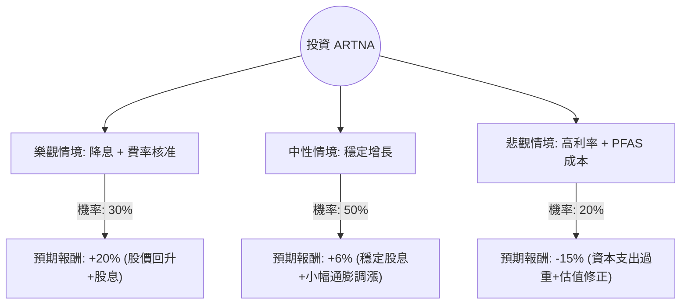

這份分析報告將針對 **Artesian Resources Corporation (股票代碼：ARTNA)** 進行評估。ARTNA 是一家主要在德拉瓦州（Delaware）提供水務及廢水處理服務的公用事業公司。

以下結合最新市場數據、財務狀況與產業趨勢，利用**決策樹（Decision Tree）**與**期望值分析（Expected Value Analysis）**進行投資評估。

---

### 一、 核心假設與背景資訊

在建立模型前，我們先彙整 ARTNA 的關鍵基本面資訊：

1.  **產業特性**：水務公用事業具有高度壟斷性與防禦性，營收受監管機構（PSC）核定的費率影響。
2.  **財務現況**：
    *   **股息**：連續 31 年增加股息，目前殖利率約在 **3.0% - 3.2%** 之間。
    *   **本益比 (P/E)**：目前約在 18x - 20x 區間，處於歷史中值偏低位置。
    *   **債務**：公用事業為資本密集產業，對利率極為敏感。
3.  **關鍵變數**：
    *   **利率環境**：聯準會（Fed）的降息預期將降低其債務成本，並提升高息股的吸引力。
    *   **監管審批**：德拉瓦州對水費調漲的核准進度。
    *   **PFAS 監管**：美國環保署（EPA）對「永久化學物質 (PFAS)」的新標準將增加水廠的資本支出（過濾系統）。

---

### 二、 決策樹分析 (Decision Tree)

我們預測未來一年的三種主要情境：**樂觀（降息+費率調升）**、**中性（維持現狀）**、**悲觀（高利率持續+環保成本激增）**。

#### 決策樹節點詳細說明：

| 情境節點 | 發生機率 (P) | 預期報酬 (R) | 說明 |
| :--- | :--- | :--- | :--- |
| **樂觀情境** | 30% | **+20%** | Fed 降息 > 2 碼，且監管機構核准全額費率調漲，PFAS 成本獲政府補貼。 |
| **中性情境** | 50% | **+6%** | 利率維持高位震盪，營收隨人口增長緩步上升，股息照常發放。 |
| **悲觀情境** | 20% | **-15%** | 通膨反彈導致利率不降反升，EPA 強制要求高額過濾設備投資，拖累現金流。 |

---

### 三、 期望值計算過程 (Expected Value Calculation)

期望值（EV）的計算公式為：
$$EV = \sum (Probability_i \times Return_i)$$

**計算步驟：**

1.  **樂觀部分**：$0.30 \times 20\% = 6.0\%$
2.  **中性部分**：$0.50 \times 6\% = 3.0\%$
3.  **悲觀部分**：$0.20 \times (-15\%) = -3.0\%$

**總期望報酬率：**
$$EV = 6.0\% + 3.0\% - 3.0\% = \mathbf{6.0\%}$$

---

### 四、 核心假設分析

1.  **市場假設**：假設未來 12 個月內美國經濟不會陷入深度衰退，水務需求保持穩定。
2.  **財務假設**：ARTNA 將維持其股息增長政策（Dividend Aristocrat 潛力），這是支撐股價的底部。
3.  **產業趨勢**：PFAS 治理是雙面刃。短期增加資本支出（負面），但長期可能透過費率調整轉嫁給消費者，並增加資產基礎（Rate Base），對公用事業長期有利。

---

### 五、 最終結論

#### **評估結果：適合投資 (適合作為防禦性配置)**

**判斷理由：**

1.  **期望值為正 (6.0%)**：雖然 6% 的預期報酬不算驚人，但考慮到 ARTNA 的低波動性（Beta 值遠低於 1），其風險調整後的報酬具有吸引力。
2.  **利率週期轉折**：目前市場普遍預期利率已達頂峰。對於 ARTNA 這種高負債、高股息的公用事業股，最壞的時間點（2023年）已經過去。
3.  **剛性需求**：無論經濟好壞，水務服務是必需品。在目前美股科技股估值偏高的情況下，ARTNA 提供良好的避險價值。
4.  **股息支撐**：約 3% 的殖利率加上穩定的增長紀錄，適合追求現金流的長期投資者。

**投資建議：**
ARTNA 不適合追求短期翻倍的投資者，但對於**「尋求穩定收息」**或**「平衡投資組合風險」**的投資者而言，目前是一個合理的切入點。建議分批布局，並關注未來 EPA 對 PFAS 處理費用的最終裁定。

---
*免責聲明：本分析僅供參考，不構成任何投資建議。投資者應自行承擔市場風險。*