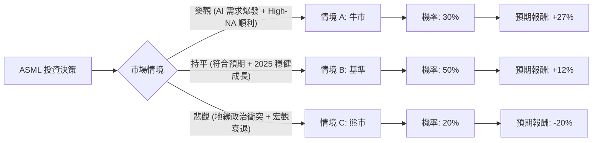

這份分析報告將結合您提供的數據與最新的市場動態（包含 2024 年 Q1 財報後的展望），利用**決策樹（Decision Tree）**與**期望值分析（Expected Value Analysis）**來評估 ASML 的投資價值。

---

### 一、 核心假設與市場背景分析

在建立模型前，我們先整合基本面數據與最新外部資訊：

1.  **2024 轉型年與 2025 爆發期**：ASML 官方定義 2024 為「過渡年」，重點在於產能擴張與 High-NA EUV（高數值孔徑極紫外光）的導入。市場普遍預期 2025 年隨著台積電、Intel、三星的新廠投產，業績將大幅成長。
2.  **AI 浪潮帶動**：AI 晶片（如 NVIDIA H100/B200）對先進製程的依賴，直接推升對 EUV 設備的需求。
3.  **地緣政治風險**：美國對中國的出口管制是最大變數。目前 ASML 約有 20-40% 營收來自中國（多為成熟製程 DUV），若管制進一步收緊，將衝擊營收。
4.  **財務指標**：
    *   **Forward P/E (30.4)** 遠低於 **Current P/E (49.23)**，顯示市場預期明年獲利將大幅增長（數據顯示 EPS next Y 預期成長 28.92%）。
    *   **ROE (51.52%)** 極高，顯示其壟斷地位帶來的超額獲利能力。

---

### 二、 決策樹分析 (Decision Tree)

我們以 **12-18 個月** 為投資週期，設定三種主要情境：

#### 節點詳細說明：

| 節點 | 情境名稱 | 機率 (P) | 預期報酬 (R) | 說明 |
| :--- | :--- | :--- | :--- | :--- |
| **情境 A** | **牛市 (Bull)** | 30% | **+27.0%** | 達到目標價 1721.07。AI 需求超預期，High-NA EUV 提前貢獻營收。 |
| **情境 B** | **基準 (Base)** | 50% | **+12.0%** | 符合 2025 成長指引。雖然中國市場受限，但美歐亞新廠補足缺口。 |
| **情境 C** | **熊市 (Bear)** | 20% | **-20.0%** | 美國全面禁止 DUV 出口中國，且全球半導體復甦不如預期。 |

---

### 三、 期望值計算 (Expected Value Calculation)

我們根據上述決策樹節點進行加權計算：

**1. 計算公式：**
$$EV = (P_{Bull} \times R_{Bull}) + (P_{Base} \times R_{Base}) + (P_{Bear} \times R_{Bear})$$

**2. 帶入數值：**
*   $0.30 \times 27\% = 8.1\%$
*   $0.50 \times 12\% = 6.0\%$
*   $0.20 \times (-20\%) = -4.0\%$

**3. 總期望報酬率：**
$$EV = 8.1\% + 6.0\% - 4.0\% = 10.1\%$$

**4. 換算預期股價：**
目前價格 $1355.17 \times (1 + 10.1\%) \approx \mathbf{1492.04}$

---

### 四、 核心假設與風險評估

1.  **估值假設**：目前 P/E 接近 50 倍確實偏高，但考慮到其在 EUV 領域的 **100% 壟斷地位**，以及 Forward P/E 降至 30 倍，顯示目前的溢價是在消化未來的成長性。
2.  **技術領先**：High-NA EUV 是 2nm 以下製程的唯一解，Intel 已率先下單，這確保了 ASML 未來 5 年的護城河。
3.  **財務健康**：Debt/Eq 僅 0.24，現金流充沛（P/C 33.89），具備極強的抗風險能力。
4.  **短期波動**：SMA20 (-2.74%) 與 SMA50 (-0.02%) 顯示短期股價處於震盪整理期，並非強勢噴發階段，這反而提供了分批入場的機會。

---

### 五、 最終結論

#### **評估結果：適合投資 (Suitable for Investment)**
*(建議採取「分批佈局」策略，而非一次性歐印)*

**判斷理由：**
1.  **正向期望值**：經過風險加權後的期望報酬率為 **10.1%**，優於多數保守型投資工具，且目標價（1721.07）顯示仍有約 27% 的潛在上漲空間。
2.  **2025 成長確定性高**：半導體週期已到底部，2024 年的低基期將使 2025 年的財報數據非常亮眼（EPS 預期成長 28.9%）。
3.  **AI 剛需**：只要 AI 產業繼續發展，台積電就必須買 ASML 的機器。ASML 是 AI 浪潮中最底層的「軍火商」。
4.  **風險可控**：雖然中國出口管制是隱憂，但數據顯示其訂單積壓（Backlog）依然強勁，非中國區的需求足以支撐長期增長。

**操作建議：**
目前股價（1355.17）距離 52 週高點有約 11% 的回檔，且位於 SMA200 (35.64% 以上) 之上的長多趨勢中。建議在 **1300 - 1350 區間分批進場**，長期持有至 2025 年收割成長紅利。