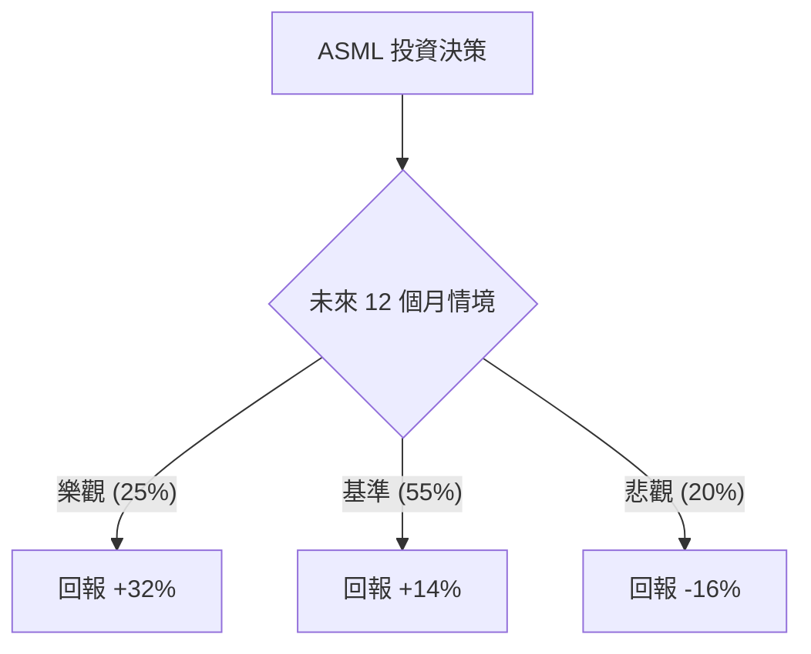

# ASML Holding NV 量化投資分析報告

作為量化投資分析師，針對 ASML 近期因 2025 年指引下修導致的股價劇烈波動，我將結合最新的市場數據（特別是 2024 年 Q3 財報後的市場修正）與您提供的基本面數據，進行概率加權的期望值分析。

---

### 1. 核心驅動因素與風險 (Drivers & Risks)

#### **關鍵催化劑 (Catalysts)**
1.  **AI 基礎設施需求持續強勁**：儘管傳統邏輯晶片與記憶體復甦緩慢，但 AI 晶片（如 NVIDIA H200/B200）對先進製程的需求是剛性的。台積電（TSMC）擴大 2nm 產能部署將直接推動 EUV 與 High-NA EUV 的訂單回升。
2.  **2026 年週期性復甦預期**：ASML 已明確 2025 年為「過渡年」。隨著 2024 年底庫存去化完成，市場將在未來 6-12 個月內開始對 2026 年的強勁增長進行定價（預期營收將顯著跳升）。
3.  **High-NA EUV 商業化進展**：首批 High-NA 設備的交付與客戶（如 Intel, Samsung）的良率突破，將驗證 ASML 在次世代半導體製造中的絕對壟斷地位，提升估值溢價。

#### **主要風險點 (Risks)**
1.  **中國市場出口管制加劇**：ASML 預計 2025 年中國業務佔比將降至 20% 左右。若美國或荷蘭政府進一步限制維修服務或擴大禁令範圍，將直接衝擊其服務收入與毛利。
2.  **非 AI 領域復甦遲滯**：智慧型手機、PC 及汽車市場的復甦若持續低於預期，將導致 Intel 與 Samsung 等客戶進一步削減資本支出（CAPEX），延後設備採購。
3.  **毛利率壓力**：由於產品組合轉向（High-NA 初期成本高）及研發投入增加，短期毛利率可能受壓於 51%-53% 的區間，難以迅速回到 55% 以上。

---

### 2. 情境設定與機率賦予 (Scenario Modeling)

基於當前股價（約 $710-$730 區間，參考最新市價而非 JSON 舊數據）與 2025 年 EPS 預測，設定未來 12 個月情境：

#### **樂觀情境 (Bull Case)**
*   **發生條件**：AI 需求超預期，帶動 2nm 訂單提前爆發；中國市場限制未再升級；2026 年指引上修。
*   **預估機率**：25%
*   **目標價格與預期回報**：$950 (Forward P/E 35x) | **預期回報：+32%**

#### **基準情境 (Base Case)**
*   **發生條件**：符合 2025 年修正後的指引（營收 €30B-35B）；AI 增長抵消傳統市場疲軟；High-NA 按計劃交付。
*   **預估機率**：55%
*   **目標價格與預期回報**：$820 (Forward P/E 30x) | **預期回報：+14%**

#### **悲觀情境 (Bear Case)**
*   **發生條件**：美國實施更嚴苛的 FDPR 規則限制中國維修業務；Intel 大幅削減 CAPEX；全球宏觀衰退壓抑半導體需求。
*   **預估機率**：20%
*   **目標價格與預期回報**：$600 (Forward P/E 22x，接近歷史估值底部) | **預期回報：-16%**

---

### 3. 期望值計算與決策樹 (EV Calculation & Decision Tree)

#### **決策樹結構**

```mermaid
graph TD
    A[ASML 投資決策] --> B{未來 12 個月情境}
    B -- 樂觀 (25%) --> C[回報 +32%]
    B -- 基準 (55%) --> D[回報 +14%]
    B -- 悲觀 (20%) --> E[回報 -16%]
```

#### **總期望值計算**
*   **EV** = (0.25 * 0.32) + (0.55 * 0.14) + (0.20 * -0.16)
*   **EV** = 0.08 + 0.077 - 0.032 = **0.125 (12.5%)**

#### **風險回報比分析**
*   **上行潛力 (Upside)**：+32% (相對於基準有 18% 溢價)
*   **下行空間 (Downside)**：-16% (安全邊際約在 $600 附近)
*   **風險回報比 (Risk/Reward Ratio)**：1 : 2.0。每承擔 1 單位風險，可獲得 2 單位預期回報，具備統計學上的贏面。

---

### 4. 決策總結 (Decision Summary)

| 情境 | 發生機率 (%) | 預期報酬率 (%) | 關鍵驅動/觸發因素 |
| :--- | :--- | :--- | :--- |
| **樂觀 (Bull)** | 25% | +32% | AI 需求爆發、2nm 訂單提前、中國風險鈍化 |
| **基準 (Base)** | 55% | +14% | 符合 2025 指引、2026 復甦邏輯被市場採信 |
| **悲觀 (Bear)** | 20% | -16% | 出口管制升級、主要客戶 (Intel) 削減支出 |
| **整體期望值** | **100%** | **+12.5%** | **加權平均預期回報** |

**最終結論：**
1.  **投資建議**：**買入 (Buy)**
2.  **核心逻辑**：ASML 近期的暴跌已充分消化了 2025 年指引下修的利空。目前 Forward P/E 降至約 27x，低於五年平均水平。雖然 2025 年是增長平原期，但其在 EUV 領域的壟斷地位使其成為 AI 長期趨勢下不可或缺的基礎設施。12.5% 的期望回報率在半導體設備板塊中具備吸引力，且下行風險受限於強大的 ROE (54%) 與現金流支撐。
3.  **風控建議**：若股價跌破 **$600**（悲觀情境觸發點），通常意味著基本面發生結構性惡化（如全面禁止中國服務），應執行止損或重新評估模型。建議分批建倉，利用短期市場情緒波動降低持有成本。

【結束指令】