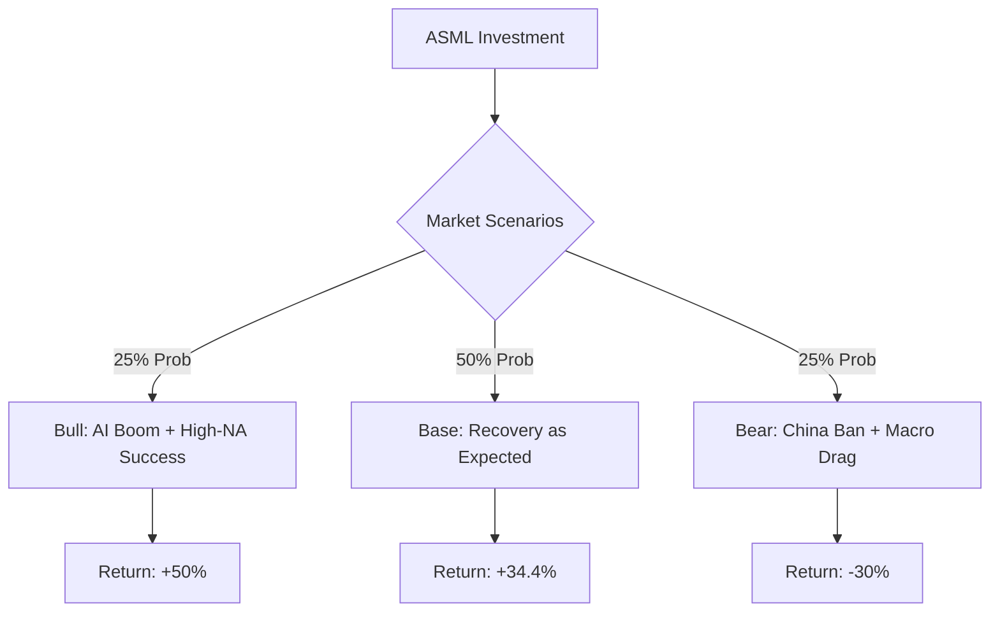

# ASML 投資價值量化分析報告

作為量化投資分析師，針對 **ASML Holding NV** 的當前數據與市場動態，我將透過機率思考框架，拆解其未來 12 個月的期望值（Expected Value, EV）。

---

### 1. 核心驅動因素與風險 (Drivers & Risks)

#### **關鍵催化劑 (Catalysts)**
1.  **High-NA EUV (EXE:5000) 的規模化交付**：ASML 的下一代高數值孔徑極紫外光顯影機是 2nm 以下製程的關鍵。若 Intel、TSMC 與 Samsung 的導入進度超前，將顯著提升 2025-2026 年的營收預期。
2.  **2025 年「過渡年」後的產能爆發**：管理層多次強調 2024 為過渡年，市場正屏息以待 2025 年因 AI 需求帶動的邏輯晶片與 HBM 記憶體擴產潮，這將直接反映在訂單積壓（Backlog）的增長。
3.  **AI 基礎設施對成熟製程的帶動**：除了尖端製程，AI 伺服器所需的電源管理 IC 與通訊晶片亦帶動 DUV 設備需求，維持毛利率在 52% 以上的高位。

#### **主要風險點 (Risks)**
1.  **地緣政治與出口管制**：美國與荷蘭政府對中國出口 DUV（如 NXT:1980Di）的限制可能進一步收緊。目前中國市場佔 ASML 營收比重較高，任何超預期的禁令將直接衝擊短期現金流。
2.  **主要客戶資本支出放緩**：若 Intel 財務壓力持續或 Samsung 3nm 良率遲未突破，可能導致其推遲設備接收時間，影響 ASML 的收入認列。
3.  **估值倍數壓縮**：目前 P/E 達 54 倍，遠高於行業平均。若利率維持高位或增長指引下修，市場可能重新定義其合理溢價。

---

### 2. 情境設定與機率賦予 (Scenario Modeling)

基於目前 Forward P/E 28.72 與 PEG 0.74 的數據，我設定以下三種互斥情境：

#### **樂觀情境 (Bull Case)**
*   **發生條件**：High-NA EUV 訂單超預期；中國市場禁令影響低於 5%；AI 需求導致 2025 年 EPS 增長率突破 45%。
*   **預估機率**：25%
*   **目標價格與預期回報**：基於 35x Forward P/E，目標價 **$2,616** (預期回報 **+50%**)。

#### **基準情境 (Base Case)**
*   **發生條件**：符合分析師預期（EPS next Y +38.12%）；2025 年營收目標順利達成；地緣政治風險維持現狀。
*   **預估機率**：50%
*   **目標價格與預期回報**：基於目前分析師平均目標價 **$2,345** (預期回報 **+34.4%**)。

#### **悲觀情境 (Bear Case)**
*   **發生條件**：中國市場營收腰斬；全球半導體週期復甦遲滯；High-NA 技術出現重大瑕疵。
*   **預估機率**：25%
*   **目標價格與預期回報**：回測 52 週低點支撐並考慮估值修正，目標價 **$1,221** (預期回報 **-30%**)。

---

### 3. 期望值計算與決策樹 (EV Calculation & Decision Tree)

#### **決策樹結構**

```mermaid
graph TD
    A[ASML Investment] --> B{Market Scenarios}
    B -- 25% Prob --> C[Bull: AI Boom + High-NA Success]
    B -- 50% Prob --> D[Base: Recovery as Expected]
    B -- 25% Prob --> E[Bear: China Ban + Macro Drag]
    C --> F[Return: +50%]
    D --> G[Return: +34.4%]
    E --> H[Return: -30%]
```

#### **總期望值計算**
`EV = (0.25 * 0.50) + (0.50 * 0.344) + (0.25 * -0.30)`
`EV = 0.125 + 0.172 - 0.075 = 0.222`
**總期望報酬率：22.2%**

#### **風險回報比分析**
*   **上行潛力 (Upside)**：34.4% ~ 50%
*   **下行空間 (Downside)**：-30%
*   **不對稱性**：期望值為正（22.2%），且基準情境的贏面極大。風險回報比約為 **1.48 : 1** (平均上行 42.2% / 下行 30%)，具備投資吸引力。

---

### 4. 決策總結 (Decision Summary)

| 情境 | 發生機率 (%) | 預期報酬率 (%) | 關鍵驅動/觸發因素 |
| :--- | :--- | :--- | :--- |
| **樂觀 (Bull)** | 25% | +50% | High-NA 提前規模化、AI 需求超預期 |
| **基準 (Base)** | 50% | +34.4% | 2025 年營收指引達成、訂單穩健 |
| **悲觀 (Bear)** | 25% | -30% | 中國出口全面受阻、客戶砍資本支出 |
| **整體期望值** | **100%** | **+22.2%** | **加權平均預期回報** |

**最終結論：**
1. **投資建議**：**買入 (Buy)**
2. **核心逻辑**：ASML 具備極高的護城河（壟斷 EUV），雖然短期受地緣政治干擾，但其 PEG 僅 0.74，顯示市場尚未完全定價 2025 年的爆發性增長。22.2% 的正期望值顯示，即便考慮了 25% 的極端悲觀情境，該標的在統計學上仍具備優厚的贏面。
3. **風控建議**：若股價跌破 $1,395 (SMA200 下方約 10% 或接近 52W Low)，需重新評估中國禁令的實質損害；若 Forward P/E 跌破 22 倍，則視為進入超跌區，可考慮加倉。