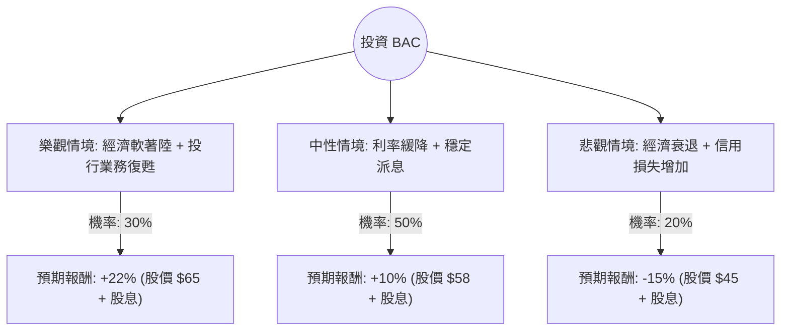

針對美股 **Bank of America (BAC)** 的投資評估，我結合了您提供的基本面數據與最新的市場動態（包含聯準會政策、巴菲特減持動向及最新財報預期）進行分析。

以下是基於**決策樹分析**與**期望值分析**的詳細報告。

---

### 一、 核心假設與市場背景分析

在建立決策樹之前，我們先設定核心假設：
1.  **宏觀環境（權重最高）**：聯準會（Fed）的降息節奏。若降息過快，淨利息收入（NII）可能受壓；若維持高利率，則有利於利差但增加違約風險。
2.  **巴菲特效應**：波克夏（Berkshire Hathaway）近期持續減持 BAC，目前持股比例已降至 10% 以下，這對短期股價造成心理壓力，但長期回歸基本面。
3.  **估值水平**：目前 Forward P/E 為 10.72，PEG 僅 0.72，顯示相對於其預期成長性，股價處於合理偏低區間。
4.  **目標價**：分析師平均目標價為 $61.06，較目前股價（$53.91）約有 **13.2%** 的上漲空間。

---

### 二、 決策樹分析 (Decision Tree)

我們將未來一年的情境分為三種：**樂觀（牛市）**、**中性（基準）**、**悲觀（熊市）**。

#### 節點詳細說明：

1.  **樂觀情境 (Bull Case) - 30% 機率**
    *   **條件**：美國經濟成功軟著陸，資本市場活躍帶動投行手續費大增，且 NII 下降幅度低於預期。
    *   **預期報酬**：股價回升至歷史高點區域（約 $65），加上 2% 股息，總報酬約 **22%**。

2.  **中性情境 (Base Case) - 50% 機率**
    *   **條件**：利率環境正常化，BAC 透過嚴格的成本控制維持利潤。巴菲特減持壓力消化完畢。
    *   **預期報酬**：股價達到分析師平均目標價（約 $58-$60），加上 2% 股息，總報酬約 **10%**。

3.  **悲觀情境 (Bear Case) - 20% 機率**
    *   **條件**：美國陷入經濟衰退，失業率上升導致信用卡與商用不動產違約率激增，迫使銀行增加撥備金。
    *   **預期報酬**：股價回測 52 週中位數（約 $45），扣除股息後總報酬約 **-15%**。

---

### 三、 期望值分析 (Expected Value Analysis)

根據上述情境，我們計算投資 BAC 一年的期望報酬率（Expected Return）：

#### 1. 計算公式：
$$EV = (P_{Bull} \times R_{Bull}) + (P_{Base} \times R_{Base}) + (P_{Bear} \times R_{Bear})$$

#### 2. 帶入數值：
*   $EV = (0.30 \times 0.22) + (0.50 \times 0.10) + (0.20 \times -0.15)$
*   $EV = 0.066 + 0.050 - 0.030$
*   $EV = 0.086$

#### 3. 計算結果：
**年度預期報酬率 (Expected Value) = 8.6%**

---

### 四、 綜合數據評估

*   **估值優勢**：PEG 0.72 顯示其成長性未被完全定價。P/B 1.39 對於大型銀行而言屬於合理區間（JPM 通常在 1.8 以上）。
*   **財務穩健度**：ROE 10.67% 表現尚可，Current Ratio 1.01 顯示流動性無虞。
*   **技術面**：SMA20/50/200 均呈現正向排列（5.4%~7.0%），顯示短期與長期趨勢均偏多。
*   **風險點**：Debt/Eq 2.45 偏高（銀行業特性，但仍需注意），且 Insider Trans 為 -3.16%，顯示內部人近期有減持動作。

---

### 五、 最終結論

#### **判斷：適合投資 (建議分批買入)**

**理由：**
1.  **期望值為正**：8.6% 的預期報酬率高於目前的無風險利率（美債殖利率約 4.2%），具有投資吸引力。
2.  **安全邊際**：Forward P/E 僅 10.72 倍，且 PEG 低於 1，提供了良好的估值保護。
3.  **技術面支撐**：股價目前站穩所有均線之上，且距離 52 週高點僅約 6% 差距，顯示動能強勁。
4.  **利空出盡**：巴菲特的減持雖然造成短期波動，但這也讓市場籌碼進行了換手，若後續財報顯示 NII 趨於穩定，股價易漲難跌。

**操作建議：**
*   **進場點**：目前價格 $53.9 附近可先建立基本倉位。
*   **加碼點**：若股價回測 SMA50（約 $50.5 附近）且基本面未惡化，可加碼。
*   **停損點**：若跌破 $45（悲觀情境觸發）或經濟數據顯示衰退風險大幅上升，應重新評估。

---
*免責聲明：本分析僅供參考，不構成具體投資建議。投資股票有風險，入市需謹慎。*