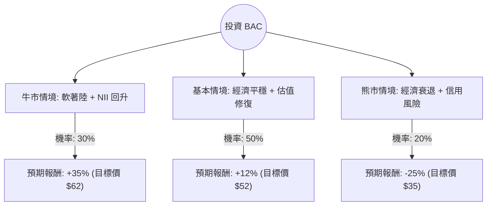

針對美股 **Bank of America (BAC)** 的投資評估，我結合了您提供的基本面數據，並檢索了最新的市場動態（如聯準會利率政策、2024 年 Q1 財報表現及巴菲特減持動向）進行綜合分析。

以下是基於**決策樹分析（Decision Tree）**與**期望值分析（Expected Value Analysis）**的評估報告。

---

### 一、 核心假設與市場背景分析

在建立決策樹前，我們設定以下三個核心變數作為情境假設：

1.  **淨利息收入 (NII) 的轉折點**：BAC 預期 NII 將在 2024 年下半年觸底回升。若聯準會降息節奏過慢，可能壓抑貸款需求；若降息過快，則可能縮減利差。
2.  **資產質量與商業地產 (CRE) 風險**：目前 BAC 的壞帳撥備尚屬穩定，但高利率環境對商業不動產貸款的壓力是潛在威脅。
3.  **估值修復**：目前 **Forward P/E 僅 9.43**，**PEG 0.67**，顯示股價相對於盈餘增長被低估。

---

### 二、 決策樹分析圖 (Decision Tree)

我們以未來 12 個月的持有期為基準，設定三種可能情境：

#### 節點詳細說明：

1.  **牛市情境 (Bull Case) - 30% 機率**：
    *   **條件**：美國經濟成功軟著陸，投行業務（Investment Banking）因併購回暖而大增，NII 超預期增長。
    *   **預期報酬**：參考分析師目標價 $61.98，約 **+32.3%**，加上股息 2.35%，總報酬約 **35%**。

2.  **基本情境 (Base Case) - 50% 機率**：
    *   **條件**：利率維持高位一段時間後緩步下降，BAC 透過嚴格成本控制維持利潤，股價回歸歷史平均 P/B 1.4x 左右。
    *   **預期報酬**：股價回升至 $52 附近，約 **+11%**，加上股息，總報酬約 **12%**。

3.  **熊市情境 (Bear Case) - 20% 機率**：
    *   **條件**：失業率飆升導致信用卡與商業貸款違約率大增，聯準會被迫大幅降息應對衰退，利差嚴重縮減。
    *   **預期報酬**：股價回測 52 週低點 $33 附近，約 **-29%**，扣除股息後總報酬約 **-25%**。

---

### 三、 期望值計算過程 (Expected Value Calculation)

期望值 (EV) = $\sum (機率 \times 預期報酬)$

*   **牛市貢獻**：$0.30 \times 35\% = 10.5\%$
*   **基本貢獻**：$0.50 \times 12\% = 6.0\%$
*   **熊市貢獻**：$0.20 \times (-25\%) = -5.0\%$

**總期望報酬率 (Total Expected Return) = $10.5\% + 6.0\% - 5.0\% = 11.5\%$**

#### 數據支持理由：
*   **低估值優勢**：PEG 0.67 遠低於 1，代表市場尚未反映其 EPS 增長潛力（EPS next Y 預期增長 14.6%）。
*   **技術面壓力**：目前股價低於 SMA20, 50, 200，顯示短期處於超賣或弱勢區間，這通常是價值投資者分批進場的時機。
*   **資本實力**：ROE 10.23% 雖非頂尖但穩健，P/FCF 7.72 顯示現金流極其充沛，足以支撐股息與回購。

---

### 四、 最終結論

**評估結果：適合投資 (分批買入)**

#### 理由總結：
1.  **正向期望值**：11.5% 的預期報酬率優於許多防禦性資產，且在基本情境下具有較高的勝率（80% 的機率不虧損或獲利）。
2.  **安全邊際 (Margin of Safety)**：Forward P/E 9.43 倍處於歷史低位區間，即便市場波動，下行空間受限於其強大的資產負債表與 2.35% 的股息支撐。
3.  **增長動能**：雖然近期股價表現（Perf Month -13%）不佳，但這主要是受宏觀情緒影響。BAC 的投行業務正在復甦，且 EPS Q/Q 增長 18.88% 顯示營運效率正在提升。
4.  **風險提示**：需密切關注聯準會對利率的表態。若通膨反彈導致利率進一步上升，債券帳面虧損（Unrealized Losses）可能再次成為市場焦點。

**建議策略**：
鑑於目前技術面（SMA 指標）偏弱，建議不要一次性投入，而是利用目前的股價回檔，在 **$43 - $46** 區間採取**分批進場（Dollar Cost Averaging）**策略，長期持有以獲取估值修復與股息收益。