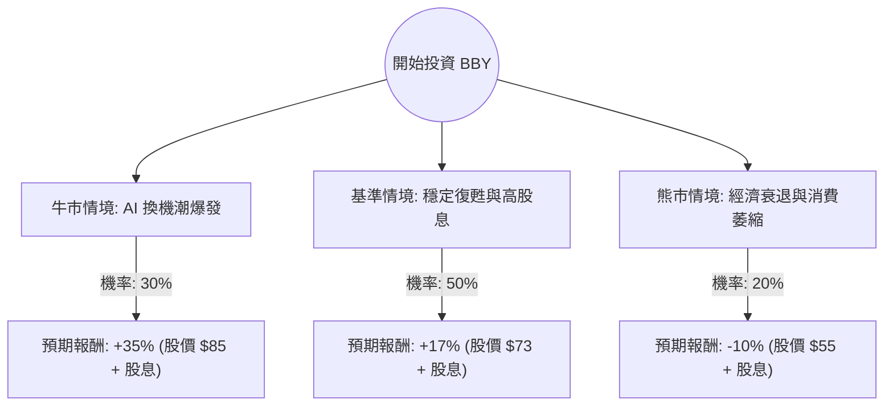

這份分析報告結合了您提供的基本面數據，以及最新的市場動態（包含 2024 年 5 月底公佈的 Q1 財報訊息與產業趨勢），利用**決策樹（Decision Tree）**與**期望值分析（Expected Value Analysis）**評估 Best Buy (BBY) 的投資價值。

---

### 1. 市場現況與核心假設

在進入決策樹之前，我們先整合最新資訊以建立假設：
*   **最新財報表現**：BBY 近期公佈的 2025 財年第一季財報顯示，雖然營收略微下滑，但 **EPS 超出市場預期**。公司重申了全年業績指引，顯示管理層對下半年復甦有信心。
*   **AI PC 換機潮**：微軟與晶片廠商推出的 AI PC 被視為 BBY 下半年的重要增長引擎。
*   **高股息支撐**：目前約 5.8% 的股息率在零售股中極具吸引力，提供了股價下行保護。
*   **宏觀環境**：高利率環境持續壓抑耐久財消費，但通膨放緩有利於消費者信心回升。

---

### 2. 決策樹分析 (Decision Tree)

我們以 **1 年持有期**為基準，設定三種可能的情境：

#### 決策樹節點詳細說明：

| 節點 (情境) | 機率 (P) | 預期股價目標 | 總報酬率 (含 5.8% 股息) | 期望值貢獻 (P * Return) |
| :--- | :--- | :--- | :--- | :--- |
| **牛市 (Bull)** | 30% | $85.00 | +35.1% | +10.53% |
| **基準 (Base)** | 50% | $73.00 | +16.9% | +8.45% |
| **熊市 (Bear)** | 20% | $55.00 | -10.5% | -2.10% |
| **總計** | **100%** | - | - | **16.88%** |

---

### 3. 計算過程與核心假設

#### A. 期望值 (Expected Value, EV) 計算
$$EV = (0.30 \times 35.1\%) + (0.50 \times 16.9\%) + (0.20 \times -10.5\%)$$
$$EV = 10.53\% + 8.45\% - 2.10\% = 16.88\%$$

#### B. 核心假設說明
1.  **牛市情境 (30%)**：
    *   **假設**：AI PC 帶動強勁換機需求，筆電與平板類別營收轉正。聯準會於下半年降息，刺激房地產帶動家電需求。
    *   **估值**：P/E 回升至歷史均值 15x 左右，股價挑戰 $85。
2.  **基準情境 (50%)**：
    *   **假設**：消費電子市場緩步回溫，BBY 透過成本控制維持利潤率（目前 Oper. Margin 4.2% 穩定）。
    *   **估值**：股價達到分析師平均目標價 $72.67，加上 5.8% 股息，提供穩健回報。
3.  **熊市情境 (20%)**：
    *   **假設**：美國經濟陷入硬著陸，失業率上升導致非必要支出（電子產品）大幅削減。
    *   **估值**：股價回測 52 週低點甚至更低（約 $55），高股息雖能抵銷部分損失，但資本利得為負。

---

### 4. 綜合數據分析 (補充基本面)

*   **估值優勢**：Forward P/E 僅 9.36，遠低於標普 500 平均，顯示股價已被低估。
*   **獲利能力**：ROE 高達 37.04%，顯示公司利用股東權益創造利潤的效率極高。
*   **財務風險**：Debt/Eq 為 1.39，雖有負債但 Current Ratio 1.11 顯示短期流動性尚可。
*   **技術面**：SMA20 與 SMA50 均為正值（3.65%, 2.22%），顯示短期趨勢轉強，股價正在築底反彈。

---

### 5. 最終結論

**投資建議：適合投資 (Buy / Overweight)**

#### 判定理由：
1.  **正向期望值**：經風險加權後的預期報酬率為 **16.88%**，顯著高於無風險利率（美債收益率）。
2.  **高股息護城河**：5.8% 的股息率在零售業中非常突出，且 P/FCF (10.93) 顯示現金流足以支撐配息，這為投資者提供了極佳的安全邊際。
3.  **催化劑明確**：下半年的 AI PC 換機潮與返校季、黑五購物節是明確的股價催化劑。
4.  **估值吸引力**：目前 P/S 僅 0.33，P/E 處於歷史低位區間，下行空間相對有限。

**風險提示**：需密切關注 **Sales Q/Q (-0.96%)** 是否能如預期在下半年轉正。若消費者支出持續疲軟，股價可能會在 $60-$65 區間震盪較長時間。

---
*免責聲明：本分析僅供參考，不構成任何投資建議。投資者應自行承擔市場風險。*