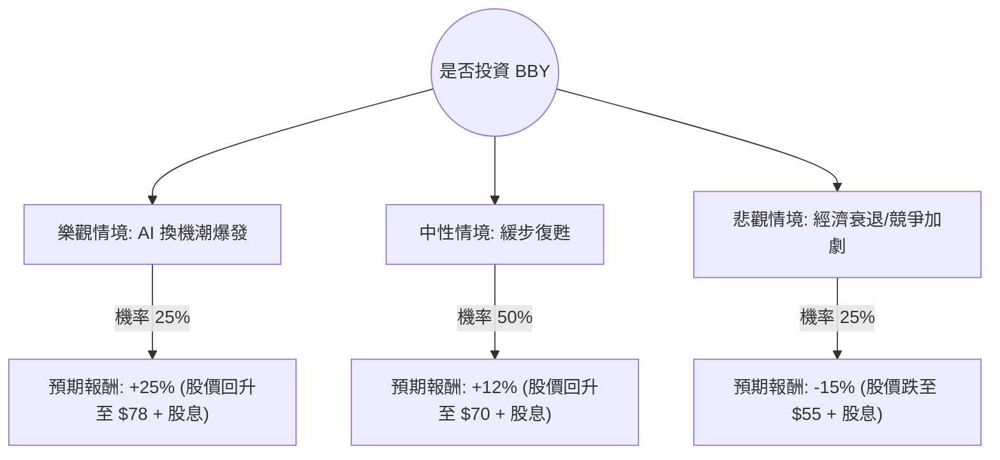

這份分析報告將結合您提供的基本面數據，以及最新的市場動態（包含 2024 年最新的財報表現與產業趨勢），利用**決策樹（Decision Tree）**與**期望值分析（Expected Value Analysis）**來評估 Best Buy (BBY) 的投資價值。

---

### 一、 市場動態與核心假設 (Core Assumptions)

根據最新網路資訊與財報（2025 財年第一季）：
1.  **AI PC 換機潮**：市場預期 2024 下半年至 2025 年將出現 AI PC 驅動的筆電換機週期，這對 BBY 是重大利多。
2.  **消費性支出疲軟**：高利率環境導致消費者對大型家電（Appliance）與家庭劇院的需求依然低迷。
3.  **獲利能力優於預期**：儘管營收微幅下滑，但 BBY 透過精簡成本與服務收入（如 Totaltech 會員制）維持了優於預期的 EPS。
4.  **高股息支撐**：目前約 6% 的股息率提供了強大的下檔支撐。

---

### 二、 決策樹分析 (Decision Tree)

我們將未來一年的情境分為三種：**樂觀（Bull）**、**中性（Base）**、**悲觀（Bear）**。

#### 節點詳細說明：

1.  **樂觀情境 (Bull Case) - 25% 機率**：
    *   **條件**：聯準會降息、AI PC 需求超預期、毛利率持續改善。
    *   **預期報酬**：股價回升至分析師目標價上方（約 $78），加上 6% 股息，總報酬約 **+25%**。

2.  **中性情境 (Base Case) - 50% 機率**：
    *   **條件**：換機潮如期但溫和、家電銷售持平、公司維持現有獲利能力。
    *   **預期報酬**：股價回升至 SMA200 以上（約 $70），加上 6% 股息，總報酬約 **+12%**。

3.  **悲觀情境 (Bear Case) - 25% 機率**：
    *   **條件**：美國經濟陷入衰退、失業率上升導致非必要支出歸零、電商競爭（Amazon/Walmart）侵蝕市佔。
    *   **預期報酬**：股價回測 52 週低點（約 $55），扣除 6% 股息後，總報酬約 **-15%**。

---

### 三、 期望值計算 (Expected Value Calculation)

期望值 (EV) = $\sum (機率 \times 預期報酬)$

*   **樂觀 (Bull)**: $0.25 \times 25\% = 6.25\%$
*   **中性 (Base)**: $0.50 \times 12\% = 6.00\%$
*   **悲觀 (Bear)**: $0.25 \times (-15\%) = -3.75\%$

**總期望報酬率 (Total Expected Return) = $6.25\% + 6.00\% - 3.75\% = 8.5\%$**

---

### 四、 綜合基本面評估

*   **估值優勢**：Forward P/E 僅 8.94，遠低於標普 500 平均，顯示股價已被低估。
*   **財務健康**：ROE 高達 37.04%，顯示管理層運用股東資本效率極高。雖然 Debt/Eq 1.39 偏高，但 Quick Ratio 0.43 顯示短期流動性需注意，不過其穩定的現金流（P/FCF 10.48）足以支撐股息。
*   **技術面**：目前股價低於 SMA20, 50, 200，處於技術性超賣或弱勢區間，但這也為價值投資者提供了較低的成本位。

---

### 五、 最終結論

**判斷：適合投資 (建議分批買入)**

#### 理由：
1.  **正向期望值**：8.5% 的預期報酬率在當前高波動市場中具有吸引力，且這尚未計入複利效應。
2.  **高安全邊際**：6% 的股息率與 8.94 的遠期本益比提供了強大的下檔保護。即使在悲觀情境下，股息也能抵銷部分資本損失。
3.  **產業催化劑明確**：微軟與各大 PC 廠商推出的 AI PC 將在 2024 下半年進入零售通路，BBY 作為線下體驗的核心通路，將是直接受益者。
4.  **空頭回補潛力**：Short Float 高達 12.09%，一旦財報利多或換機潮數據顯現，可能引發軋空行情（Short Squeeze）。

**風險提示**：需密切關注美國失業率數據。若失業率大幅攀升，BBY 的非必需消費品屬性將使其受創嚴重。建議投資者將此標的定位為「價值型+高股息」配置，而非短線成長股。