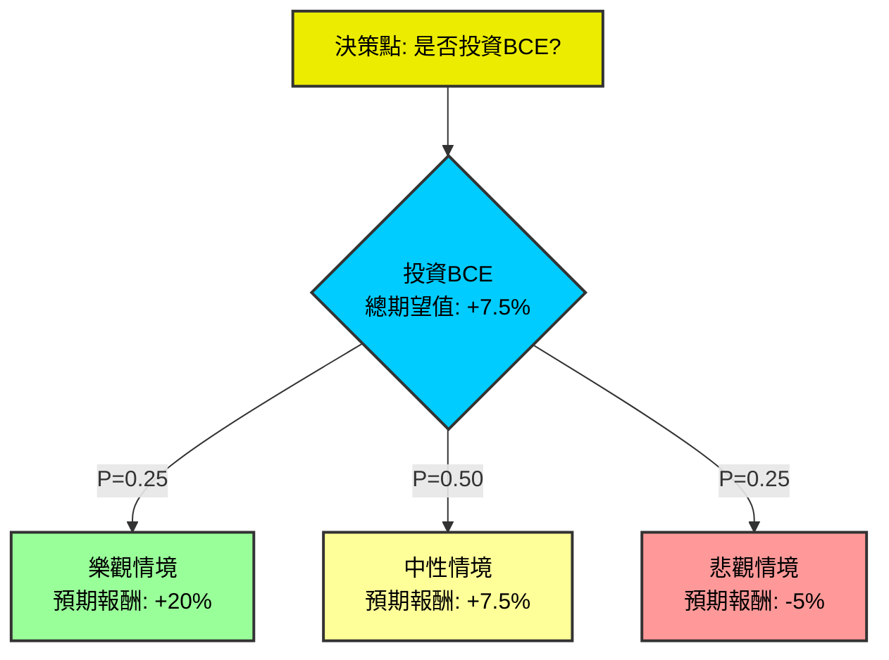

# BCE 投資決策樹與期望值分析

## 核心假設

*   **投資標的**：BCE Inc. (TSX: BCE, NYSE: BCE) - 加拿大最大的電信公司，提供無線、有線、網路、電視及媒體服務。
*   **投資期間**：中期 (1-3年)。
*   **預期報酬**：此處所指的報酬為「總報酬率」，涵蓋股價資本利得/損失與股息報酬的綜合。
*   **市場環境**：考量目前全球利率政策、通膨、產業競爭及監管趨勢。BCE作為典型的公用事業型高股息股票，其表現對利率變化尤為敏感。

## 決策樹繪製

### 決策樹結構（文本表示）

以下是決策樹的各個節點及其標示：

**1. 決策節點：是否投資BCE**
    *   **預測情境名稱**：評估是否執行投資BCE的決策
    *   **對應機率**：N/A (此為決策點，非機率事件)
    *   **期望值 (Overall Expected Value)**：+7.5% (此為經過所有情境加權後計算出的最終期望值)

**2. 機會節點：市場情境 (若決定投資BCE，則會面臨此機會節點)**
    *   **預測情境名稱**：投資後可能發生的三種主要市場與公司表現情境
    *   **對應機率**：N/A (此節點本身無機率，其下分支才有)
    *   **期望值**：N/A (此節點的期望值由其下分支加權計算而得)

    **2.1. 情境一：樂觀情境 (Optimistic Scenario)**
        *   **預測情境名稱**：全球經濟軟著陸，央行啟動降息週期，對BCE這類高負債公司減輕利息負擔；加拿大市場競爭環境趨於穩定，BCE的5G基礎設施投資開始實現更高的ARPU和用戶增長；營運成本控制得宜，監管環境對電信商較為有利。
        *   **對應機率 (Probability)**：0.25 (25%)
        *   **預期報酬 / 期望值 (Expected Return for this scenario)**：+20% (包含股價反彈及穩定的股息收入)

    **2.2. 情境二：中性情境 (Neutral Scenario)**
        *   **預測情境名稱**：利率維持在高位但不再顯著上升，經濟溫和增長；BCE的營收和EBITDA保持穩定的小幅增長，用戶數穩定增長但面臨持續的市場競爭壓力；公司維持現有股息政策，無重大變革。
        *   **對應機率 (Probability)**：0.50 (50%)
        *   **預期報酬 / 期望值 (Expected Return for this scenario)**：+7.5% (主要來自穩定的高股息，股價波動不大或略有小幅增長)

    **2.3. 情境三：悲觀情境 (Pessimistic Scenario)**
        *   **預測情境名稱**：全球經濟硬著陸或陷入衰退，央行被迫進一步升息或高利率持續更久；加拿大電信市場競爭加劇導致價格戰，政府監管進一步趨嚴對BCE不利；公司因負債成本高昂或業績不佳而被迫削減股息，導致投資者信心崩潰。
        *   **對應機率 (Probability)**：0.25 (25%)
        *   **預期報酬 / 期望值 (Expected Return for this scenario)**：-5% (股價顯著下跌，部分抵銷股息收入)

### 決策樹視覺化（使用 Mermaid）

## 計算過程

### 1. 核心假設細節

*   **市場假設**：
    *   **利率趨勢**：目前高利率環境對BCE這類高負債、穩定股息的公用事業型公司是挑戰，因為借貸成本增加，且股息吸引力相對下降。未來利率走向是影響其股價和盈利的關鍵變數。
    *   **經濟成長**：加拿大經濟溫和或放緩，可能影響消費者支出，但電信服務通常具有較高的剛性需求，受經濟週期影響相對較小。
    *   **通膨壓力**：影響營運成本（如人工、設備），BCE有能力在一定程度上透過提價轉嫁成本，但也可能面臨監管壓力。
*   **財務假設 (BCE特有)**：
    *   **高股息特性**：BCE是著名的股息股，目前殖利率高。股息成長率放緩或潛在股息削減會對股價造成重大打擊。
    *   **高負債比**：電信業是資本密集型產業，BCE的債務水平較高，使其對利率變化高度敏感。
    *   **穩定的現金流**：作為基礎設施服務提供商，其現金流相對穩定，為其高股息提供支撐，但在高資本開支下自由現金流仍有壓力。
*   **產業趨勢假設**：
    *   **競爭格局**：加拿大電信市場主要由三大巨頭（BCE, Rogers, Telus）主導，競爭激烈但相對理性。任何新進入者或政府政策（如強制批發接入）可能改變格局。
    *   **技術升級**：5G網絡建設仍需大量資本開支，但未來可望帶來新的服務和收入來源，提升ARPU。
    *   **監管環境**：加拿大電信監管機構（CRTC）的決策對BCE的業務模式（如批發費率、網路共享）影響巨大，存在不確定性。

### 2. 節點期望值計算

*   **樂觀情境的期望貢獻**：
    *   計算：0.25 (機率) * 20% (預期報酬) = 0.05
*   **中性情境的期望貢獻**：
    *   計算：0.50 (機率) * 7.5% (預期報酬) = 0.0375
*   **悲觀情境的期望貢獻**：
    *   計算：0.25 (機率) * (-5%) (預期報酬) = -0.0125

### 3. 整體投資BCE的期望值

*   **計算**：
    期望值 (BCE) = (樂觀情境期望貢獻) + (中性情境期望貢獻) + (悲觀情境期望貢獻)
    期望值 (BCE) = 0.05 + 0.0375 + (-0.0125)
    期望值 (BCE) = 0.0875 - 0.0125
    **期望值 (BCE) = 0.075 或 7.5%**

## 最終結論

根據上述決策樹分析與期望值計算，投資BCE的整體期望值為 **+7.5%**。

**判斷：適合投資**

**理由：**
投資BCE的期望值為正（+7.5%），表明在綜合考慮市場可能出現的樂觀、中性和悲觀情境及其對應機率後，預期能獲得一個合理的正向投資報酬。BCE作為加拿大電信業的領頭羊，儘管面臨高利率環境、激烈競爭及潛在的監管挑戰，但其提供的電信服務具有高度的剛性需求，產生穩定的現金流，並能提供具吸引力的高股息。目前的股價可能已部分反映了市場的悲觀預期。對於追求穩定收益、注重股息收入，且願意承受一定市場波動的投資者而言，+7.5%的預期總報酬是具有吸引力的，特別是考慮到其防禦性特質和作為核心基礎設施的穩定性。

**重要提示**：此分析基於當前市場資訊和假設情境，實際投資結果可能因市場變化、公司表現或未預期事件而有所不同。投資者在做出決策前，應充分評估自身的風險承受能力和投資目標。