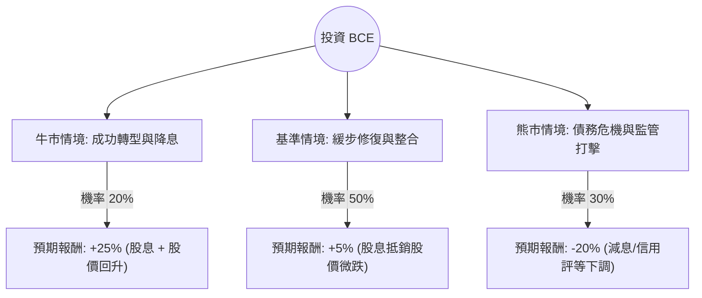

這份分析報告將結合您提供的基本面數據，以及針對 **BCE Inc. (BCE)** 的最新市場動態（特別是近期收購 Ziply Fiber 的重大決策、加拿大監管環境及利率趨勢）進行綜合評估。

---

### 1. 核心背景與最新動態分析

在進入決策樹之前，我們必須納入以下關鍵即時資訊：
*   **重大收購案**：BCE 於 2024 年 11 月宣布以約 50 億美元收購美國光纖業者 **Ziply Fiber**。這標誌著 BCE 首次大規模進軍美國市場，旨在尋求增長，但也導致其**暫停了連續 18 年的股息增長**，並增加了債務壓力。
*   **監管壓力**：加拿大廣播電視及通訊委員會 (CRTC) 要求 Bell 開放其光纖網路給競爭對手，這嚴重打擊了其利潤率與投資意願。
*   **財務壓力**：您提供的數據顯示 **Debt/Eq 為 1.78**，且 **Quick Ratio 僅 0.48**，顯示流動性偏緊。收購案後，槓桿率將進一步上升。
*   **利率環境**：加拿大央行開始降息，這對高負債且具備債券屬性的電信股（BCE）有利，可減輕利息負擔。

---

### 2. 決策樹分析 (Decision Tree)

以下決策樹評估未來 12 個月的投資預期報酬：

#### 決策樹節點詳細說明：

| 情境 | 機率 | 預期報酬 (Total Return) | 說明 |
| :--- | :--- | :--- | :--- |
| **牛市情境** | 20% | +25% | Ziply 整合順利，美國業務增長超預期；利率大幅下降減輕債務壓力；CRTC 政策轉向。 |
| **基準情境** | 50% | +5% | 股息維持（不增長），股價受債務壓制在 $22-$25 區間震盪。收購案短期無明顯貢獻。 |
| **熊市情境** | 30% | -20% | 負債比過高導致信用評等下調；被迫削減股息（Dividend Cut）；加拿大本業競爭加劇。 |

---

### 3. 期望值分析 (Expected Value Analysis)

#### A. 計算過程
期望值 (EV) = $\sum (機率 \times 預期報酬)$

*   **牛市節點**: $0.20 \times 25\% = 5.0\%$
*   **基準節點**: $0.50 \times 5\% = 2.5\%$
*   **熊市節點**: $0.30 \times (-20\%) = -6.0\%$

**總期望報酬率 (Total EV) = 5.0% + 2.5% - 6.0% = 1.5%**

#### B. 核心假設
1.  **股息政策**：假設 BCE 雖然暫停增長股息，但會竭力維持現有派息（目前殖利率約 8-9% CAD，美股數據顯示 5.3% 可能未反映最新股價下跌後的真實殖利率）。若發生減息，報酬將大幅轉負。
2.  **估值修復**：Target Price $26.74 較目前 $24.09 有約 11% 空間，但考慮到 Forward P/E (12.3) 高於 Current P/E (4.93)，顯示市場預期未來獲利可能下滑。
3.  **債務成本**：假設利率環境維持下行趨勢，否則 1.78 的 Debt/Eq 將成為致命傷。

---

### 4. 最終結論

**判斷：不適合投資 (Avoid / Underperform)**

#### 理由：
1.  **期望值過低**：計算出的總期望報酬僅為 **1.5%**，遠低於標普 500 的歷史平均報酬，且風險不對稱（下行風險大）。
2.  **財務結構惡化**：BCE 目前面臨「高債務 + 低流動性 (Quick Ratio 0.48)」的困境。收購 Ziply Fiber 雖然是為了增長，但在高利率尾聲進行大規模舉債收購，風險極高。
3.  **股息神話破滅**：BCE 過去是穩定的收息股，但近期「暫停股息增長」是一個強烈的警訊。如果未來現金流無法覆蓋利息支出，下一步可能就是「削減股息」，這會導致機構投資者大規模撤出。
4.  **技術面與動能**：SMA20, SMA50, SMA200 全線為負（-2.2% 到 -5.0%），顯示股價處於空頭排列，短期內缺乏催化劑。

**建議**：
如果您是追求高股息的投資者，目前 BCE 的風險已顯著高於其收益。建議觀察其收購 Ziply 後的首兩季財報，確認債務比率是否受控，以及現金流是否足以支撐現有股息發放，再行考慮。目前資金配置於其他資產負債表更健康的電信股（如 T-Mobile）或基礎設施 ETF 可能更為穩妥。