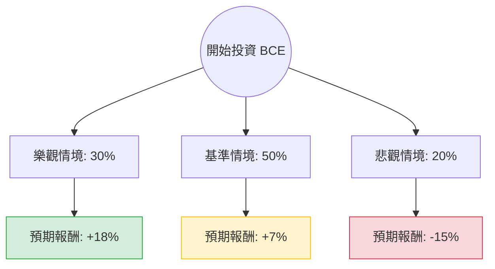

這份分析報告將結合您提供的基本面數據，以及最新的市場動態（如加拿大 CRTC 監管政策、利率環境、BCE 裁員與資產剝離計畫），利用**決策樹（Decision Tree）**與**期望值分析（Expected Value Analysis）**評估 BCE 的投資價值。

---

### 一、 核心假設與市場背景分析

在建立決策樹之前，我們必須考慮以下關鍵因素：

1.  **利率環境（利多/中性）**：BCE 債務股本比（Debt/Eq）高達 **1.82**，對利率極度敏感。隨著加拿大央行與聯準會進入降息週期，其利息支出壓力將減輕，對這類高股息電信股有利。
2.  **監管壓力（利空）**：加拿大廣播電視及通訊委員會（CRTC）強制要求 BCE 開放其光纖網路給競爭對手，這嚴重打擊了 BCE 的資本回報率，導致其縮減資本支出。
3.  **財務健康（中性偏弱）**：雖然 **ROE (31.28%)** 極高，但 **Quick Ratio (0.48)** 偏低，且 **EPS next Y (-1.62%)** 預期衰退，顯示短期增長乏力。
4.  **股息安全性（關鍵）**：目前股息率約 **6.8%**，但 P/FCF 為 7.99，顯示現金流尚能支撐股息，但增長空間有限。

---

### 二、 決策樹分析 (Decision Tree)

我們將未來一年的投資情境分為三種：**樂觀（降息+轉型成功）**、**基準（維持現狀）**、**悲觀（監管惡化+股息削減）**。

#### 節點詳細說明：

1.  **樂觀情境 (30%)**：
    *   **條件**：利率快速下降，BCE 成功出售非核心資產（如 MLSE 股份）減債，且 CRTC 政策有所放寬。
    *   **預期報酬**：股價回升至 52 週高點附近（約 $26）+ 6.8% 股息 $\approx$ **18%**。
2.  **基準情境 (50%)**：
    *   **條件**：利率緩步下降，營收持平（Sales Q/Q 0.32% 顯示增長緩慢），股息維持不變。
    *   **預期報酬**：股價維持在目標價 $25.93 附近（約 +7% 漲幅），但考慮到市場波動，總回報約為 **7%**（含息）。
3.  **悲觀情境 (20%)**：
    *   **條件**：監管壓力持續，競爭加劇導致利潤率（Profit Margin 25.44%）下滑，甚至出現股息削減的市場傳聞。
    *   **預期報酬**：股價跌破 $21，總回報約為 **-15%**。

---

### 三、 期望值計算 (Expected Value Calculation)

我們計算投資 BCE 一年的預期總報酬率（Total Return）：

$$EV = (P_{Bull} \times R_{Bull}) + (P_{Base} \times R_{Base}) + (P_{Bear} \times R_{Bear})$$

*   **計算過程**：
    *   樂觀貢獻：$0.30 \times 18\% = 5.4\%$
    *   基準貢獻：$0.50 \times 7\% = 3.5\%$
    *   悲觀貢獻：$0.20 \times (-15\%) = -3.0\%$
*   **總期望值 (EV)**：
    *   $5.4\% + 3.5\% - 3.0\% = \mathbf{5.9\%}$

---

### 四、 綜合數據評估

*   **估值面**：P/E 5.06 看似極低，但 Forward P/E 12.58 顯示市場預期未來獲利會修正。P/B 1.64 處於合理區間。
*   **技術面**：SMA20, 50, 200 均為正值（3.4% ~ 4.7%），顯示短期股價處於反彈趨勢。
*   **風險面**：Debt/Eq 1.82 是最大隱憂。如果全球經濟衰退導致信用環境收緊，BCE 的利息負擔將侵蝕利潤。

---

### 五、 最終結論

#### **判斷：謹慎持有 / 適合尋求現金流的投資者，但不適合追求高成長者。**

**理由：**
1.  **期望值為正 (5.9%)**：雖然期望值不算驚艷，但考慮到其 6.8% 的高股息，對於需要固定收益的投資者具有吸引力。
2.  **下行風險受限**：股價已從高點回落不少，且目前處於 SMA200 之上，技術面有支撐。
3.  **債務與監管雙重壓力**：BCE 不是一個可以「買入並忘記」的標的。其高槓桿比率意味著它在利率高企時非常脆弱。
4.  **投資建議**：
    *   **若您是收益型投資者**：BCE 目前價格（$24.24）接近其目標價（$25.93），適合分批佈局以獲取股息。
    *   **若您是成長型投資者**：BCE 的 EPS 增長預期為負，且 PEG 無法計算，顯示缺乏成長動能，建議避開。

**總結：BCE 目前更像是一個「債券替代品」。在降息預期下，它具備穩定性，但受限於加拿大電信市場的監管天花板，股價爆發力不足。**