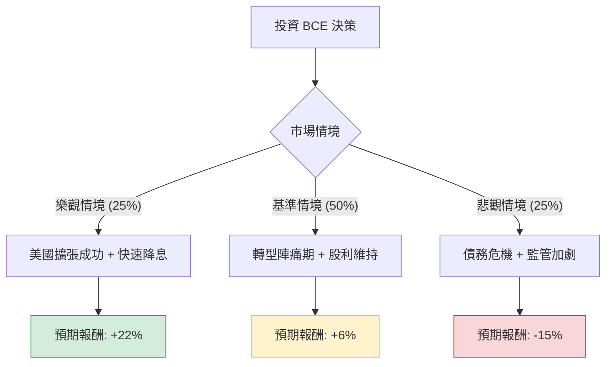

針對美股 BCE Inc. (BCE) 的投資評估，我已結合您提供的基本面數據，並整合了最新的市場動態（如 2024 年 Q3 財報、收購 Ziply Fiber 消息及股利政策變動）進行深度分析。

---

### 一、 最新市場動態與核心假設

在進行決策樹分析前，必須納入以下關鍵即時資訊：
1.  **收購 Ziply Fiber**：BCE 宣布以約 50 億加幣收購美國光纖業者 Ziply Fiber，正式進軍美國市場。這雖然帶來增長潛力，但也增加了債務壓力。
2.  **股利政策轉向**：BCE 宣布 **2025 年將暫停增加股利**，以保留現金流用於收購與去槓桿。這對於長期視其為「股利成長股」的投資者是重大打擊。
3.  **監管壓力**：加拿大 CRTC 要求 Bell 開放光纖網路給競爭對手，這持續壓低其國內利潤率。
4.  **財務壓力**：負債權益比 (Debt/Eq) 高達 1.78，在當前高利率環境下（即便開始降息）利息支出仍重。

---

### 二、 決策樹分析 (Decision Tree Analysis)

以下為未來 12 個月的投資情境預測：

#### 節點詳細說明：

1.  **樂觀情境 (Bull Case) - 25% 機率**：
    *   **描述**：Ziply Fiber 整合優於預期，美國業務貢獻顯著營收；聯準會與加拿大央行激進降息，大幅減輕 BCE 債務負擔。
    *   **預期報酬**：股息 6.45% + 股價回升至目標價 $27 以上 (約 15%) ≈ **22%**。

2.  **基準情境 (Base Case) - 50% 機率**：
    *   **描述**：股利凍結被市場消化，股價在 $24-$26 區間震盪。收購案進展平穩但無驚喜，營收微幅增長 (Sales Q/Q 0.01% 顯示增長乏力)。
    *   **預期報酬**：股息 6.45% + 股價持平 (0%) ≈ **6%** (取整數)。

3.  **悲觀情境 (Bear Case) - 25% 機率**：
    *   **描述**：收購導致信用評等下調；加拿大國內競爭加劇導致市佔流失；若現金流惡化，市場擔心未來可能「減息」而非僅是「凍結」。
    *   **預期報酬**：股息 6.45% - 股價下跌 (20% 以上) ≈ **-15%**。

---

### 三、 期望值分析 (Expected Value Analysis)

#### 1. 計算過程：
期望值 (EV) = Σ (情境報酬 × 對應機率)

*   **樂觀情境**：$22\% \times 0.25 = 5.5\%$
*   **基準情境**：$6\% \times 0.50 = 3.0\%$
*   **悲觀情境**：$-15\% \times 0.25 = -3.75\%$

**總體期望報酬率 (Total EV) = 5.5% + 3.0% - 3.75% = 4.75%**

#### 2. 核心假設與數據解讀：
*   **估值矛盾**：雖然 P/E 5.23 看似極低，但 **Forward P/E 13.06** 顯示未來獲利預期並不樂觀。**PEG 130.57** 是一個極端警訊，顯示其增長速度遠低於其估值。
*   **財務風險**：Current Ratio 0.51 與 Quick Ratio 0.48 顯示短期流動性非常緊張，這解釋了為何公司必須凍結股利增長。
*   **技術面**：股價接近 52 週高點 (-3.58%)，且 SMA20 (-1.43%) 顯示短期動能轉弱，追高風險較大。

---

### 四、 最終結論

#### **判斷：不適合投資 (Not Recommended)**

#### **理由：**
1.  **期望值過低**：4.75% 的預期報酬率甚至低於目前的無風險利率（如美債殖利率或高利活存），投資者承擔了高額的債務風險與監管風險，卻僅獲得極低的風險溢酬。
2.  **核心吸引力喪失**：BCE 過去被視為穩定的收息股，但「凍結股利增長」打破了其股利成長的神話，這會導致追求 DGI (Dividend Growth Investing) 的機構資金撤出。
3.  **財務結構脆弱**：高達 1.78 的債務權益比，加上收購 Ziply 帶來的現金流壓力，使其在面對經濟衰退時的容錯率極低。
4.  **增長乏力**：PEG 破百與 Sales Q/Q 幾乎停滯，顯示這是一家陷入困境的傳統電信商，而非轉型成功的成長股。

**建議**：若您是為了 6.4% 的殖利率，市場上有更多資產負債表更健康、且具備股利成長潛力的標的（如部分能源股或基礎設施 REITs）。目前 BCE 處於轉型與債務壓力的交界點，建議觀望至 2025 年收購整合進度明朗後再行評估。