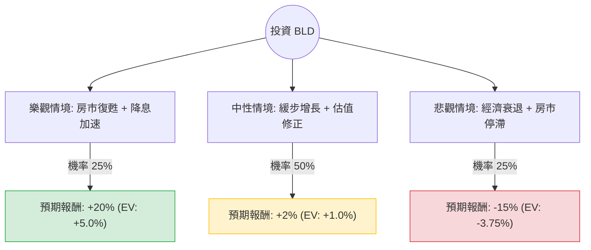

這份分析報告將針對 **TopBuild Corp. (股票代碼：BLD)** 進行深入評估。TopBuild 是美國領先的絕緣材料安裝與分銷商，其業務與美國房地產市場（新屋開工率）高度相關。

以下結合您提供的數據與最新的市場動態（包含聯準會利率趨勢、房地產市場預測及公司近期財報表現）進行決策樹與期望值分析。

---

### 一、 核心背景與市場動態分析

1.  **財務現況**：
    *   **估值偏高**：目前股價（$500.68）已超越分析師平均目標價（$488.6），且 PEG 高達 5.76，顯示市場對其增長預期已過度反應。
    *   **盈利能力**：ROE (26.18%) 表現優異，顯示公司管理層運用資本效率高。
    *   **內部人動向**：內部人交易減少 11.84%，這通常是一個警訊，顯示高層可能認為目前股價已達高點。
2.  **外部環境**：
    *   **利率環境**：聯準會雖進入降息週期，但房貸利率下降速度緩慢，壓抑了新屋開工的爆發性成長。
    *   **產業趨勢**：美國住房供應長期短缺對 BLD 有利，但短期內建築成本與勞動力短缺仍是挑戰。
    *   **併購動能**：BLD 依賴併購（M&A）驅動成長，目前的負債比（Debt/Eq 1.39）尚在可控範圍，但需關注收購後的整合效率。

---

### 二、 決策樹分析 (Decision Tree)

我們將未來一年的投資情境分為三種：**樂觀（牛市）**、**中性（基準）**、**悲觀（熊市）**。

#### 1. 樂觀情境 (Bull Case) - 機率 25%
*   **假設**：聯準會大幅降息，房貸利率降至 6% 以下，刺激新屋開工量大增；BLD 成功完成大型併購。
*   **預期報酬**：+20% (股價挑戰 $600)。

#### 2. 中性情境 (Base Case) - 機率 50%
*   **假設**：利率維持高位震盪，房市緩步復甦；公司業績符合預期，但因目前股價已高於目標價，漲幅受限於估值修正。
*   **預期報酬**：+2% (股價在 $490 - $510 區間震盪)。

#### 3. 悲觀情境 (Bear Case) - 機率 25%
*   **假設**：美國經濟陷入硬著陸，失業率上升導致購屋需求萎縮；內部人持續拋售，股價回測 SMA200。
*   **預期報酬**：-15% (股價回落至 $425 附近)。

---

### 三、 期望值計算 (Expected Value Analysis)

根據上述模型，我們計算投資 BLD 的總體期望報酬率：

| 情境 | 機率 (P) | 預期報酬 (R) | 期望值 (P * R) |
| :--- | :--- | :--- | :--- |
| **樂觀** | 0.25 | +20% | +5.0% |
| **中性** | 0.50 | +2% | +1.0% |
| **悲觀** | 0.25 | -15% | -3.75% |
| **總計** | **1.00** | | **+2.25%** |

**計算過程：**
$EV = (0.25 \times 20\%) + (0.50 \times 2\%) + (0.25 \times -15\%)$
$EV = 5.0\% + 1.0\% - 3.75\% = 2.25\%$

---

### 四、 最終結論與建議

#### **判斷：不適合投資 (目前觀望 / 等待回調)**

**理由如下：**

1.  **期望值過低**：計算出的期望報酬率僅為 **2.25%**，遠低於標普 500 指數的歷史平均回報，且風險回報比（Risk-Reward Ratio）並不理想。
2.  **估值溢價**：目前股價（$500.68）已高於分析師目標價（$488.6），且 PEG (5.76) 顯示其增長速度無法支撐當前的高本益比。
3.  **技術面過熱**：股價距離 SMA200 (200日均線) 高出 30.56%，短期內存在強烈的回調壓力。
4.  **內部人拋售**：Insider Trans 為 -11.84%，顯示公司內部人員在當前價位獲利了結的意願較高。
5.  **成長動能放緩**：今年 EPS 增長為負 (-5.68%)，明年預期增長也僅 5.6%，缺乏強力的基本面催化劑來推動股價進一步突破。

**建議操作：**
若您已持有，建議可考慮**部分獲利了結**；若尚未進場，建議等待股價回落至 **$450 - $460** 區間（接近 SMA50 或更低）且房市數據有明顯好轉時，再行重新評估。