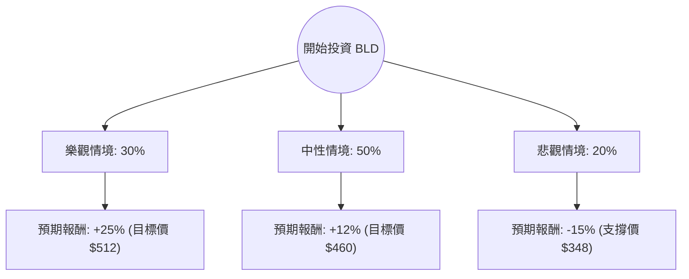

這份分析報告將針對 **TopBuild Corp. (股票代碼：BLD)** 進行深入評估。TopBuild 是美國領先的絕緣材料安裝與分銷商，其業績與美國房地產市場（新屋開工率）高度相關。

以下結合您提供的數據與最新的市場動態（包含聯準會降息預期、房地產趨勢及公司財報）進行決策樹與期望值分析。

---

### 一、 核心假設與市場動態分析

在建立模型前，我們先釐清影響 BLD 的關鍵變數：

1.  **宏觀環境（利率）**：聯準會（Fed）預計於 2024 年 9 月啟動降息。降息將降低抵押貸款利率，刺激新屋開工與房屋修繕需求，這對 BLD 是重大利多。
2.  **財務表現**：BLD 的 **ROE (23.06%)** 極高，顯示管理層資本運用效率優異。**Forward P/E (19.55)** 低於當前 P/E，顯示市場預期明年獲利將增長。
3.  **產業趨勢**：美國住房供應長期短缺，且建築法規對節能（絕緣材料）的要求日益嚴格，支撐了 BLD 的長期需求。
4.  **近期走勢**：股價近期表現強勁（月漲幅 14.66%），SMA20 遠高於現價（+11.46%），顯示短期動能充足，但需注意回調風險。

---

### 二、 決策樹分析 (Decision Tree)

我們將未來一年的投資情境分為三種：**樂觀（降息超預期+房市復甦）**、**中性（緩步降息+穩健增長）**、**悲觀（經濟衰退+高利率持續）**。

#### 節點詳細說明：

1.  **樂觀情境 (30%)**：
    *   **條件**：Fed 降息節奏快，房地產市場因低利率爆發，BLD 併購策略成功。
    *   **預期報酬**：股價突破 52 週高點，挑戰 $510-$520 區間。
2.  **中性情境 (50%)**：
    *   **條件**：利率緩步下降，房市維持現狀，BLD 依靠市佔率與 EPS 增長（預期明年 +15.12%）推升股價。
    *   **預期報酬**：接近分析師平均目標價 $474.79。
3.  **悲觀情境 (20%)**：
    *   **條件**：通膨反彈導致利率維持高位，或美國陷入經濟衰退導致建築業停滯。
    *   **預期報酬**：股價回測 SMA200 或 52 週低點支撐。

---

### 三、 期望值分析 (Expected Value Analysis)

#### 1. 計算過程：
我們根據上述情境的機率與預期報酬率進行加權計算：

*   **樂觀 (Bull)**：$0.30 \times 25\% = 7.5\%$
*   **中性 (Base)**：$0.50 \times 12\% = 6.0\%$
*   **悲觀 (Bear)**：$0.20 \times (-15\%) = -3.0\%$

**總期望報酬率 (Expected Return) = 7.5% + 6.0% - 3.0% = 10.5%**

#### 2. 核心數據支持：
*   **估值合理性**：Forward P/E 19.55 倍，對於一家 ROE 達 23% 且具有產業龍頭地位的公司來說，估值並不極端。
*   **安全邊際**：雖然 Debt/Eq (1.36) 略高，但 Quick Ratio (1.34) 顯示短期流動性無虞。
*   **分析師共識**：Recom 為 1.59（介於強烈買進與買進之間），目標價 $474.79 較現價 $410 有約 **15.7%** 的上漲空間。

---

### 四、 最終結論

**判斷：適合投資 (Suitable for Investment)**

#### 理由：
1.  **正向期望值**：10.5% 的預期報酬率優於多數成熟工業股，且在降息循環啟動的背景下，上行風險大於下行風險。
2.  **強勁的基本面**：高 ROE (23%) 與穩定的營運利潤率 (15.18%) 證明了公司在產業內的議價能力與成本控制能力。
3.  **技術面支撐**：股價已從近期低點反彈，SMA20 向上交叉，顯示短期趨勢轉強。
4.  **產業紅利**：美國住房短缺是結構性問題，BLD 作為絕緣材料龍頭，將直接受益於未來幾年的新屋開工增長。

#### 投資建議（風險控管）：
*   **進場時機**：目前股價 $410 距離目標價仍有空間，但因短期已有一波漲幅（月漲 14%），建議採**分批進場**策略。
*   **停損設定**：若股價跌破 $370（接近 SMA200 與近期支撐位），需重新評估房地產市場的基本面是否惡化。
*   **關注指標**：未來幾個月的美國新屋開工數據（Housing Starts）以及聯準會的利率點陣圖。

---
*免責聲明：本分析僅供參考，不構成具體投資建議。投資股票具有風險，入市前請務必自行審慎評估。*