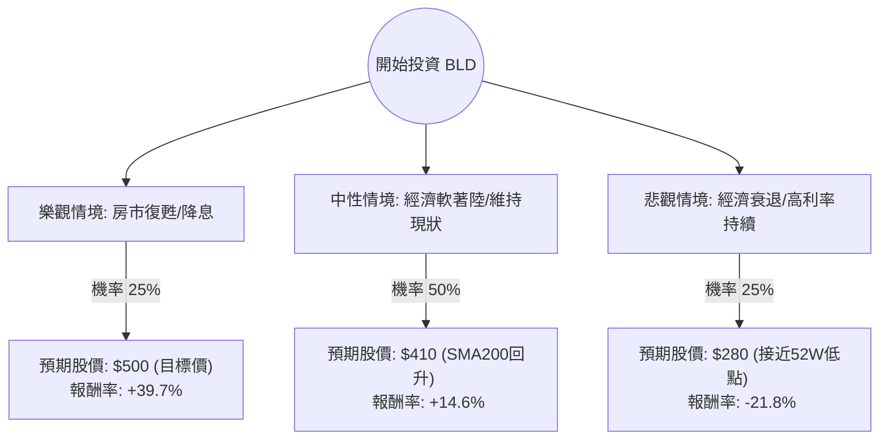

這份分析報告將針對 **TopBuild Corp. (股票代碼：BLD)** 進行深度評估。BLD 是美國領先的絕緣材料安裝與分銷商，其業績與美國房地產市場（新屋開工率）高度相關。

以下結合您提供的數據與最新的市場動態（包含 2024 年 Q1 財報表現與聯準會利率前景）進行決策樹與期望值分析。

---

### 一、 核心假設與市場背景分析

在建立模型前，我們必須釐清影響 BLD 股價的三大核心變數：

1.  **利率環境與房市需求**：BLD 的業務依賴住宅與商業建築。若聯準會（Fed）維持高利率，將壓抑新屋開工；若降息，則有利於估值修復。
2.  **近期股價修正**：數據顯示 BLD 近一個月跌幅達 **-30.97%**，近一季跌幅 **-16.46%**。這反映了市場對房市放緩的擔憂，但也可能創造了「超跌」的機會。
3.  **財務韌性**：BLD 的 ROE 高達 **23.06%**，且 Forward P/E (17.27) 低於當前 P/E (20.26)，顯示市場預期明年盈利將增長。

---

### 二、 決策樹分析 (Decision Tree)

我們將未來一年的投資情境分為三種：**樂觀（牛市）**、**中性（基準）**、**悲觀（熊市）**。

#### 節點詳細說明：

1.  **樂觀情境 (Bull Case) - 25% 機率**：
    *   **假設**：聯準會於下半年啟動降息，美國住房供應短缺引發新一波建築潮。BLD 成功整合近期收購案，利潤率提升。
    *   **目標價**：參考分析師平均目標價 **$499.4**（約 $500）。

2.  **中性情境 (Base Case) - 50% 機率**：
    *   **假設**：利率維持高檔但不再上升，房市表現平穩。BLD 憑藉其市場領導地位維持 15% 左右的營運利潤率。股價回補近期缺口，回到 SMA200 附近。
    *   **目標價**：**$410**（約為近期暴跌前的支撐位）。

3.  **悲觀情境 (Bear Case) - 25% 機率**：
    *   **假設**：通膨黏性導致利率不降反升，美國進入經濟衰退，建築活動停滯。BLD 債務壓力（Debt/Eq 1.36）增加。
    *   **目標價**：**$280**（接近 52 週低點 $266.26）。

---

### 三、 期望值分析 (Expected Value Analysis)

#### 1. 計算過程
我們以當前股價 **$357.86** 為基準，計算一年後的預期價值（Expected Value, EV）：

*   **EV = (樂觀股價 × 樂觀機率) + (中性股價 × 中性機率) + (悲觀股價 × 悲觀機率)**
*   **EV** = ($500 × 0.25) + ($410 × 0.50) + ($280 × 0.25)
*   **EV** = $125 + $205 + $70 = **$400**

#### 2. 預期報酬率計算
*   **預期報酬率** = (EV - 當前股價) / 當前股價
*   **預期報酬率** = ($400 - $357.86) / $357.86 = **+11.77%**

---

### 四、 綜合評估與數據解讀

*   **估值面**：Forward P/E 17.27 倍，對於一家 ROE 達 23% 的行業龍頭來說並不昂貴。PEG 為 2.33，顯示目前股價相對於增長速度處於合理偏高位置，但近期 30% 的修正已大幅釋放風險。
*   **技術面**：股價目前遠低於 SMA20 (-16.48%)、SMA50 (-21%) 與 SMA200 (-10.79%)，處於**嚴重超賣區**。短期內可能有技術性反彈。
*   **風險點**：
    *   **EPS Q/Q 下降 27.24%**：這解釋了為何近期股價大跌，顯示短期獲利動能受阻。
    *   **負債比**：Debt/Eq 1.36 略高，在高利率環境下會增加財務成本。

---

### 五、 最終結論

**判斷：適合投資（分批買入 / 逢低佈局）**

#### 理由：
1.  **期望值為正**：計算出的預期報酬率約為 **11.77%**，優於現金持有。
2.  **安全邊際顯現**：股價在一個月內修正了 30%，已部分反映了房市放緩的利空。目前股價 ($357) 距離分析師目標價 ($499) 有極大的上行空間。
3.  **基本面穩健**：儘管短期 EPS 波動，但 BLD 擁有高 ROE (23%) 與良好的自由現金流估值 (P/FCF 14.98)，顯示其在產業低谷仍具備生存與擴張能力。
4.  **產業剛需**：美國住房長期供應不足是結構性問題，一旦利率環境鬆動，BLD 作為絕緣材料龍頭將首當其衝受益。

**建議策略**：
由於目前技術面仍呈空頭排列（SMA 全線跌破），建議不要一次性投入，而是採取**分批進場**策略，關注 $330 - $350 區間的支撐力道。若跌破 $300 則需重新評估悲觀情境發生的可能性。

***

**免責聲明：** 本分析僅供參考，不構成任何投資建議。投資者應自行承擔市場風險。