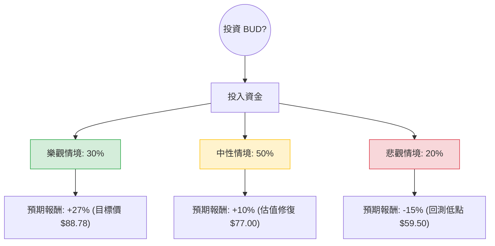

這份分析報告結合了您提供的基本面數據，以及透過網路搜尋獲取的最新市場動態（包含 2024 年第三季財報表現、美國市場復甦進度、中國市場挑戰及公司回購計畫）。

---

### 一、 核心假設與市場背景分析

在建立決策樹之前，我們基於以下關鍵資訊設定假設：

1.  **財務表現（Q3 2024）**：BUD 最近的財報顯示營收略低於預期（150.5 億美元），主要受中國市場疲軟與美國銷量下滑影響。然而，EBITDA 增長了 7.1%，且 EPS（0.98 美元）優於預期，顯示利潤率管理強勁。
2.  **美國市場復甦**：Bud Light 事件的影響正在淡化，雖然銷量尚未完全恢復，但市佔率已趨於穩定。
3.  **資本配置**：公司宣布了 **10 億美元的股票回購計畫**，並持續去槓桿化（債務/權益比 0.84，雖有改善空間但已在控制中）。
4.  **估值水平**：目前 Forward P/E 為 14.94，低於歷史平均與同業，顯示股價具有安全邊際。
5.  **外部風險**：中國消費力不足、原材料成本波動、以及全球經濟放緩對高端啤酒需求的壓抑。

---

### 二、 決策樹分析 (Decision Tree)

我們將未來一年的投資情境分為三種：**樂觀（Bull）**、**中性（Base）**、**悲觀（Bear）**。

#### 節點詳細說明：

1.  **樂觀情境 (30%)**：
    *   **條件**：美國市場全面收復失地；中國經濟刺激政策奏效帶動銷量；10 億美元回購推升股價。
    *   **預期報酬**：達到分析師目標價 $88.78，較目前 $69.93 約有 **+27%** 的漲幅。
2.  **中性情境 (50%)**：
    *   **條件**：美國市場持平；利潤率因自動化與成本控制持續改善；去槓桿進度符合預期。
    *   **預期報酬**：估值回歸至 Forward P/E 16-17 倍，股價約 $77.00，漲幅約 **+10%**。
3.  **悲觀情境 (20%)**：
    *   **條件**：全球經濟衰退導致高端化策略失效；中國市場持續萎縮；原材料（鋁、大麥）價格飆升。
    *   **預期報酬**：股價回測 52 週低點區域約 $59.50，跌幅約 **-15%**。

---

### 三、 期望值分析 (Expected Value Analysis)

#### 1. 計算過程
期望值 (EV) = (機率1 × 報酬1) + (機率2 × 報酬2) + (機率3 × 報酬3)

*   **EV = (0.30 × 27%) + (0.50 × 10%) + (0.20 × -15%)**
*   **EV = 8.1% + 5.0% - 3.0%**
*   **EV = 10.1%**

#### 2. 股息收益補充
除了資本利得的期望值 10.1% 外，BUD 目前提供約 **1.68%** 的股息率。
*   **總預期回報 = 10.1% + 1.68% = 11.78%**

---

### 四、 最終結論與建議

#### **結論：適合投資 (Moderate Buy)**

#### **理由：**
1.  **正向期望值**：11.78% 的總預期回報優於許多防禦性板塊，且風險回報比（Risk/Reward Ratio）合理。
2.  **利潤率韌性**：儘管銷量（Volume）面臨挑戰，但公司透過提價與成本管理維持了 25.36% 的營業利益率，顯示其強大的護城河。
3.  **估值吸引力**：Forward P/E 14.94 倍處於歷史低位，且 PEG 為 1.12，顯示增長並未被過度定價。
4.  **催化劑明確**：10 億美元的股票回購計畫將在未來幾個月內提供股價支撐，並抵銷部分市場波動。

#### **投資風險提示：**
*   **匯率風險**：BUD 作為全球企業，美元走強會侵蝕海外利潤。
*   **中國市場**：需密切關注中國消費數據，若持續低迷，中性情境可能向悲觀情境傾斜。
*   **債務壓力**：雖然正在改善，但 0.84 的債/權比在利率高企的環境下仍需關注其利息支出。

**建議操作：** 考慮到近期股價從高點回落（SMA20 為 -4.64%），建議採取**分批買入**策略，利用目前的技術性回檔建立長線部位。