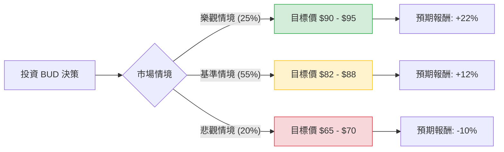

這份分析報告結合了您提供的基本面數據，以及針對 **Anheuser-Busch InBev (BUD)** 的最新市場動態（如 2024 年財報表現、美國市場復甦進度、全球體育賽事贊助效果等）進行的綜合評估。

---

### 一、 核心假設與市場背景分析

在構建決策樹之前，我們基於最新資訊設定以下核心假設：

1.  **美國市場復甦（Bud Light 事件後續）：** 2023 年的抵制事件影響已進入尾聲，雖然市佔率尚未完全恢復，但銷量下滑已趨於平緩。
2.  **全球增長引擎：** 拉丁美洲（巴西、墨西哥）與歐洲市場表現強勁，足以抵消美國市場的部分疲軟。
3.  **財務去槓桿化：** 公司持續利用強大的自由現金流（P/FCF 11.7）償還債務，這對高利率環境下的估值修復至關重要。
4.  **大型賽事效應：** 2024 年為奧運年，BUD 作為全球贊助商，預期在 Q3、Q4 有較強的行銷推動力。
5.  **估值修復：** 目前 Forward P/E 為 15.93，低於歷史平均與同業（如 Heineken），具備補漲空間。

---

### 二、 決策樹分析 (Decision Tree)

以下為投資 BUD 一年期的預期情境分析：

#### 節點詳細說明：

1.  **樂觀情境 (Bull Case) - 25% 機率：**
    *   **條件：** 美國市佔率超預期回升；拉丁美洲銷量雙位數增長；原物料成本大幅下降。
    *   **預期報酬：** 股價達到分析師目標價上限，加上 1.6% 股息，總報酬約 **+22%**。
2.  **基準情境 (Base Case) - 55% 機率：**
    *   **條件：** 美國市場維持穩定；全球銷量小幅增長；公司持續去槓桿化，估值回歸至 Forward P/E 18x。
    *   **預期報酬：** 股價接近平均目標價 $88，總報酬約 **+12%**。
3.  **悲觀情境 (Bear Case) - 20% 機率：**
    *   **條件：** 全球經濟衰退導致消費降級；美國市場再度面臨品牌危機；債務償還進度受阻。
    *   **預期報酬：** 股價回測 52 週低點支撐位，總報酬約 **-10%**。

---

### 三、 期望值分析 (Expected Value Analysis)

#### 1. 計算過程
期望值 (EV) = (機率1 × 報酬1) + (機率2 × 報酬2) + (機率3 × 報酬3)

*   **EV = (0.25 × 22%) + (0.55 × 12%) + (0.20 × -10%)**
*   **EV = 5.5% + 6.6% - 2.0%**
*   **EV = 10.1%**

#### 2. 數據支持與財務指標解讀
*   **獲利能力：** 營業利益率 (Oper. Margin) 高達 25.36%，顯示其在產業中具備極強的定價權與成本控制能力。
*   **成長潛力：** 明年預期 EPS 增長 11.53%，與 PEG 1.27 相符，顯示目前股價並未過度泡沫。
*   **技術面：** 股價目前高於 SMA20, 50, 200，顯示短期與長期趨勢均偏向多頭。
*   **風險點：** Current Ratio (0.72) 偏低，顯示短期流動性略緊，但考慮到其穩定的現金流（P/FCF 11.7），違約風險極低。

---

### 四、 最終結論

**判斷：適合投資 (Buy / Overweight)**

#### 理由：
1.  **正向期望值：** 經過加權計算，一年期的預期報酬率為 **10.1%**。雖然不是爆發型成長股，但在民生必需品板塊中，這是一個非常穩健的預期回報。
2.  **風險回報比優異：** 基準與樂觀情境合計佔 80% 的機率，顯示上行空間遠大於下行風險。
3.  **基本面修復：** BUD 最糟糕的時期（2023 年抵制事件與高通膨）已經過去。目前的 Forward P/E 15.93 顯著低於其 5 年平均值，具備「估值修復」的投資邏輯。
4.  **技術面支撐：** 股價已突破所有均線，且距離 52 週高點僅約 7%，顯示市場信心正在回籠。

**建議操作：**
目前股價 $75.76 接近合理區間。若能在 $72 - $74 區間逢低布局，可進一步提高期望值並增加安全邊際。目標價設定在 **$88.44**（分析師共識目標）。