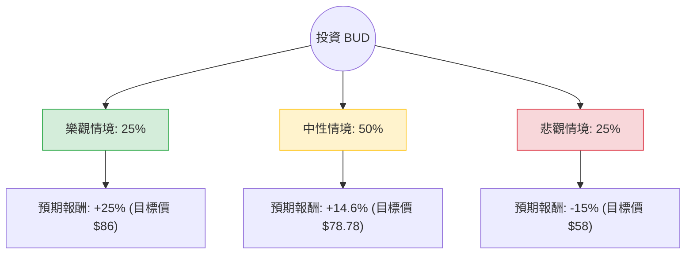

這份分析報告將結合您提供的基本面數據與最新的市場動態（包含 2024 年第二季財報表現、中國市場疲軟、美國市場復甦進度及債務削減狀況），利用**決策樹（Decision Tree）**與**期望值分析（Expected Value Analysis）**評估 **Anheuser-Busch InBev (BUD)** 的投資價值。

---

### 一、 核心假設與市場背景分析

在構建決策樹前，我們基於最新資訊設定以下核心假設：

1.  **美國市場復甦（權重：中）**：Bud Light 爭議的影響正在消退，但市佔率回升緩慢。公司正透過大規模行銷（如奧運贊助）試圖奪回失地。
2.  **中國市場壓力（權重：高）**：最新財報顯示中國銷量因消費疲軟而下滑，這對 BUD 的高端化戰略（Premiumization）構成威脅。
3.  **財務去槓桿（權重：高）**：BUD 持續利用強勁的自由現金流（P/FCF 僅 10.22）償還債務。目前 Debt/Eq 為 0.94，雖有改善但仍需關注利息支出。
4.  **估值水平**：目前 Forward P/E 為 16.32，低於歷史平均與同業（如 Heineken），顯示市場已部分反映利空。

---

### 二、 決策樹分析圖 (Decision Tree)

我們將未來一年的表現分為三種情境：**樂觀（Bull）**、**中性（Base）**、**悲觀（Bear）**。

---

### 三、 期望值計算過程

#### 1. 情境參數設定

| 情境 | 發生機率 (P) | 預期報酬率 (R) | 核心觸發因素 |
| :--- | :--- | :--- | :--- |
| **樂觀 (Bull)** | 25% | **+25%** | 美國市佔完全恢復、中國經濟刺激奏效、原物料成本大幅下降。 |
| **中性 (Base)** | 50% | **+14.6%** | 達到分析師平均目標價 ($78.78)。美國市場穩定，債務持續削減。 |
| **悲觀 (Bear)** | 25% | **-15%** | 中國消費持續低迷、美國品牌形象再度受挫、高利率環境導致債務壓力增加。 |

#### 2. 期望值 (Expected Value, EV) 計算

$$EV = (P_{Bull} \times R_{Bull}) + (P_{Base} \times R_{Base}) + (P_{Bear} \times R_{Bear})$$

*   **樂觀貢獻**：$0.25 \times 25\% = 6.25\%$
*   **中性貢獻**：$0.50 \times 14.6\% = 7.3\%$
*   **悲觀貢獻**：$0.25 \times (-15\%) = -3.75\%$

**總期望報酬率 = $6.25\% + 7.3\% - 3.75\% = 9.8\%$**

---

### 四、 綜合基本面評估

*   **盈利能力**：ROE 8.97% 偏低，但 EPS Q/Q 增長 51.83% 顯示獲利動能正在反彈。
*   **現金流與債務**：P/FCF 10.22 顯示現金流極其強勁，這是 BUD 抵禦風險的最強盾牌。儘管 Current Ratio (0.64) 偏低，但作為大型必需消費品公司，其再融資能力強。
*   **技術面**：股價目前高於 SMA20、50、200，顯示短期與長期趨勢均偏向多頭。
*   **估值**：PEG 1.54 顯示相對於其 15% 的預期增長，目前股價處於合理區間，並未過度高估。

---

### 五、 最終結論

#### **判斷：適合投資 (Moderate Buy)**

**理由如下：**

1.  **正向期望值**：計算出的期望報酬率為 **9.8%**，優於目前的無風險利率（美債殖利率），且具備追趕標普 500 平均報酬的潛力。
2.  **估值修復空間**：目前股價 ($68.72) 距離分析師目標價 ($78.78) 仍有約 14.6% 的上行空間。Forward P/E 16.32 具備防禦性。
3.  **最壞情況已過**：美國 Bud Light 事件的基期已低，未來同比數據將趨於美化；雖然中國市場是變數，但強大的自由現金流足以支撐其在低迷期持續去槓桿並支付股息。
4.  **技術面支撐**：股價已突破所有主要均線，顯示市場信心正在回流。

**建議操作策略：**
*   **進場點**：目前價格可分批佈局。
*   **風險監控**：需密切關注中國區銷量數據（下一季財報）以及美國大選期間是否再次引發文化戰爭相關的品牌抵制。若股價跌破 $60 (悲觀情境觸發點)，應重新評估投資邏輯。