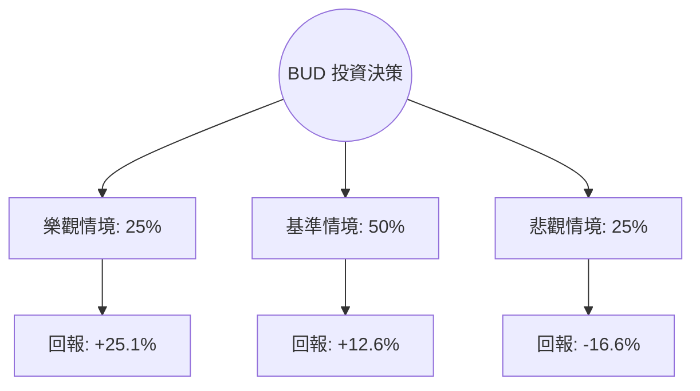

# BUD (Anheuser-Busch InBev) 投資價值量化分析報告

作為量化投資分析師，針對 **BUD** 的當前數據與市場動態，我將透過機率模型與期望值（Expected Value, EV）框架進行深度拆解。

---

### 1. 核心驅動因素與風險 (Drivers & Risks)

#### **關鍵催化劑 (Catalysts)**
1.  **資產負債表去槓桿化與信用評級提升**：BUD 持續致力於減少債務（目前 Debt/Eq 為 0.84）。隨著淨債務/EBITDA 比率接近 2.5x 的目標，利息支出將顯著下降，且可能觸發信用評級上調，進而降低融資成本並釋放更多現金流用於股票回購。
2.  **利潤率擴張與高端化策略**：儘管銷量在部分市場承壓，但透過「高端化」（Premiumization）策略（如 Michelob Ultra, Stella Artois），公司毛利率維持在 55.93% 的高水準。若大宗商品成本（鋁、大麥）進一步回落，營運利潤率（目前 25.36%）具備上行空間。
3.  **美國市場份額修復與新興市場增長**：Bud Light 事件的負面影響已逐步鈍化。若美國市場份額回升速度超預期，加上拉美與非洲市場的強勁內需增長，將帶動 EPS 超預期表現。

#### **主要風險點 (Risks)**
1.  **匯率波動風險**：BUD 很大一部分收入來自新興市場（如巴西、墨西哥、南非）。若美元持續走強，將對換算後的營收與利潤產生負面衝擊。
2.  **消費降級壓力**：在全球通膨壓力下，若消費者從高端啤酒轉向廉價品牌或替代品（如烈酒或無酒精飲料），其高端化策略將面臨挑戰。
3.  **原材料成本反彈**：能源與包裝成本若因地緣政治因素再度飆升，將直接侵蝕利潤空間。

---

### 2. 情境設定與機率賦予 (Scenario Modeling)

基於目前股價 $83.96 與分析師平均目標價 $94.42，設定未來 12 個月的三種情境：

#### **樂觀情境 (Bull Case)**
*   **發生條件**：美國市場份額完全恢復；去槓桿速度超預期導致大規模回購啟動；新興市場銷量雙位數增長。
*   **預估機率**：25%
*   **目標價格與預期回報**：**$105.00 (+25.1%)**。基於 Forward P/E 回升至 20x（歷史均值上方）及 EPS 增長超預期。

#### **基準情境 (Base Case)**
*   **發生條件**：業務穩健增長，利潤率小幅改善；債務按計畫削減；美國市場維持現狀不再惡化。
*   **預估機率**：50%
*   **目標價格與預期回報**：**$94.50 (+12.6%)**。符合目前市場共識目標價，反映 Forward P/E 約 18x。

#### **悲觀情境 (Bear Case)**
*   **發生條件**：全球經濟衰退導致消費大幅萎縮；匯率劇烈波動；美國品牌形象再度受損。
*   **預估機率**：25%
*   **目標價格與預期回報**：**$70.00 (-16.6%)**。回測 52 週低點附近的支撐位，反映估值收縮至 P/E 15x。

---

### 3. 期望值計算與決策樹 (EV Calculation & Decision Tree)

#### **決策樹結構**

#### **總期望值計算**
*   `EV = (0.25 * 25.1%) + (0.50 * 12.6%) + (0.25 * -16.6%)`
*   `EV = 6.275% + 6.3% - 4.15% = 8.425%`

#### **風險回報比分析**
*   **上行潛力 (Upside)**：$105.00 - $83.96 = $21.04
*   **下行空間 (Downside)**：$83.96 - $70.00 = $13.96
*   **風險回報比 (Risk/Reward Ratio)**：1 : 1.51。這顯示每承擔 1 單位的風險，預期可獲得 1.51 單位的回報，具備正向不對稱性。

---

### 4. 決策總結 (Decision Summary)

| 情境 | 發生機率 (%) | 預期報酬率 (%) | 關鍵驅動/觸發因素 |
| :--- | :--- | :--- | :--- |
| **樂觀 (Bull)** | 25% | +25.1% | 美國份額全面收復、信用評級上調、強勢回購 |
| **基準 (Base)** | 50% | +12.6% | 穩定的利潤率擴張、債務有序削減、符合預期的 EPS |
| **悲觀 (Bear)** | 25% | -16.6% | 匯率逆風、全球消費衰退、原材料成本飆升 |
| **整體期望值** | **100%** | **+8.43%** | **具備正期望值的穩健配置標的** |

**最終結論：**
1.  **投資建議**：**買入 (Buy)**
2.  **核心邏輯**：BUD 目前的期望值為 +8.43%，且風險回報比為 1.51，顯示下行風險已在很大程度上被市場消化（52W Low 具備強支撐）。隨著 Forward P/E 僅 17.01x，低於行業平均與自身歷史均值，去槓桿帶來的估值修復（Re-rating）是未來 12 個月最核心的獲利邏輯。
3.  **風控建議**：若股價跌破 **$75.00**（跌破 SMA200 且接近悲觀情境邊界），應重新評估基本面是否發生結構性惡化（如債務削減停滯）；若跌破 **$70.00** 則應執行強制止損。