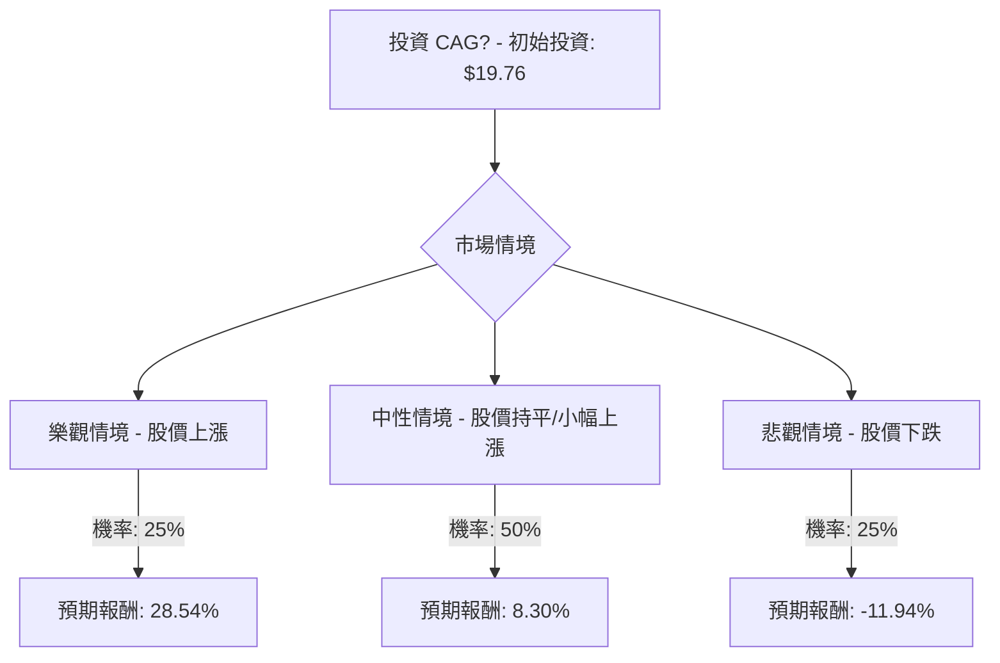

根據對 Conagra Brands Inc. (CAG) 的基本面數據、最新新聞、財報、市場動態和產業趨勢的綜合評估，以下是使用決策樹分析和期望值分析對其目前是否適合投資的評估。

### **核心假設**

在進行決策樹分析之前，我們建立以下核心假設：

*   **市場假設**：消費品行業，特別是包裝食品領域，面臨通脹壓力、消費者對價格敏感度提高以及轉向自有品牌產品的趨勢。然而，該行業通常被視為防禦性行業，需求相對穩定。
*   **財務假設**：Conagra Brands 將在未來一年內努力實現其財政年度 2026 年的指引，即有機淨銷售額變化在 -1% 至 1% 之間，調整後營業利潤率在 11.0% 至 11.5% 之間，調整後每股收益在 1.70 美元至 1.85 美元之間。公司將繼續專注於債務削減和營運效率。
*   **產業趨勢假設**：公司將透過創新（例如，健康食品、植物性產品）和增加行銷投入來應對不斷變化的消費者偏好和激烈的競爭。供應鏈問題預計將持續改善。
*   **股息假設**：公司將維持每股 0.35 美元的季度股息，即每年 1.40 美元。儘管報告的每股收益為負導致派息率異常高，但穩健的自由現金流預計將支持股息支付。

### **決策樹分析**

**當前股價 (Close):** $19.76
**年度股息:** $1.40 (基於每季度 $0.35)

我們將考慮未來一年的三種情境：樂觀、中性、悲觀。

#### **節點詳情與計算過程**

**1. 樂觀情境 (Optimistic Scenario)**
*   **預測情境名稱**：市場復甦與公司表現優異
*   **情境描述**：Conagra 成功執行其創新策略，有效提升市場份額，行銷投入帶來顯著回報，有機銷售額和利潤率超出預期。債務削減進展順利。股價達到分析師預期的高端或略高。
*   **預期股價**：$24.00 (參考分析師最高目標價 $26.00 並考慮強勁表現)
*   **預期報酬 (Return)**：
    *   資本利得 = 預期股價 - 當前股價 = $24.00 - $19.76 = $4.24
    *   總報酬 = 資本利得 + 年度股息 = $4.24 + $1.40 = $5.64
    *   預期報酬率 = 總報酬 / 當前股價 = $5.64 / $19.76 ≈ 0.2854 或 **28.54%**
*   **機率 (Probability)**：25% (考慮到當前市場挑戰和分析師普遍「持有」的評級，此情境發生機率較低)

**2. 中性情境 (Neutral Scenario)**
*   **預測情境名稱**：符合預期與穩定發展
*   **情境描述**：Conagra 達到其財政年度 2026 年的指引，有機銷售額持平或略有增長，調整後營業利潤率保持穩定。公司在應對通脹和競爭方面表現平穩。股價維持在當前水平或略有波動，符合分析師的平均目標價。
*   **預期股價**：$20.00 (參考分析師平均目標價約 $18.86 - $21.00，取接近當前股價且略有上漲的數值)
*   **預期報酬 (Return)**：
    *   資本利得 = 預期股價 - 當前股價 = $20.00 - $19.76 = $0.24
    *   總報酬 = 資本利得 + 年度股息 = $0.24 + $1.40 = $1.64
    *   預期報酬率 = 總報酬 / 當前股價 = $1.64 / $19.76 ≈ 0.0830 或 **8.30%**
*   **機率 (Probability)**：50% (大多數分析師給予「持有」評級，且公司重申了財測，此情境發生機率最高)

**3. 悲觀情境 (Pessimistic Scenario)**
*   **預測情境名稱**：市場逆風與業績下滑
*   **情境描述**：通脹壓力加劇，消費者轉向更便宜的替代品，導致有機銷售額大幅下滑，利潤率受到嚴重擠壓。公司未能達到財測，可能出現新的資產減值。股價跌至分析師預期的低端或更低。
*   **預期股價**：$16.00 (參考分析師最低目標價 $16.00 以及近期股價曾觸及 52 週低點 $15.96)
*   **預期報酬 (Return)**：
    *   資本利得 = 預期股價 - 當前股價 = $16.00 - $19.76 = -$3.76
    *   總報酬 = 資本利得 + 年度股息 = -$3.76 + $1.40 = -$2.36
    *   預期報酬率 = 總報酬 / 當前股價 = -$2.36 / $19.76 ≈ -0.1194 或 **-11.94%**
*   **機率 (Probability)**：25% (部分分析師給予「賣出」或「減持」評級，且公司面臨多重挑戰，此情境發生機率不容忽視)

#### **整體期望值計算**

整體期望值 (Expected Value) = (樂觀情境報酬率 × 樂觀情境機率) + (中性情境報酬率 × 中性情境機率) + (悲觀情境報酬率 × 悲觀情境機率)

整體期望值 = (0.2854 × 0.25) + (0.0830 × 0.50) + (-0.1194 × 0.25)
整體期望值 = 0.07135 + 0.0415 - 0.02985
整體期望值 = 0.0830

因此，CAG 在未來一年的**整體期望報酬率約為 8.30%**。

### **最終結論**

根據決策樹分析和期望值分析，美股公司 CAG **目前適合投資**。

**理由**：
儘管 Conagra Brands 面臨銷售額下降、通脹壓力以及分析師普遍持「持有」甚至「減持」的謹慎態度，但其高達 7.09% 的年度股息率 在很大程度上支撐了其正向的整體期望報酬率 (8.30%)。公司管理層重申了 2026 財年的業績指引，並在第二季度調整後每股收益超出預期，顯示出在挑戰性環境下的韌性。此外，公司在創新和市場份額提升方面也取得了一些進展，特別是在冷凍食品和零食領域。

然而，投資者應意識到潛在的風險，包括宏觀經濟逆風、消費者轉向低價產品以及持續的利潤壓力。儘管如此，對於尋求穩定股息收入且能承受一定資本波動的投資者而言，CAG 仍具有吸引力。其穩健的自由現金流被認為足以支持目前的股息支付。