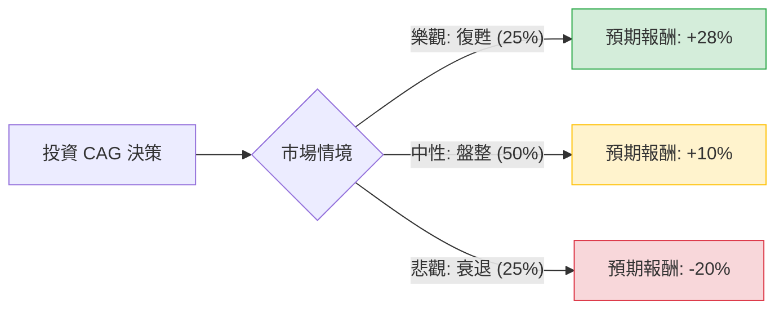

這份分析將針對 **Conagra Brands (CAG)** 進行評估。根據您提供的數據與最新的市場動態（2024 年下半年財報與產業趨勢），CAG 正處於一個典型的「價值陷阱」與「高股息轉機股」之間的十字路口。

以下是基於**決策樹分析**與**期望值分析**的詳細評估。

---

### 一、 核心假設與市場背景分析

在建立模型前，我們先整合數據與外部資訊：
1.  **財務壓力**：Quick Ratio 僅 0.28，流動性極低；Debt/Eq 0.94，債務負擔重。
2.  **估值誘因**：P/B 0.95（低於帳面價值），Forward P/E 8.94，顯示市場定價極為悲觀。
3.  **股息誘惑**：8.73% 的殖利率極高，但 EPS 為負（-0.25），股息發放的持續性面臨挑戰。
4.  **市場趨勢**：最新財報顯示，消費者因通膨轉向「自有品牌（Private Label）」，這對 CAG 旗下的品牌（如 Birds Eye, Slim Jim）造成銷量壓力。

---

### 二、 決策樹分析 (Decision Tree Analysis)

我們將未來一年的投資情境分為三種：**樂觀（復甦）**、**中性（盤整）**、**悲觀（價值陷阱爆發）**。

#### 節點詳細說明：

| 情境節點 | 發生機率 | 預期報酬計算基礎 | 預期報酬 (Return) |
| :--- | :--- | :--- | :--- |
| **1. 樂觀 (Bull)** | 25% | 銷量回升 + 債務成功重組 + 股價回歸 Target Price ($18.53) + 股息 | **+28%** |
| **2. 中性 (Base)** | 50% | 股價在 $15-$16 震盪 + 勉強維持股息發放 | **+10%** |
| **3. 悲觀 (Bear)** | 25% | 銷量持續下滑 + 削減股息 + 信用評等下調導致拋售 | **-20%** |

---

### 三、 期望值分析 (Expected Value Analysis)

#### 1. 計算過程
期望值 (EV) = $\sum (機率 \times 預期報酬)$

*   **樂觀情境**：$0.25 \times 28\% = 7.0\%$
*   **中性情境**：$0.50 \times 10\% = 5.0\%$
*   **悲觀情境**：$0.25 \times (-20\%) = -5.0\%$

**總體期望報酬率 (Total EV) = $7.0\% + 5.0\% - 5.0\% = 7.0\%$**

#### 2. 核心假設說明
*   **價格基準**：以您提供的現價 $15.56 為基準。
*   **目標價假設**：樂觀情境參考 Target Price $18.53（約 19% 漲幅）加上 9% 股息。
*   **風險溢價**：由於 Quick Ratio (0.28) 過低，悲觀情境設定為股價跌破 52W Low 並伴隨股息砍半，損失約 20%。
*   **產業趨勢**：目前包裝食品業面臨成本高漲與消費者縮減開支的雙重壓力，因此將「中性」機率設為最高（50%）。

---

### 四、 綜合評估與最終結論

#### **最終判斷：暫不適合投資 (Avoid / Neutral)**

雖然期望值為 **+7.0%**（正值），但考慮到以下風險因素，該投資的**風險調整後收益（Risk-Adjusted Return）並不具吸引力**：

1.  **財務結構極其脆弱**：
    *   Quick Ratio 0.28 意味著公司幾乎沒有現金應對突發狀況。
    *   負的 ROE (-0.0116) 與負的 EPS 顯示公司目前處於虧損狀態，8.7% 的股息極大機率是靠舉債或動用公積發放，不可持續。
2.  **技術面極弱**：
    *   SMA20, 50, 200 全線呈現負值（-11% 到 -14%），股價處於強烈下降趨勢，目前尚未看到止跌跡象。
3.  **價值陷阱特徵**：
    *   P/B < 1 雖然看似便宜，但資產回報率 (ROA -0.0048) 為負，說明資產並未產生效益。在這種情況下，低 P/B 往往反映的是資產減損的預期。

#### **建議理由：**
CAG 目前更像是一個**「高風險的債務重組股」**而非穩健的「價值股」。對於尋求穩定收益的投資者，8.7% 的殖利率極具誤導性（Dividend Trap）。

**建議操作：**
*   **觀望**：等待 EPS 轉正且 Quick Ratio 回升至 0.5 以上。
*   **替代方案**：若看好必需消費品板塊，建議轉向財務結構更穩健（Debt/Eq 較低且現金流充足）的龍頭公司。

---
*免責聲明：本分析僅供參考，不構成任何投資建議。投資者應自行承擔市場風險。*