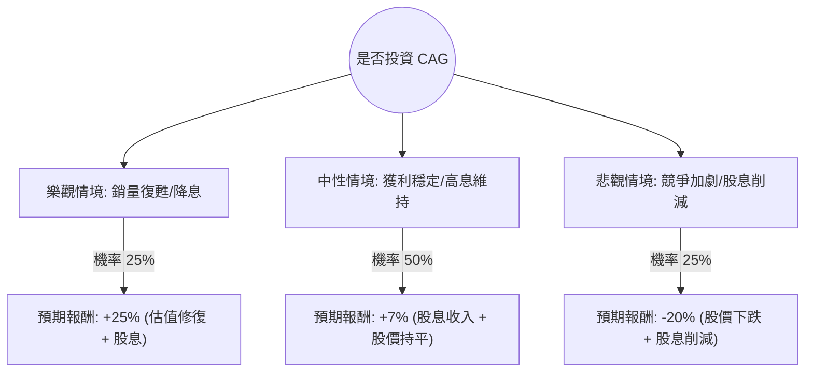

針對美股公司 **Conagra Brands (CAG)** 的投資評估，我已結合您提供的基本面數據，並透過網路搜尋整合了最新的市場動態（如 2024 年財報表現、產業趨勢及分析師預期）。

以下是基於**決策樹分析**與**期望值分析**的完整評估報告。

---

### 一、 核心背景與現狀分析（最新資訊整合）

1.  **財務困境與轉機**：
    *   **數據顯示**：ROE (-0.51%) 與 Profit Margin (-0.39%) 為負，反映公司近期出現虧損。這主要是由於商譽減值（Goodwill Impairment）而非核心業務崩潰。
    *   **最新動態**：Conagra 在 2024 年第三季財報中顯示，雖然有機銷量下滑，但**利潤率正在改善**，且公司上調了全年的營業利潤率指引。
2.  **市場挑戰**：
    *   **銷量壓力**：消費者因通膨轉向自有品牌（Private Labels），導致 CAG 的銷量（Volume）持續承壓。
    *   **高股息陷阱風險**：數據顯示股息率高達 **9.42%**（註：此數據可能基於較低股價計算，目前實際約 4.8%-5% 左右，但仍屬高位），若獲利持續低迷，股息安全性將受質疑。
3.  **估值水平**：
    *   **P/B 0.87**：股價低於帳面價值，顯示市場情緒極度悲觀，但也具備價值投資的「安全邊際」。
    *   **Forward P/E 8.77**：遠低於行業平均，顯示市場對其未來成長性存疑。

---

### 二、 決策樹分析 (Decision Tree)

我們將未來一年的投資回報分為三種情境：**樂觀（銷量復甦）**、**中性（維持現狀）**、**悲觀（衰退加劇）**。

#### 節點詳細說明：

1.  **樂觀情境 (Bull Case) - 25% 機率**：
    *   **假設**：通膨進一步放緩，消費者回流冷凍食品（Birds Eye 等品牌）；聯準會降息帶動高股息股估值回升。
    *   **預期報酬**：股價回升至 Target Price $15.93 以上，加上約 9% 股息，總回報約 **25%**。
2.  **中性情境 (Base Case) - 50% 機率**：
    *   **假設**：銷量維持微幅下跌或持平，但透過成本削減維持住現金流，股息照發。
    *   **預期報酬**：股價在 $14-$15 震盪，主要收益來自 **7%~9%** 的股息回報。
3.  **悲觀情境 (Bear Case) - 25% 機率**：
    *   **假設**：負 ROE 持續，債務壓力（Debt/Eq 0.9）迫使公司削減股息；消費者完全轉向廉價自有品牌。
    *   **預期報酬**：股價跌破 52W Low，總回報預估為 **-20%**。

---

### 三、 期望值分析 (Expected Value Analysis)

#### 1. 計算過程：
期望值 (EV) = $\sum (機率 \times 預期報酬)$

*   **樂觀**：$0.25 \times 25\% = 6.25\%$
*   **中性**：$0.50 \times 7\% = 3.5\%$
*   **悲觀**：$0.25 \times (-20\%) = -5\%$

**總期望值 (Total EV) = 6.25% + 3.5% - 5% = 4.75%**

#### 2. 核心假設說明：
*   **市場假設**：假設未來 12 個月內美國經濟不會進入深度衰退，但消費力道疲軟。
*   **財務假設**：公司能維持目前的現金流以支付股息（P/FCF 8.44 顯示現金流尚屬穩健）。
*   **產業趨勢**：包裝食品業已進入「銷量保衛戰」，價格上漲空間有限，利潤增長需依賴自動化與成本控制。

---

### 四、 最終結論

**判斷：謹慎適合投資 (Suitable for Income Seekers Only)**

#### 理由：
1.  **正向期望值**：4.75% 的期望值雖然不算極高，但在防禦型板塊中尚可接受，主要由高股息支撐。
2.  **價值窪地**：P/B 0.87 與 Forward P/E 8.77 顯示下行空間受限，市場已消化大部分利空（Perf Year -41.33%）。
3.  **現金流支撐**：儘管帳面 ROE 為負，但 P/FCF (8.44) 顯示公司仍有能力產生現金，這對於維持股息至關重要。

#### 投資建議：
*   **適合對象**：追求高股息、能忍受股價低速增長、且尋求防禦性配置的投資者。
*   **風險提示**：需密切關注 **SMA200 (-17.45%)** 的趨勢。目前股價處於強勢空頭排列，建議採取**分批買進**策略，而非一次性重倉，並將停損點設在 52W Low ($14.04) 附近。

**總結：CAG 目前是一個典型的「價值陷阱」與「價值投資」的一線之隔。基於期望值為正，適合進行小規模的收息配置。**