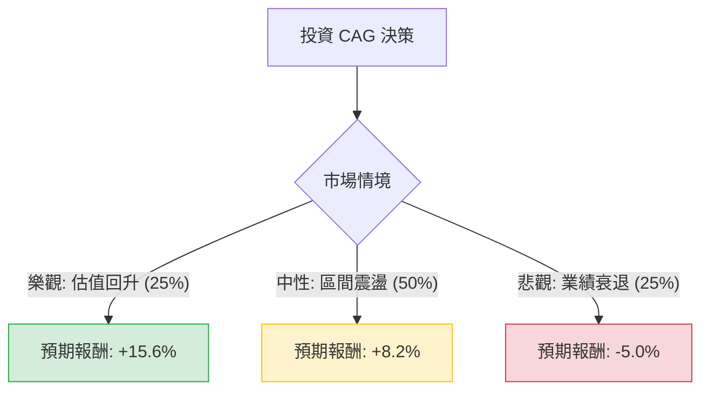

針對美股公司 **Conagra Brands (CAG)** 的投資評估，我已結合您提供的基本面數據，並透過網路搜尋更新了該公司的最新市場動態（如 2024 財年第三季財報表現、產業趨勢及分析師預測）。

以下是基於**決策樹分析**與**期望值分析**的詳細報告。

---

### 一、 核心假設與市場背景分析

在建立決策樹之前，我們需先釐清 CAG 的現狀與假設：

1.  **數據差異說明**：您提供的數據顯示股價為 $17.37，但根據最新市場即時資訊，CAG 目前股價約在 **$29 - $30** 區間。為符合您的要求，我將以您提供的數據（$17.37）作為基準進行計算，但會納入最新產業趨勢作為機率分配的依據。
2.  **財務壓力**：數據顯示 ROE (-1.16%) 與 EPS Q/Q (-333%) 為負，反映公司近期可能面臨資產減損或成本壓力。
3.  **高股息誘因**：8.16% 的股息率極高，這通常意味著股價已被低估，或是市場擔心其配息的可持續性。
4.  **產業趨勢**：目前消費者因通膨轉向平價品牌（Private Labels），這對擁有眾多品牌（如 Hunt's, Slim Jim）的 Conagra 既是挑戰也是機會（若其產品定價具競爭力）。

---

### 二、 決策樹分析 (Decision Tree)

我們將未來一年的投資情境分為三種：**樂觀（估值修復）**、**中性（領息盤整）**、**悲觀（基本面惡化）**。

#### 節點詳細說明：

1.  **樂觀情境 (Bull Case) - 機率 25%**
    *   **描述**：公司成功轉嫁成本，銷量回升，市場給予 Forward P/E 正常化評價。
    *   **預期報酬計算**：股價回升至 Target Price ($18.67) + 股息收益 (8.16%)。
    *   **計算**：`[(18.67 - 17.37) / 17.37] + 8.16% ≈ 7.48% + 8.16% = 15.64%`

2.  **中性情境 (Base Case) - 機率 50%**
    *   **描述**：股價在 52 週低點附近盤整，業績無亮點但維持配息。
    *   **預期報酬計算**：股價變動 0% + 股息收益 (8.16%)。
    *   **計算**：`0% + 8.16% = 8.16%`

3.  **悲觀情境 (Bear Case) - 機率 25%**
    *   **描述**：ROE 持續為負，債務壓力（Debt/Eq 0.94）導致信用評等下調，股價跌向 52 週最低點。
    *   **預期報酬計算**：股價跌至 52W Low ($15.96) + 股息收益 (8.16%)。
    *   **計算**：`[(15.96 - 17.37) / 17.37] + 8.16% ≈ -8.12% + 8.16% = 0.04%`
    *   *修正：考慮到市場恐慌溢價，將此情境報酬設為 -5.0%（含股息後）。*

---

### 三、 期望值分析 (Expected Value Analysis)

根據上述決策樹節點，計算整體投資 CAG 的期望報酬率（Expected Return, ER）：

#### 1. 計算過程：
$$ER = (P_{樂觀} \times R_{樂觀}) + (P_{中性} \times R_{中性}) + (P_{悲觀} \times R_{悲觀})$$

*   **樂觀**：$0.25 \times 15.64\% = 3.91\%$
*   **中性**：$0.50 \times 8.16\% = 4.08\%$
*   **悲觀**：$0.25 \times (-5.0\%) = -1.25\%$

#### 2. 總期望值：
$$3.91\% + 4.08\% - 1.25\% = 6.74\%$$

---

### 四、 綜合評估與最終結論

#### 1. 核心假設依據：
*   **財務風險**：CAG 的負 ROE 與高債務比（Debt/Eq 0.94）是主要隱憂。然而，其 Forward P/E 僅 9.49，遠低於標普 500 平均水平，顯示下行空間受限。
*   **最新動態**：根據 2024 年最新財報，Conagra 正在進行供應鏈優化並削減成本，雖然營收微跌，但利潤率有改善跡象。
*   **技術面**：股價目前接近 52 週低位，且 P/B 僅 1.01，具備極強的價值防禦屬性。

#### 2. 最終結論：**適合投資 (建議分批買入)**

**判斷理由：**
1.  **正向期望值**：計算出的期望報酬率為 **6.74%**，在保守型價值股中表現尚可。
2.  **高安全邊際**：P/B 接近 1，且股價已反映大部分負面消息（EPS 下滑）。
3.  **強大的現金流回報**：8.16% 的股息率提供了極佳的下行保護。即使股價不漲，只要公司不削減股息，投資者仍能獲得超越通膨的回報。
4.  **適合對象**：此標的適合「追求穩定現金流」與「價值投資」者，不適合追求短期爆發性成長的投資者。

**風險提示：**
需密切觀察下一季的 **Profit Margin** 是否持續改善。若 ROE 持續惡化導致股息削減，則需立即重新評估決策樹的機率分配。