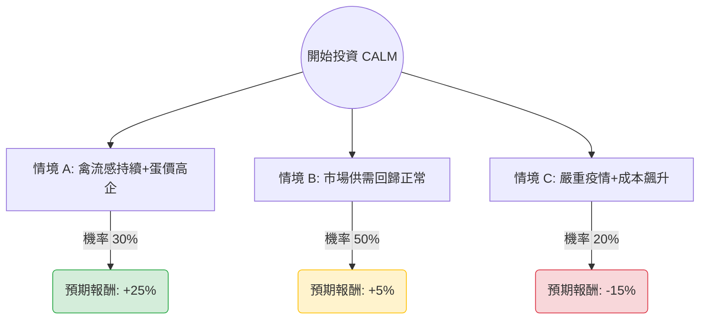

這份分析報告將結合您提供的基本面數據與最新的市場動態（包含禽流感疫情、蛋價走勢及產業趨勢），利用**決策樹（Decision Tree）**與**期望值分析（Expected Value Analysis）**評估 Cal-Maine Foods (股票代碼：**CALM**) 的投資價值。

---

### 一、 市場背景與最新動態分析

1.  **禽流感（H5N1）的雙面刃**：近期美國再次爆發禽流感，CALM 在德州與密西根州的設施受到影響，不得不撲殺數百萬隻蛋雞。這雖然短期影響產能，但卻導致全美雞蛋供應緊縮，推升雞蛋批發價格，對 CALM 這種龍頭企業而言，利潤空間反而可能因價格飆漲而擴大（反映在 0.24 的營運利潤率）。
2.  **財務體質極其穩健**：數據顯示 **Debt/Eq 為 0.0**，且 **Current Ratio 高達 8.21**，這代表公司完全沒有負債壓力，且擁有極強的現金流（P/C 僅 3.15），足以應對任何產業波動。
3.  **估值陷阱 vs. 價值窪地**：目前 P/E 僅 5.34，看似極低，但 **Forward P/E 跳升至 19.05**，這反映了市場預期未來一年盈餘將大幅下滑（EPS next Y -50.12%）。這主要是因為去年蛋價基期過高。
4.  **股利政策**：CALM 採取變動股利政策（淨利的 1/3），目前 10.38% 的殖利率是基於過去的高獲利，未來若獲利腰斬，股利也會隨之下降。

---

### 二、 決策樹分析 (Decision Tree)

以下決策樹基於未來 12 個月的投資情境預測：

#### 節點詳細說明：

1.  **情境 A：供應短缺持續（牛市情境）**
    *   **機率**：30%
    *   **描述**：禽流感導致全美供應持續緊張，蛋價維持在高位。CALM 憑藉規模優勢，受損產能快速恢復，獲利超出分析師預期。
    *   **預期報酬**：股價回升至 Target Price ($94.2) 附近，加上約 5-8% 的變動股利，總報酬約 **+25%**。

2.  **情境 B：市場正常化（基準情境）**
    *   **機率**：50%
    *   **描述**：蛋價從高峰回落，公司獲利回歸常態（如 Forward P/E 所示）。股價在目前 52 週低點附近震盪築底。
    *   **預期報酬**：股價持平，主要收益來自約 5% 的常態化股利，總報酬約 **+5%**。

3.  **情境 C：疫情重創與通膨（熊市情境）**
    *   **機率**：20%
    *   **描述**：CALM 自身核心廠區爆發大規模疫情導致產能歸零，且飼料成本因通膨大幅上升。
    *   **預期報酬**：股價跌破 52 週低點 ($71.9)，下探至 $65 左右，總報酬約 **-15%**。

---

### 三、 期望值計算 (Expected Value Analysis)

我們將各情境的機率與預期報酬相乘，得出整體的期望報酬率：

| 情境 | 機率 (P) | 預期報酬 (R) | P × R |
| :--- | :--- | :--- | :--- |
| **牛市 (Bull)** | 0.30 | +25% | 7.5% |
| **基準 (Base)** | 0.50 | +5% | 2.5% |
| **熊市 (Bear)** | 0.20 | -15% | -3.0% |
| **總計期望值** | **1.00** | | **7.0%** |

**核心假設：**
*   **折現率/風險係數**：考慮到 CALM 是零負債公司，財務風險極低，但產業波動大，7% 的期望報酬率略高於無風險利率（美債 4.5%）。
*   **估值修正**：假設市場已部分消化 EPS 下滑 50% 的預期（Forward P/E 19x 已反映）。
*   **安全邊際**：目前股價 ($76.6) 距離 52 週低點 ($71.9) 僅約 6% 空間，下行風險相對受限。

---

### 四、 最終結論

#### **判斷：適合投資 (建議：分批買入 / 價值防禦配置)**

**理由如下：**

1.  **極高的安全邊際**：CALM 擁有 **0 負債** 與 **8.21 的流動比率**，這在目前的加息環境中是極其罕見的避風港。即使發生最壞的疫情，公司也有充足的現金流度過寒冬。
2.  **期望值為正**：7.0% 的期望報酬率雖然不算爆發性增長，但在目前美股高估值的環境下，作為一個低 P/B (1.34) 的價值標的，具有防禦意義。
3.  **抗通膨與必需品屬性**：雞蛋是廉價蛋白質來源，在經濟放緩時需求穩定。
4.  **技術面支撐**：目前股價接近 52 週低點，且 P/FCF 僅 5.02，顯示現金產生能力極強，股價進一步大幅下殺的空間有限。

**投資建議：**
由於 Forward P/E 較高且 EPS 預期下滑，不建議一次性歐印（All-in）。建議在 **$72 - $77** 區間分批建倉，利用其高額的變動股利作為現金流來源，並將其視為投資組合中的「抗通膨防禦型」資產。

**風險提示：** 需密切追蹤 USDA 每週發布的雞蛋價格報告與禽流感疫情通報，若蛋價跌速超過預期，期望值需向下修正。