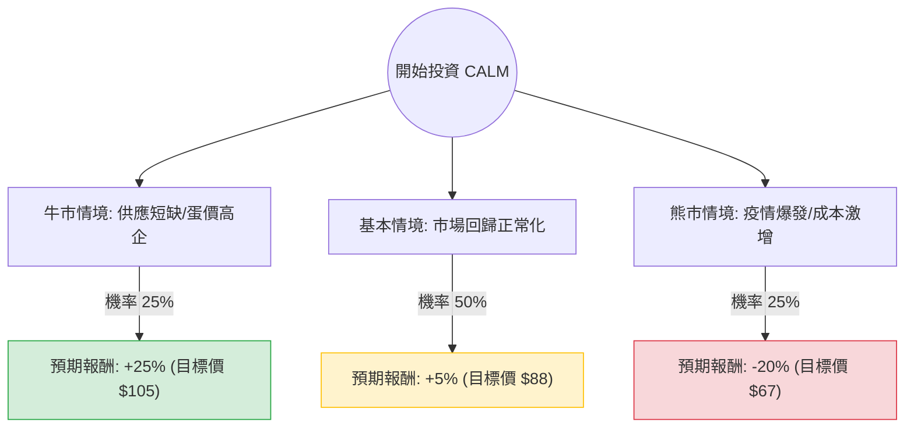

針對美股最大的雞蛋生產商 **Cal-Maine Foods (股票代碼：CALM)**，我結合了您提供的基本面數據以及最新的市場動態（包含禽流感疫情、蛋價走勢及財報預期）進行深度分析。

---

### 一、 市場現況與核心假設分析

在建立決策樹之前，我們必須釐清 CALM 目前面臨的關鍵變數：

1.  **禽流感 (HPAI) 的雙面刃**：禽流感會導致供應減少、蛋價飆升（如 2023 年），這對未受災的生產商是利多；但若 CALM 自身的設施受災（如 2024 年 4 月德州廠爆發），則會面臨減產與成本損失。
2.  **估值陷阱警示**：目前 **P/E 僅 3.71** 看似極低，但 **Forward P/E 高達 21.68**，這反映市場預期未來一年獲利將大幅衰退（EPS next Y 預期衰退 47%）。
3.  **財務體質極佳**：**Debt/Eq 為 0**，流動比率高達 8.02，這表示公司有極強的抗風險能力與併購潛力。
4.  **股利政策**：CALM 採取變動股利政策（淨利的 1/3），因此 9.06% 的殖利率是「過去式」，未來若獲利下滑，股利將顯著縮水。

---

### 二、 決策樹分析 (Decision Tree Analysis)

我們以未來 12 個月的投資報酬率為目標，設定三種主要情境：

#### 1. 牛市情境 (Bull Case) - 機率 25%
*   **假設**：全美禽流感持續擴散但 CALM 成功防疫，導致雞蛋供應持續吃緊，蛋價維持在高位。
*   **預期報酬**：股價挑戰歷史高點，加上潛在的特別股利，預期總報酬約 **+25%**。

#### 2. 基本情境 (Base Case) - 機率 50%
*   **假設**：蛋價從高峰回落至歷史平均水平，飼料成本（玉米、大豆）保持穩定。公司獲利回歸常態，EPS 如預期修正。
*   **預期報酬**：股價在目前價位震盪，緩步向分析師目標價 $92.8 靠攏，扣除波動後預期總報酬約 **+5%**。

#### 3. 熊市情境 (Bear Case) - 機率 25%
*   **假設**：CALM 自身主要產區爆發大規模疫情需撲殺蛋雞，或市場競爭加劇導致蛋價崩盤。
*   **預期報酬**：獲利大幅縮減，股利停發，股價回測 52 週低點，預期總報酬約 **-20%**。

---

### 三、 期望值計算 (Expected Value Analysis)

根據上述情境，我們計算投資 CALM 的期望報酬率：

| 情境 | 預期報酬 (R) | 發生機率 (P) | 加權期望值 (R × P) |
| :--- | :--- | :--- | :--- |
| **牛市情境** | +25% | 0.25 | +6.25% |
| **基本情境** | +5% | 0.50 | +2.50% |
| **熊市情境** | -20% | 0.25 | -5.00% |
| **總計期望值** | | **1.00** | **+3.75%** |

**計算過程：**
$EV = (25\% \times 0.25) + (5\% \times 0.50) + (-20\% \times 0.25) = 6.25\% + 2.5\% - 5\% = 3.75\%$

---

### 四、 核心假設與風險評估

1.  **商品週期性**：CALM 是典型的週期性股票。目前的低 P/E 是因為正處於獲利週期的頂峰（或剛過頂峰），投資者必須警惕「均值回歸」。
2.  **技術面壓力**：SMA200 為 -6.36%，顯示長期趨勢仍偏弱，股價處於整理區間。
3.  **空方勢力**：Short Float 高達 12.21%，顯示市場上有大量資金在賭蛋價下跌或公司獲利不如預期。

---

### 五、 最終結論

#### **判斷：不適合現在大舉買入 (觀望或少量配置)**

**理由：**
1.  **期望值過低**：計算出的期望報酬率僅為 **3.75%**，遠低於目前美股大盤的平均預期報酬，且風險（波動率）極高。
2.  **獲利衰退預期**：Forward P/E (21.68) 遠高於 Current P/E (3.71)，這是一個經典的信號，顯示公司最輝煌的獲利時刻可能已過。
3.  **股利不確定性**：雖然數據顯示 9% 殖利率，但這是基於過去高獲利計算的。隨著 EPS Q/Q 下滑 52%，未來的股利發放將大幅縮水。
4.  **缺乏催化劑**：除非再次爆發全國性的大規模禽流感導致蛋價失控，否則 CALM 缺乏推動股價突破 $100 的新動能。

**建議：**
*   **現有持股者**：可考慮在股價接近 Target Price ($92.8) 時逢高減碼。
*   **空手者**：建議等待蛋價週期底部，或 P/E 隨獲利修正完畢後再行考慮。若追求高殖利率，目前有更多配息穩定的標的（如電信或基礎設施類股）優於受商品價格波動巨大的 CALM。