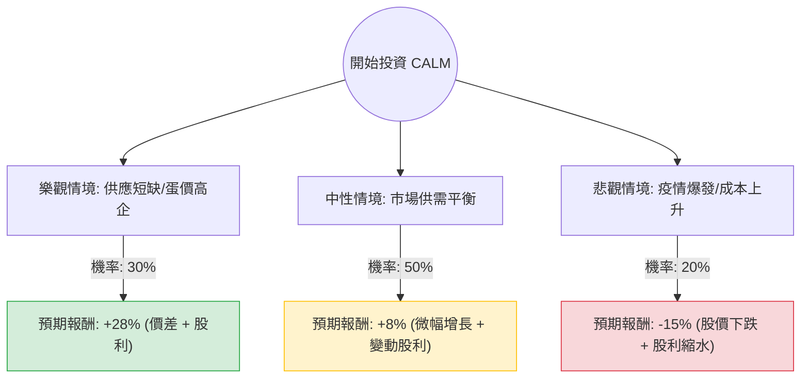

這份分析報告將結合您提供的基本面數據，以及針對 **Cal-Maine Foods (股票代碼：CALM)** 的最新市場動態（如禽流感 HPAI 影響、雞蛋價格走勢及公司股利政策）進行綜合評估。

---

### 1. 決策樹分析 (Decision Tree Analysis)

我們將未來一年的投資情境分為三種：**樂觀（供應短缺推升金價）**、**中性（市場回歸常態）**、**悲觀（疫情重創產能）**。

---

### 2. 核心假設與計算過程

#### A. 核心假設 (Assumptions)
1.  **禽流感 (HPAI) 的雙面刃**：CALM 是美國最大蛋商。若同業爆發禽流感而 CALM 倖免，蛋價飆升將帶來暴利（如 2023 年初）；若 CALM 自身設施受損（如 2024 年 4 月德州廠案例），則產能受創。
2.  **股利政策**：CALM 採取「變動股利政策」（發放當季淨利的 1/3）。目前的 11.4% 是基於過去一年的高獲利，**未來極可能隨獲利正常化而下降**。
3.  **估值陷阱**：目前 P/E 3.23 倍看似極低，但 Forward P/E 卻跳升至 16.82 倍，顯示市場預期未來一年 EPS 將大幅衰退（數據顯示 EPS next Y 為 -44.6%）。

#### B. 情境參數設定
*   **樂觀情境 (30%)**：
    *   原因：HPAI 導致全美雞蛋供應持續緊張，蛋價維持高位。
    *   預期股價：回升至 Target Price $92 (約 +19%)。
    *   預期股利：獲利維持高檔，發放約 9% 股利。
    *   **總報酬 = 28%**。
*   **中性情境 (50%)**：
    *   原因：蛋價回歸歷史均值，飼料成本（玉米、大豆）穩定。
    *   預期股價：維持在 $80 附近 (約 +3.7%)。
    *   預期股利：獲利腰斬，股利降至約 4-5%。
    *   **總報酬 = 8%**。
*   **悲觀情境 (20%)**：
    *   原因：CALM 自身爆發大規模疫情需撲殺蛋雞，或消費者因高通膨轉向廉價蛋白質替代品。
    *   預期股價：跌至 52W 低點 $68 附近 (約 -12%)。
    *   預期股利：因虧損或獲利微薄，暫停或僅發放 1-2% 股利。
    *   **總報酬 = -15%**。

#### C. 期望值 (Expected Value, EV) 計算
$$EV = (P_{Bull} \times R_{Bull}) + (P_{Base} \times R_{Base}) + (P_{Bear} \times R_{Bear})$$
$$EV = (0.30 \times 0.28) + (0.50 \times 0.08) + (0.20 \times -0.15)$$
$$EV = 0.084 + 0.04 - 0.03 = 0.094$$
**最終期望報酬率 = 9.4%**

---

### 3. 綜合分析與最新動態補充

1.  **財務體質極佳**：Debt/Eq 為 0.0，Current Ratio 高達 8.02。這意味著 CALM 有極強的抗風險能力，即便遇到產業寒冬也不會倒閉。
2.  **技術面疲軟**：SMA20, 50, 200 均線皆為負值（-4% 到 -20%），顯示股價處於空頭排列，短期內缺乏上攻動能。
3.  **最新新聞影響**：2024 年第二季以來，美國多地再次偵測到禽流感，CALM 曾暫時關閉德州部分廠房。這解釋了為何股價近期表現（Perf Year -30.5%）如此低迷。

---

### 4. 最終結論

**判斷：適合投資 (但僅限於「價值防禦型」或「波段操作」，不建議長期無腦持有)**

#### 理由：
1.  **期望值為正 (9.4%)**：雖然獲利預期下修，但目前股價已反映大部分利空（接近 52W 低點），且 9.4% 的期望報酬仍優於現金儲蓄。
2.  **下行風險有撐**：公司帳上現金充裕（P/C 3.2），且無負債，1.35 的 P/B 值顯示股價已接近清算價值的安全邊際。
3.  **博弈禽流感溢價**：CALM 是一種「波動率對沖」工具。當市場因疫情恐慌導致蛋價大漲時，它是少數能直接受益的標的。

**建議操作策略：**
*   **進場點**：目前 $77 接近支撐位，可分批布局。
*   **風險警示**：不要被 11% 的殖利率誤導，應以 Forward P/E 16x 作為估值基準。若蛋價持續走低，股利將大幅縮水。
*   **適合對象**：尋求資產配置多樣化、能忍受商品循環波動的投資者。