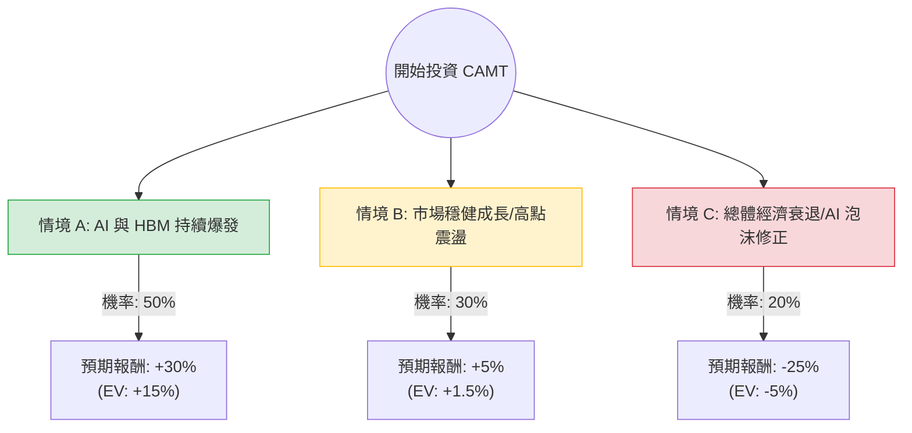

針對美股 **Camtek Ltd. (CAMT)** 的投資評估，我結合了您提供的基本面數據以及最新的市場動態（包含 2024 年第一季財報表現與 AI 產業趨勢）進行分析。

---

### 一、 核心背景與市場動態分析

在進入決策樹之前，我們先釐清影響 CAMT 股價的關鍵因素：

1.  **AI 與 HBM 需求爆發**：Camtek 是半導體封裝檢測設備領導者。目前 AI 晶片（如 NVIDIA H100/B200）大量使用 **HBM（高頻寬記憶體）** 與 **Chiplet（小晶片）** 技術，這類先進封裝對檢測的需求遠高於傳統晶片。
2.  **財務表現**：
    *   **Forward P/E (44.62)** 遠低於 **Trailing P/E (167.74)**，顯示市場預期未來一年盈餘將大幅成長。
    *   **Q1 2024 財報**：營收與 EPS 均超預期，且公司上調了未來指引，預計 2024 年將是創紀錄的一年。
3.  **技術面**：股價接近 52 週高點（$150），SMA20/50/200 均呈現多頭排列，顯示強勁動能。
4.  **風險**：估值偏高（P/S 13.98），且對單一產業（半導體先進封裝）依賴度高。

---

### 二、 決策樹分析 (Decision Tree)

以下根據未來 12 個月的市場情境進行模擬：

#### 節點詳細說明：

1.  **情境 A：AI 與 HBM 持續爆發 (Bull Case)**
    *   **機率**：50%
    *   **描述**：NVIDIA、SK Hynix、美光持續擴大 HBM 產能，Camtek 訂單能見度看到 2025 年。
    *   **預期報酬**：+30% (目標價約 $187)
2.  **情境 B：市場穩健成長 / 高點震盪 (Base Case)**
    *   **機率**：30%
    *   **描述**：AI 需求符合預期，但高估值限制了漲幅，股價隨大盤緩步推升或在 $140-$160 區間震盪。
    *   **預期報酬**：+5% (目標價約 $151)
3.  **情境 C：總體經濟衰退 / AI 泡沫修正 (Bear Case)**
    *   **機率**：20%
    *   **描述**：聯準會降息延後導致科技股估值修正，或 AI 投資回報率受質疑，導致半導體設備支出縮減。
    *   **預期報酬**：-25% (回測至 SMA200 約 $108 附近)

---

### 三、 期望值分析 (Expected Value Analysis)

#### 1. 計算過程：
期望值 (EV) = Σ (各情境機率 × 各情境報酬率)

*   **EV** = (0.50 × 30%) + (0.30 × 5%) + (0.20 × -25%)
*   **EV** = 15% + 1.5% - 5%
*   **EV = 11.5%**

#### 2. 核心假設：
*   **市場假設**：假設 AI 基礎設施建設在未來 12 個月內不會停止，且 HBM 產能缺口依然存在。
*   **財務假設**：Camtek 的 Forward P/E 能維持在 40-45 倍之間，且 EPS 成長率能達到市場預期的 30% 以上。
*   **產業趨勢**：先進封裝（Advanced Packaging）是半導體產業中成長最快的子領域，Camtek 擁有技術護城河。

---

### 四、 最終結論

#### **判斷：適合投資 (建議：分批買入 / 逢回加碼)**

#### **理由：**
1.  **正向期望值**：計算出的期望報酬率為 **11.5%**，在當前高利率環境下仍具吸引力。
2.  **產業紅利**：Camtek 處於 AI 產業鏈的「賣鏟子」地位。無論哪家晶片商勝出，只要使用 HBM 或先進封裝，都需要 Camtek 的檢測設備。
3.  **成長性抵銷估值風險**：雖然目前 P/E 高達 167，但 Forward P/E 降至 44，顯示其盈餘爆發力極強。Q/Q 營收成長 12.15% 且毛利高達 50.36%，顯示其議價能力強。
4.  **技術面強勢**：股價站穩所有均線之上，且 Short Float (12%) 雖不低，但也代表若股價突破高點，可能引發軋空行情。

#### **投資建議與風險提示：**
*   **進場策略**：由於目前股價接近歷史高點且 RSI 可能偏高，不建議一次性歐印（All-in）。建議在股價回測 **SMA20 (約 $135-$140)** 附近分批佈局。
*   **風險監控**：需密切關注 NVIDIA 財報以及 HBM 三大廠（三星、SK海力士、美光）的資本支出計畫。若 AI 需求放緩，CAMT 作為高估值成長股，回撤幅度會大於大盤。