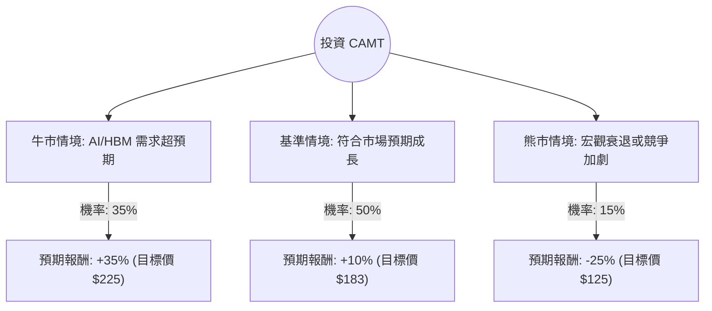

這份分析報告將結合您提供的財務數據與最新的市場動態（特別是 AI 浪潮下的 HBM 高頻寬記憶體需求），利用**決策樹（Decision Tree）**與**期望值分析（Expected Value Analysis）**來評估 Camtek Ltd. (CAMT) 的投資價值。

---

### 1. 核心背景與市場動態分析

在進入計算前，我們先整合最新的市場資訊：
*   **產業定位**：CAMT 是半導體封裝檢測設備領導者，核心增長動力來自 **HBM (High Bandwidth Memory)** 與 **Advanced Packaging (先進封裝)**。
*   **最新利多**：2024 年第一季財報顯示營收與 EPS 均超預期，且公司上調了全年展望。受惠於 NVIDIA 等 AI 晶片對 HBM 的強勁需求，CAMT 的訂單能見度已達 2024 年底。
*   **估值壓力**：目前 P/E 高達 164.3，但 **Forward P/E 僅為 35.16**，這顯示市場預期未來一年獲利將有爆發性成長（EPS next Y 預計增長 26.17%）。

---

### 2. 決策樹分析 (Decision Tree)

我們以未來 **12 個月** 為投資期限，設定三種情境：

#### 節點詳細說明：

1.  **牛市情境 (Bull Case) - 35% 機率**：
    *   **條件**：AI 伺服器需求持續井噴，HBM 產能擴張速度快於預期，CAMT 獲得更多一線晶圓代工廠訂單。
    *   **預期報酬**：+35%。基於 Forward P/E 重新評價至 45 倍。
2.  **基準情境 (Base Case) - 50% 機率**：
    *   **條件**：公司達到目前的財務指引，HBM 需求穩健。
    *   **預期報酬**：+10%。接近分析師平均目標價 $173.83，並考慮到小幅溢價。
3.  **熊市情境 (Bear Case) - 15% 機率**：
    *   **條件**：美國經濟硬著陸導致半導體資本支出縮減，或競爭對手（如 KLA）推出更具競爭力的先進封裝檢測方案。
    *   **預期報酬**：-25%。股價回測 SMA200（約 $120-$125 區間）。

---

### 3. 期望值計算 (Expected Value Calculation)

#### A. 核心假設：
*   **現價 ($P_0$)**：$166.70
*   **牛市目標價**：$225 (基於強勁 EPS 增長與估值維持)
*   **基準目標價**：$183 (參考 Target Price $173.83 並加上近期訂單利多)
*   **熊市目標價**：$125 (技術面支撐位)

#### B. 計算過程：
期望報酬率 ($E[R]$) 計算公式：
$$E[R] = \sum (P_i \times R_i)$$
其中 $P_i$ 為機率，$R_i$ 為該情境報酬率。

1.  **牛市貢獻**：$0.35 \times 35\% = 12.25\%$
2.  **基準貢獻**：$0.50 \times 10\% = 5.00\%$
3.  **熊市貢獻**：$0.15 \times (-25\%) = -3.75\%$

**總期望報酬率 ($E[R]$)** = $12.25\% + 5.00\% - 3.75\% = \mathbf{13.5\%}$

**期望價值 (Expected Value)** = $\$166.70 \times (1 + 13.5\%) = \mathbf{\$189.20}$

---

### 4. 綜合評估與最終結論

#### 數據亮點分析：
*   **財務健康度**：Current Ratio 8.35 且 Quick Ratio 7.31，顯示公司現金極其充裕，具備極強的抗風險能力與研發投入能力。
*   **成長動能**：雖然目前 P/E 164 顯得昂貴，但 PEG 2.09 在高成長科技股中尚屬合理範圍。EPS Q/Q 與 Sales Q/Q 均維持正成長。
*   **技術面**：股價目前在 SMA50 之上，但略低於 SMA20，顯示短期處於高檔震盪盤整，正在消化過去一年 131% 的漲幅。

#### 最終結論：適合投資 (建議：分批買入)

**判斷理由：**
1.  **期望值為正**：13.5% 的預期報酬率優於多數標普 500 成分股，且期望價格 ($189.20) 高於目前市價。
2.  **AI 剛需**：CAMT 處於 AI 產業鏈的「賣鏟子」地位。只要 HBM 需求不減，其檢測設備就是台積電、海力士等大廠的必需品。
3.  **風險可控**：極高的流動性比率（Quick Ratio 7.31）確保了即使市場環境惡化，公司也不會有生存危機。

**投資建議：**
由於目前股價接近 52 週高點且 P/E 較高，建議**不要一次性全倉投入**。可在股價回調至 SMA50（約 $163 附近）或更低時分批佈局，以降低成本風險。

---
*免責聲明：本分析僅供參考，不構成投資建議。美股投資具有高風險，請根據自身風險承受能力做出決策。*