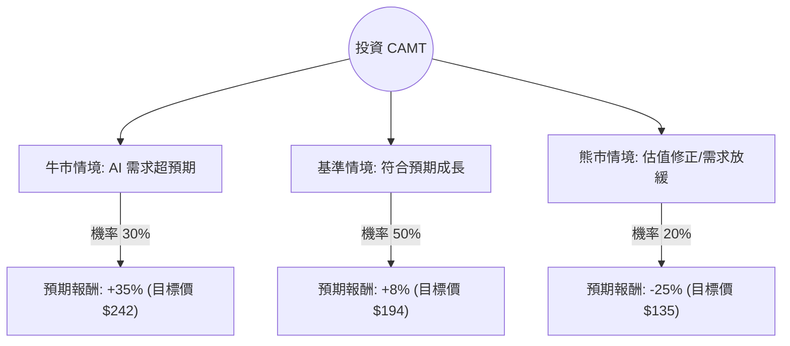

這份分析報告將針對 **Camtek Ltd. (CAMT)** 進行深入評估。Camtek 是半導體封裝檢測設備的領導者，受惠於當前 AI 浪潮（特別是 HBM 高頻寬記憶體與先進封裝 Chiplet 技術）。

以下結合您提供的數據與最新的市場動態（截至 2024 年中）進行決策樹與期望值分析。

---

### 一、 核心假設與市場動態分析

在建立決策樹前，我們先設定核心假設：

1.  **AI 需求持續性（關鍵驅動力）：** CAMT 的增長高度依賴於 HBM（High Bandwidth Memory）的產能擴張。NVIDIA、SK Hynix 與美光（Micron）的擴產直接帶動 CAMT 的檢測設備需求。
2.  **估值壓力：** 目前 P/E 高達 196 倍，雖然 Forward P/E 降至 41 倍，顯示市場預期明年盈餘將大幅成長，但當前股價已超越分析師平均目標價 ($174.67)，短期存在回調風險。
3.  **競爭與技術：** CAMT 在先進封裝檢測領域具有強大競爭力，毛利率（50.46%）穩定，財務結構極其健康（Current Ratio 8.35）。

---

### 二、 決策樹分析 (Decision Tree)

我們以 **未來 12 個月** 的投資回報為目標，設定三種情境：

#### 節點詳細說明：

1.  **牛市情境 (Bull Case) - 30% 機率：**
    *   **前提：** AI 伺服器需求持續爆發，HBM4 提前進入量產準備，CAMT 訂單能見度看到 2025 年底。
    *   **預期報酬：** 股價突破歷史高點，受惠於 EPS 增長與估值維持高位。
    *   **期望值貢獻：** $0.30 \times 35\% = 10.5\%$

2.  **基準情境 (Base Case) - 50% 機率：**
    *   **前提：** 公司達到 EPS next year 25.3% 的成長目標，但由於目前股價已反映大部分利多，估值倍數（P/E）隨市場利率環境小幅下修。
    *   **預期報酬：** 股價隨盈餘緩步上升，接近分析師高端目標價。
    *   **期望值貢獻：** $0.50 \times 8\% = 4\%$

3.  **熊市情境 (Bear Case) - 20% 機率：**
    *   **前提：** 半導體週期性疲軟，或 AI 投資過熱出現泡沫化質疑。高達 12.24% 的空單比例（Short Float）發動攻擊，股價回測 SMA200（目前約 $120-$130 區間）。
    *   **預期報酬：** 估值大幅修正。
    *   **期望值貢獻：** $0.20 \times (-25\%) = -5\%$

---

### 三、 期望值計算 (Expected Value Analysis)

根據上述決策樹，我們計算整體投資的預期報酬率（Expected Return, E(R)）：

$$E(R) = (P_{Bull} \times R_{Bull}) + (P_{Base} \times R_{Base}) + (P_{Bear} \times R_{Bear})$$

**計算過程：**
1.  牛市：$0.30 \times 0.35 = 0.105$
2.  基準：$0.50 \times 0.08 = 0.040$
3.  熊市：$0.20 \times (-0.25) = -0.050$

**總計：**
$$E(R) = 0.105 + 0.040 - 0.050 = 0.095 = 9.5\%$$

---

### 四、 綜合評估與最終結論

#### 1. 數據亮點與隱憂
*   **優勢：** 財務極其穩健（Quick Ratio 7.31），幾乎沒有債務壓力（Debt/Eq 0.86 且多為長期）。EPS 下一年度預期增長 25.3%，顯示基本面強勁。
*   **劣勢：** 股價已高於平均目標價（$179.78 > $174.67），且 P/S 高達 16.61，這在硬體設備股中屬於極高水平。
*   **技術面：** 股價遠高於 SMA200 (48.95%)，顯示短期過熱，有技術性回調壓力。

#### 2. 最終判斷：**適合投資（但建議「分批買入」或「等待回調」）**

**理由：**
*   **期望值為正 (9.5%)**：雖然目前股價偏高，但 AI 驅動的先進封裝是未來 2-3 年的剛性需求，CAMT 作為細分市場龍頭，其溢價具有支撐。
*   **盈餘轉折點**：Forward P/E (41.24) 遠低於 Trailing P/E (196)，代表公司正處於獲利爆發期。
*   **風險控管建議**：由於 Short Float (12.24%) 較高且股價處於高位，不建議在此刻一次性歐印（All-in）。較佳策略是在股價回測 SMA20 或 SMA50（約 $160-$170 區間）時分批佈局。

**總結：**
CAMT 是一間**基本面極佳但估值昂貴**的公司。基於 9.5% 的正期望值與 AI 產業的長線趨勢，該股適合尋求成長性的投資者，但需忍受短期可能的高波動。