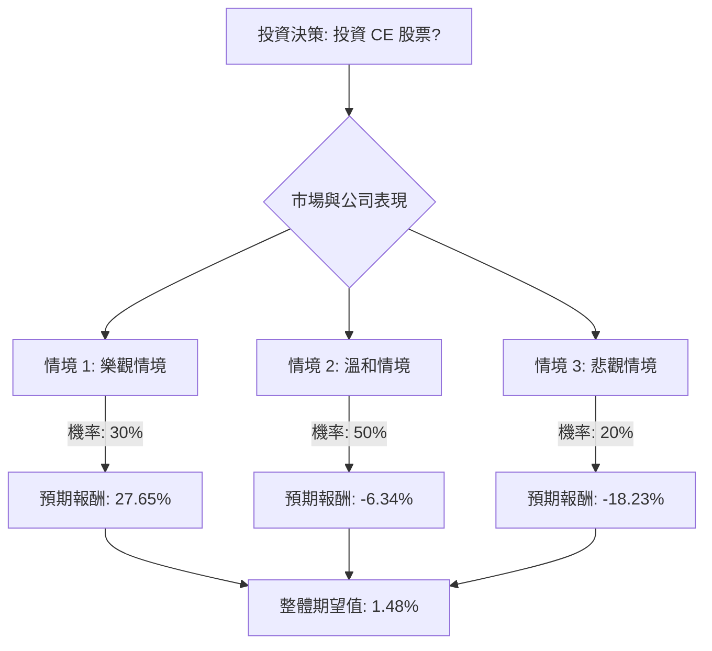

為了評估美股公司 Celanese Corporation (CE) 目前是否適合投資，我們將結合其基本面數據、最新市場資訊，並運用決策樹分析與期望值分析。

### 核心假設

在進行決策樹分析之前，我們基於收集到的資訊建立以下核心假設：

*   **市場趨勢：** 全球化學產業預計將經歷複雜的復甦。汽車和電子等部分終端市場可能出現改善跡象，但建築和非醋酸纖維素產品等市場仍將面臨挑戰。電動車市場的「後熱潮」現實將在短期內持續，但 2026 年仍有可能反彈。Celanese 在美國的低成本醋酸鹽優勢提供了對歐洲競爭對手缺乏的原料成本對沖。
*   **公司財務與營運：** Celanese 將持續專注於透過資產剝離（如 Micromax 業務已完成出售）和債務償還來去槓桿化。成本優化措施和 DuPont M&M 收購案的協同效應實現對未來盈利能力至關重要。管理層預計 2026 年每股盈餘 (EPS) 將增長 1-2 美元，即使在「持平需求」的環境下，這在溫和情境下是可實現的。 公司預計自由現金流為 7-8 億美元。
*   **債務風險：** 超過 100 億美元的高額債務負擔仍然是一個重大問題，影響著信用評級和借貸成本。S&P Global 已於 2025 年 11 月將其信用評級下調至 BB（非投資級）。 然而，公司專注於產生自由現金流對債務削減是積極的。
*   **分析師情緒：** 分析師普遍給予「持有」評級，平均目標價約在當前股價附近或略低，反映出謹慎但非完全負面的展望。

### 決策樹分析

我們將考慮未來 12-18 個月內 Celanese 股票的三種主要情境：樂觀、溫和與悲觀。

**當前股價 (P0) = $58.85**
**年度股息 = $0.12 ($0.03/季)**

#### 節點計算與情境說明：

**1. 樂觀情境 (Optimistic Scenario)**
*   **預測情境名稱：** 市場強勁復甦與公司成功執行策略
*   **機率 (Probability)：** 30%
    *   **核心假設：** 宏觀經濟顯著復甦，特別是汽車和電子行業需求回升。公司成功實現 DuPont M&M 收購案的協同效應目標（4.5 億美元），並有效去槓桿化。成本控制和產品提價措施效果顯著。電動車市場加速反彈。
*   **預期未來股價 (P1_Opt)：** $75.00 (基於 52 週高點 $70.51 及部分分析師較高預期，約 27% 上漲空間)
*   **預期報酬 (Expected Return)：**
    *   報酬率 = ((P1_Opt - P0) + 年度股息) / P0
    *   報酬率 = (($75.00 - $58.85) + $0.12) / $58.85
    *   報酬率 = ($16.15 + $0.12) / $58.85 = $16.27 / $58.85 ≈ 0.2765 或 **27.65%**
*   **期望值 (Expected Value)：** 0.30 * 27.65% = **8.295%**

**2. 溫和情境 (Moderate Scenario)**
*   **預測情境名稱：** 市場緩慢改善與公司穩健執行策略
*   **機率 (Probability)：** 50%
    *   **核心假設：** 終端市場持續面臨挑戰但逐步穩定。公司在去槓桿化和實現協同效應方面取得穩健進展，但速度可能不如預期。EPS 增長落在管理層指導範圍的低端。分析師普遍維持「持有」評級。
*   **預期未來股價 (P1_Mod)：** $55.00 (接近分析師平均目標價 $55.44 及提示中給出的目標價 $52.22，約 6.5% 下跌空間)
*   **預期報酬 (Expected Return)：**
    *   報酬率 = ((P1_Mod - P0) + 年度股息) / P0
    *   報酬率 = (($55.00 - $58.85) + $0.12) / $58.85
    *   報酬率 = (-$3.85 + $0.12) / $58.85 = -$3.73 / $58.85 ≈ -0.0634 或 **-6.34%**
*   **期望值 (Expected Value)：** 0.50 * -6.34% = **-3.17%**

**3. 悲觀情境 (Pessimistic Scenario)**
*   **預測情境名稱：** 市場衰退與公司執行面臨挑戰
*   **機率 (Probability)：** 20%
    *   **核心假設：** 全球經濟陷入衰退或關鍵終端市場長期疲軟。公司未能充分實現協同效應或剝離資產。高額債務導致借貸成本進一步上升，或出現新的資產減值。PFAS 相關訴訟風險加劇。
*   **預期未來股價 (P1_Pes)：** $48.00 (高於分析師最低目標價 $40.00 和 52 週低點 $35.13，約 18.4% 下跌空間)
*   **預期報酬 (Expected Return)：**
    *   報酬率 = ((P1_Pes - P0) + 年度股息) / P0
    *   報酬率 = (($48.00 - $58.85) + $0.12) / $58.85
    *   報酬率 = (-$10.85 + $0.12) / $58.85 = -$10.73 / $58.85 ≈ -0.1823 或 **-18.23%**
*   **期望值 (Expected Value)：** 0.20 * -18.23% = **-3.646%**

#### 整體期望值計算：

整體期望值 = (樂觀情境期望值) + (溫和情境期望值) + (悲觀情境期望值)
整體期望值 = 8.295% + (-3.17%) + (-3.646%)
整體期望值 = **1.479%**

### 最終結論

根據決策樹分析和期望值計算，Celanese (CE) 股票在未來 12-18 個月內的**整體期望值為 1.48%**。

**判斷：不適合投資**

**理由：**
儘管整體期望值為正，但 1.48% 的預期報酬率相對較低，未能充分補償投資 Celanese 所面臨的風險。該公司目前背負著高額債務（超過 100 億美元），信用評級為非投資級，且其主要終端市場（如汽車和建築）仍面臨挑戰。雖然公司積極進行去槓桿化、成本控制和資產剝離，且管理層預計 2026 年 EPS 將增長，但這些利好因素在溫和情境下僅能帶來微薄甚至負的報酬。分析師普遍的「持有」評級和平均目標價接近當前股價也反映了市場的謹慎態度。 考慮到其固有的周期性風險和高槓桿，1.48% 的預期報酬率不足以吸引尋求更高風險調整後回報的投資者。因此，目前不建議投資 CE 股票。