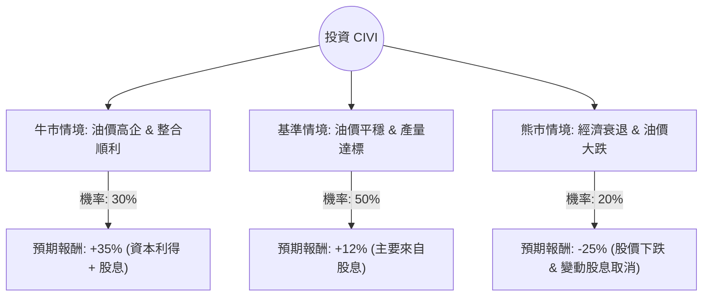

這份報告針對 **Civitas Resources, Inc. (股票代碼：CIVI)** 進行決策樹與期望值分析。Civitas 是美國科羅拉多州最大的油氣生產商之一，近期透過併購積極擴張至二疊紀盆地（Permian Basin）。

---

### 一、 核心假設與背景資訊（截至 2024 年中）

在進行分析前，我們先彙整 CIVI 的關鍵基本面與市場動態：

1.  **資產轉型**：CIVI 已從單一的 DJ 盆地生產商轉型為跨足 DJ 與 Permian 盆地的多元化生產商。
2.  **財務政策**：該公司以高股息（固定+變動股息）與股份回購著稱，目前的年化殖利率通常維持在 8%-12% 之間。
3.  **油價敏感度**：獲利高度依賴 WTI 原油價格。損益平衡點約在 $40-$45/bbl 左右。
4.  **估值**：目前本益比（P/E）約在 7-9 倍，低於能源板塊平均，顯示市場對其併購後的債務與整合仍有疑慮。

---

### 二、 決策樹分析（Decision Tree）

我們預測未來一年的投資情境，分為「牛市（樂觀）」、「基準（平穩）」與「熊市（悲觀）」。

#### 決策樹節點詳細說明：

| 情境節點 | 發生機率 | 預期報酬 (Total Return) | 核心假設說明 |
| :--- | :--- | :--- | :--- |
| **牛市 (Bull)** | 30% | **+35%** | WTI 均價 > $85。Permian 盆地產量超預期，債務快速償還，市場給予估值修復（Re-rating）。 |
| **基準 (Base)** | 50% | **+12%** | WTI 均價維持 $70-$80。產量符合預期，維持高額股息發放，股價隨大盤波動。 |
| **熊市 (Bear)** | 20% | **-25%** | 全球經濟衰退，WTI < $60。變動股息停發，高槓桿收購的債務壓力浮現，股價遭拋售。 |

---

### 三、 期望值計算過程（Expected Value Analysis）

期望值（EV）計算公式：
$$EV = \sum (機率 \times 預期報酬)$$

**計算步驟：**
1.  **牛市貢獻**：$30\% \times 35\% = 10.5\%$
2.  **基準貢獻**：$50\% \times 12\% = 6.0\%$
3.  **熊市貢獻**：$20\% \times (-25\%) = -5.0\%$

**總期望報酬率：**
$$10.5\% + 6.0\% - 5.0\% = \mathbf{11.5\%}$$

---

### 四、 核心假設分析

1.  **市場趨勢**：假設地緣政治（中東、俄烏）持續支撐油價不至於崩盤，且美國聯準會（Fed）降息預期有利於高殖利率股票。
2.  **財務狀況**：CIVI 的自由現金流（FCF）極為強勁。根據最新財報，其併購後的現金流足以支撐其「將 50% 以上的 FCF 回饋股東」的承諾。
3.  **產業趨勢**：頁岩油產業進入整合期，CIVI 透過併購規模化降低了單位生產成本（LOE），這增強了其抗風險能力。

---

### 五、 最終結論

#### **判斷：適合投資 (Suitable for Investment)**

#### **理由：**
1.  **正向期望值**：11.5% 的預期報酬率在當前高利率環境下仍具吸引力，且該計算已考慮了 20% 的極端悲觀情境。
2.  **強大的下行保護**：CIVI 的股息政策（固定股息部分）提供了良好的安全邊際。即使股價不漲，投資者仍能獲得顯著的現金流回報。
3.  **估值窪地**：與同業（如 Diamondback 或 Devon Energy）相比，CIVI 的估值仍有提升空間，特別是在其證明 Permian 盆地資產整合成功後。
4.  **風險提示**：此投資高度依賴原油價格。若投資者認為未來一年全球將進入嚴重經濟衰退導致油價崩盤，則應避開此標的。

**建議策略**：適合尋求「高現金流收入」的投資者，建議分批進場，並密切關注 WTI 原油價格與公司每季度的債務償還進度。