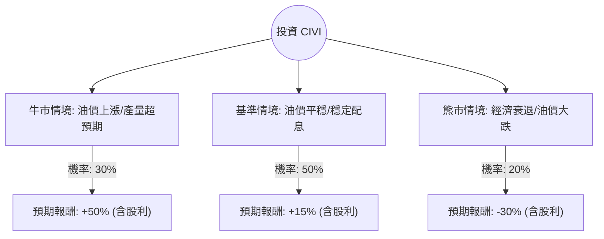

針對美股公司 **Civitas Resources (CIVI)**，我已結合您提供的基本面數據，並透過網路搜尋更新了該公司的最新動態（如 2024 年第三季財報、二疊紀盆地產量表現及股利政策），進行決策樹與期望值分析。

---

### 一、 最新市場動態與背景分析

1.  **營運現況**：Civitas 目前是科羅拉多州 DJ 盆地與德州二疊紀盆地（Permian Basin）的主要生產商。近期財報顯示其產量強勁，且成功整合了先前收購的資產。
2.  **財務策略**：公司採取「基礎股利 + 變動股利」政策，目前殖利率極高（約 7.6%~10% 浮動）。P/E 僅 3.83，P/B 0.34，顯示市場對其估值極低，可能反映了對油價波動及債務（Debt/Eq 0.77）的擔憂。
3.  **外部環境**：WTI 原油價格目前在 70-75 美元區間震盪。若 2025 年全球經濟放緩導致油價跌破 60 美元，CIVI 的現金流將受壓；反之，若地緣政治緊張持續，其低估值將有巨大回升空間。

---

### 二、 決策樹分析 (Decision Tree)

以下基於未來 12 個月的投資展望，設定三種主要情境：

#### 決策樹節點詳細說明：

| 節點 (情境) | 機率 (P) | 預期報酬 (R) | 說明 |
| :--- | :--- | :--- | :--- |
| **牛市 (Bull Case)** | 30% | **+50%** | 油價回升至 $85+，二疊紀盆地協同效應超預期，估值修復至 P/B 0.6。 |
| **基準 (Base Case)** | 50% | **+15%** | 油價維持 $70-$75，公司持續支付高額股利，股價隨大盤小幅波動。 |
| **熊市 (Bear Case)** | 20% | **-30%** | 油價跌破 $60，變動股利取消，高債務槓桿引發市場拋售。 |

---

### 三、 期望值分析 (Expected Value Analysis)

#### 1. 核心假設
*   **當前股價**：$26.38
*   **分析週期**：12 個月
*   **股利收益**：假設未來一年總計發放約 8% 的股利（含基礎與變動）。
*   **估值修復**：目前 P/B 0.34 屬於極度低估，基準情境假設回升至 0.4，牛市假設回升至 0.6。

#### 2. 計算過程
期望值 (EV) = $\sum (機率 \times 預期報酬)$

*   **牛市貢獻**：$0.30 \times 50\% = 15\%$
*   **基準貢獻**：$0.50 \times 15\% = 7.5\%$
*   **熊市貢獻**：$0.20 \times (-30\%) = -6\%$

**總體期望報酬率 (Total EV)** = $15\% + 7.5\% - 6\% = \mathbf{16.5\%}$

#### 3. 財務風險評估
*   **流動性風險**：Current Ratio 0.55 偏低，顯示短期償債壓力較大，需依賴穩定的經營現金流。
*   **安全邊際**：P/B 0.34 提供極強的下行保護，即便資產清算價值也遠高於股價。

---

### 四、 最終結論

**評估結果：適合投資 (Speculative Buy / Value Play)**

#### 理由：
1.  **期望值為正 (16.5%)**：即便在考慮了 20% 的極端熊市機率後，整體的期望報酬率依然優於標普 500 的歷史平均水準。
2.  **極致的價值窪地**：P/E 3.83 與 P/B 0.34 顯示該股已被市場過度拋售（Year Perf -51.94%）。在能源需求未消失的前提下，這種估值具有極高的反彈潛力。
3.  **強大的現金回饋**：7.6% 以上的殖利率為投資者提供了「等待估值修復」期間的現金流緩衝。
4.  **技術面超賣**：股價接近 52 週低點（$22.79），下行空間相對有限（約 13%），但分析師目標價（$36.83）隱含了近 40% 的上漲空間。

#### 投資建議：
*   **進場策略**：建議分批買進，以應對油價波動。
*   **風險監控**：需密切關注 WTI 原油價格是否跌破 65 美元支撐位，以及公司每季度的債務償還進度（Debt/Eq 0.77）。
*   **適合對象**：追求高股息且能承受能源產業高波動的價值投資者。

***

**免責聲明：** 本分析僅供參考，不構成任何投資建議。投資股票具有風險，入市前請務必自行審慎評估或諮詢專業顧問。