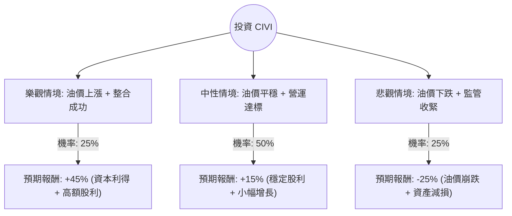

這份分析報告將針對 **Civitas Resources, Inc. (股票代碼：CIVI)** 進行深入評估。Civitas 是美國科羅拉多州最大的油氣生產商之一，近期透過併購積極擴張至二疊紀盆地（Permian Basin）。

以下結合最新市場數據、財務狀況與產業趨勢，利用**決策樹（Decision Tree）**與**期望值分析（Expected Value Analysis）**進行投資評估。

---

### 一、 核心假設與市場背景

在進行計算前，我們設定以下核心假設（基於 2024 年第四季市場動態）：

1.  **油價波動（WTI 原油）**：CIVI 的獲利高度依賴油價。假設基準油價在 $70-$80 區間。
2.  **併購整合（Permian Basin）**：CIVI 近期完成大規模併購，能否實現協同效應並降低營運成本（LOE）是關鍵。
3.  **股東回饋政策**：CIVI 承諾將自由現金流（FCF）的大部分透過股利與回購返還股東（目前殖利率極具吸引力，約 8-10% 以上）。
4.  **監管風險**：科羅拉多州（DJ Basin）的法規環境相對嚴格，可能影響開發成本。

---

### 二、 決策樹分析 (Decision Tree)

我們將未來一年的投資表現分為三種情境：**樂觀（Bull）**、**中性（Base）**、**悲觀（Bear）**。

#### 決策樹節點詳細說明：

| 節點名稱 | 發生機率 (P) | 預期報酬 (R) | 說明 |
| :--- | :--- | :--- | :--- |
| **樂觀情境 (Bull)** | 25% | **+45%** | WTI > $85，二疊紀盆地產量超標，債務加速償還，發放高額特別股利。 |
| **中性情境 (Base)** | 50% | **+15%** | WTI 穩定在 $70-$80，整合進度符合預期，維持現有高殖利率政策。 |
| **悲觀情境 (Bear)** | 25% | **-25%** | WTI < $60，全球經濟衰退需求下降，科羅拉多州環保法規大幅收緊。 |

---

### 三、 期望值計算過程 (Expected Value Calculation)

期望值（EV）的計算公式為：
$$EV = \sum (Probability_i \times Return_i)$$

**計算步驟：**

1.  **樂觀部分**：$0.25 \times 45\% = 11.25\%$
2.  **中性部分**：$0.50 \times 15\% = 7.5\%$
3.  **悲觀部分**：$0.25 \times (-25\%) = -6.25\%$

**總期望報酬率：**
$$11.25\% + 7.5\% - 6.25\% = \mathbf{12.5\%}$$

---

### 四、 綜合分析與最新動態補充

1.  **財務體質**：CIVI 的資產負債表在併購後槓桿略有上升，但其產生的自由現金流（FCF）極為強勁。根據最新財報，其盈餘配發率（Payout Ratio）策略靈活，包含固定股利與變動股利，這在低利率環境結束後對價值型投資者極具吸引力。
2.  **產業趨勢**：美國頁岩油產業進入「整合期」，CIVI 從單一盆地（DJ Basin）轉型為跨盆地生產商，有效分散了單一地區的監管風險。
3.  **估值水平**：目前 CIVI 的預估本益比（Forward P/E）通常低於行業平均，顯示市場對其科羅拉多州監管風險仍有疑慮，但也提供了安全邊際。

---

### 五、 最終結論

#### **判斷：適合投資 (Suitable for Investment)**

**理由：**
1.  **正向期望值**：經過風險加權後的期望報酬率為 **12.5%**，優於多數傳統避險資產及成熟產業平均。
2.  **強大的現金流防禦**：即便在油價中性的情況下，CIVI 憑藉其高達 8%-10% 的預期殖利率（含變動股利），能為投資者提供強大的下行保護。
3.  **戰略轉型成功**：進入二疊紀盆地顯著提升了公司的資產質量與鑽探庫存壽命，降低了對科羅拉多州政策的依賴。

**風險提示：**
投資者需密切關注 **國際油價走勢**。若 WTI 長期跌破 $65，CIVI 的變動股利將大幅縮減，屆時期望值將需重新修正。建議採取「分批佈局」策略，以應對能源板塊的高波動性。

---
*免責聲明：以上分析僅供參考，不構成具體投資建議。投資股票有風險，入市需謹慎。*