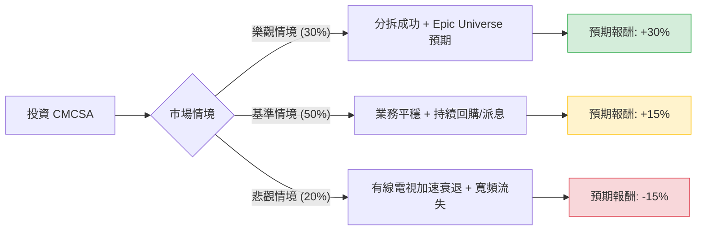

針對美股 **Comcast Corporation (CMCSA)** 的投資評估，我已結合您提供的基本面數據，並透過網路搜尋獲取了最新的市場動態（如：分拆有線電視網路業務的計畫、Peacock 串流媒體進展及主題樂園擴張）。

以下是基於**決策樹分析**與**期望值分析**的詳細報告。

---

### 一、 核心背景與市場動態分析

在進行定量分析前，需考慮以下關鍵變數：
1.  **業務分拆（Spin-off）**：Comcast 近期宣布考慮將其傳統有線電視網路（如 MSNBC, CNBC, USA Network 等）分拆為獨立公司。這有助於將「衰退中的傳統媒體」與「成長中的寬頻與內容業務」分離，釋放估值。
2.  **寬頻競爭**：面臨固定無線接入（FWA，如 T-Mobile/Verizon）與光纖的激烈競爭，寬頻用戶數增長放緩，但 ARPU（每用戶平均收入）持續提升。
3.  **主題樂園（Epic Universe）**：2025 年即將開幕的奧蘭多環球影城「Epic Universe」被視為重大的長期增長引擎。
4.  **估值極低**：目前 P/E 僅 5.61，P/FCF 僅 4.96，顯示市場對其傳統業務過度悲觀。

---

### 二、 決策樹分析 (Decision Tree)

以下決策樹模擬了未來 12 個月內 CMCSA 可能面臨的三種主要情境：

#### 節點詳細說明：

1.  **樂觀情境 (Bull Case) - 30% 機率**：
    *   **描述**：分拆計畫獲得市場認可，估值倍數修復；Peacock 虧損大幅縮減；Epic Universe 開幕前的預期心理推升股價。
    *   **預期報酬**：股價回升至 $38 左右（接近 52 週高點並突破）。
2.  **基準情境 (Base Case) - 50% 機率**：
    *   **描述**：寬頻用戶數維持穩定，ARPU 增長抵銷用戶流失；公司持續利用強大的自由現金流（P/FCF 4.96）進行大規模股票回購與派息。
    *   **預期報酬**：達到分析師目標價 $33.54（約 +15%）。
3.  **悲觀情境 (Bear Case) - 20% 機率**：
    *   **描述**：剪線潮（Cord-cutting）速度超過預期；宏觀經濟轉弱影響主題樂園收入；寬頻競爭導致市佔率大幅下滑。
    *   **預期報酬**：股價下探至 $24 左右（52 週低點附近）。

---

### 三、 期望值分析 (Expected Value Analysis)

#### 1. 核心假設
*   **當前股價**：$28.98
*   **股息收益**：4.17%（這提供了強大的下行保護，計算總報酬時應計入）。
*   **分析師目標價**：$33.54（隱含約 15.7% 的上漲空間）。

#### 2. 計算過程
我們將各情境的預期報酬率（含股息）乘以其發生機率：

| 情境 | 發生機率 (P) | 預期報酬率 (R) | 加權期望值 (P * R) |
| :--- | :--- | :--- | :--- |
| **樂觀情境** | 0.30 | +34% (30% 價差 + 4% 股息) | +10.2% |
| **基準情境** | 0.50 | +19% (15% 價差 + 4% 股息) | +9.5% |
| **悲觀情境** | 0.20 | -11% (-15% 價差 + 4% 股息) | -2.2% |
| **總計** | **1.00** | | **+17.5%** |

**總期望報酬率 (Expected Return) = 17.5%**

---

### 四、 財務數據補充分析

*   **估值優勢**：P/E 5.61 與 Forward P/E 7.59 遠低於標普 500 平均水平，甚至低於其自身歷史平均。這代表市場已經反映了大部分的負面預期（如 EPS Q/Q 下降 52%）。
*   **現金流能力**：P/FCF 4.96 是一個極其強大的指標，顯示公司產生的現金足以支撐債務（Debt/Eq 1.08 尚在可控範圍）與高額派息。
*   **獲利能力**：ROE 21.92% 顯示管理層在資本運用上仍具效率。

---

### 五、 最終結論

**判斷：適合投資 (Buy / Overweight)**

#### 理由：
1.  **極高的安全邊際**：目前股價接近 52 週低點，且 P/E 估值極低。4.17% 的股息率為投資者提供了良好的現金流回報，限制了下行風險。
2.  **正向的期望值**：經過決策樹計算，未來一年的預期總報酬率約為 **17.5%**，優於多數成熟工業或媒體股。
3.  **催化劑明確**：
    *   **業務分拆**：有望解決長期困擾 Comcast 的「傳統媒體拖累估值」問題。
    *   **Epic Universe**：2025 年的增長引擎將在未來幾個月開始反映在股價預期中。
4.  **技術面支撐**：雖然短期表現（Perf Week/Month）疲軟，但股價在 $28 附近有強大支撐，且 P/S 0.88 顯示營收價值被低估。

**建議操作**：
適合**價值型投資者**或**領息族**。建議分批入場，並關注公司關於有線電視業務分拆的具體時間表，以及 Peacock 訂閱用戶數是否能持續增長以抵銷傳統電視的流失。