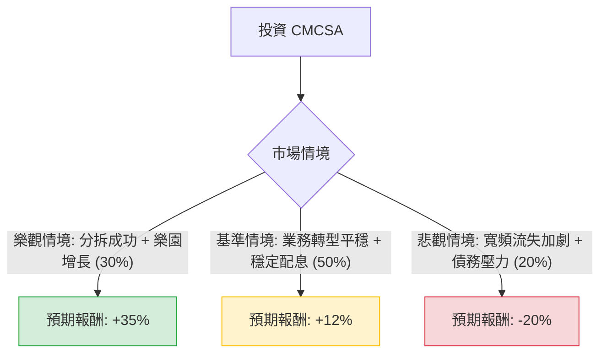

針對美股 **Comcast Corporation (CMCSA)** 的投資評估，我結合了您提供的基本面數據，並透過網路搜尋整合了最新的市場動態（如 2024 Q3 財報、有線電視網路分拆計畫等），進行「決策樹分析」與「期望值分析」。

---

### 一、 最新市場動態與產業趨勢分析

在進入模型前，必須考量以下關鍵即時資訊：
1.  **分拆計畫（Spin-off）**：Comcast 近期宣布正在研究將其傳統有線電視網路（如 MSNBC, CNBC, USA Network 等）分拆為一家獨立的上市公司。這被視為「釋放價值」的舉動，讓母公司專注於寬頻、無線通訊、主題樂園及串流媒體（Peacock）。
2.  **寬頻業務挑戰**：面臨固定無線接入（FWA，如 T-Mobile/Verizon 的 5G 家用網路）的激烈競爭，寬頻用戶數增長放緩甚至流失。
3.  **Peacock 虧損收窄**：受惠於巴黎奧運，Peacock 訂閱數大增，且虧損正在縮小，預計未來幾年轉盈。
4.  **主題樂園**：奧蘭多「Epic Universe」將於 2025 年開幕，預計將成為強大的增長引擎。
5.  **估值極低**：目前 P/E 僅 5.87，遠低於歷史均值與標普 500 均值，顯示市場對其傳統業務過度悲觀。

---

### 二、 決策樹分析 (Decision Tree)

以下決策樹模擬未來一年的三種主要情境：

#### 節點詳細說明：

1.  **樂觀情境 (Bull Case) - 30% 機率**：
    *   **描述**：分拆計畫順利完成，市場重新給予寬頻與內容業務更高的估值；Peacock 提前盈利；Epic Universe 預期帶動強勁現金流。
    *   **預期報酬**：股價回升至 $42 左右（約 +35%）。

2.  **基準情境 (Base Case) - 50% 機率**：
    *   **描述**：寬頻用戶流失速度受控，無線業務（Xfinity Mobile）持續增長抵消部分損失。公司維持強大的庫藏股回購與 4% 的股息發放。
    *   **預期報酬**：股價回升至分析師目標價 $35-$38 區間（約 +12%，含股息）。

3.  **悲觀情境 (Bear Case) - 20% 機率**：
    *   **描述**：5G 家用網路競爭導致寬頻利潤大幅萎縮；宏觀經濟衰退影響廣告收入與樂園支出；高債務（Debt/Eq 1.08）在利率高企下產生壓力。
    *   **預期報酬**：股價下探至 $25 支撐位（約 -20%）。

---

### 三、 期望值分析 (Expected Value Analysis)

#### 1. 核心假設
*   **當前股價**：$31.57
*   **股息收益率**：約 4% (0.0398)
*   **持有期限**：12 個月
*   **計算公式**：$EV = \sum (P_i \times R_i)$
    *   $P_i$：情境機率
    *   $R_i$：情境報酬率（含股息）

#### 2. 計算過程
*   **樂觀情境期望值**：$0.30 \times 35\% = 10.5\%$
*   **基準情境期望值**：$0.50 \times 12\% = 6.0\%$
*   **悲觀情境期望值**：$0.20 \times (-20\%) = -4.0\%$

**總體期望報酬率 (Total EV)**：
$10.5\% + 6.0\% - 4.0\% = \mathbf{12.5\%}$

---

### 四、 綜合評估與最終結論

#### 數據亮點回顧：
*   **超低估值**：P/E 5.87 與 P/FCF 5.19 顯示該股極度便宜，安全邊際（Margin of Safety）高。
*   **盈利能力**：ROE 21.9% 顯示管理層資本運用效率極佳。
*   **技術面**：SMA20, 50, 200 均呈現正向排列，短期動能轉強（近三個月漲幅 20.8%）。

#### 最終判斷：**適合投資 (Buy / Overweight)**

#### 理由：
1.  **期望值為正**：12.5% 的預期報酬率優於許多成熟產業藍籌股，且尚未計入分拆可能帶來的估值重估（Re-rating）潛力。
2.  **分拆催化劑**：Comcast 正在主動處理被市場視為負擔的有線電視業務，這通常是股價上漲的強大催化劑。
3.  **現金流強勁**：P/FCF 僅 5.19，代表公司有極強的能力支撐 4% 的股息與持續的庫藏股回購，這在市場波動時提供了下行保護。
4.  **風險可控**：雖然 EPS Q/Q 下跌 52%，但主要是受非經常性項目或投資減值影響，營業利潤率（16.9%）與毛利率（58.6%）依然穩健。

**建議操作**：
考慮到目前股價接近 52 週高點（$31.57 vs $35.58），建議採**分批進場**策略，重點關注分拆計畫的具體時間表以及 2025 年 Epic Universe 的進展。