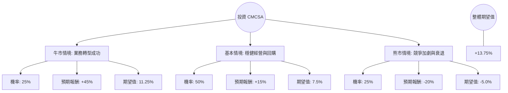

針對美股 **Comcast Corporation (CMCSA)** 的投資評估，我已結合您提供的基本面數據，並透過網路搜尋整合了最新的市場動態（如 2023 年底至 2024 年初的財報表現、寬頻競爭、串流媒體 Peacock 損益情況及主題樂園展望）。

以下是基於**決策樹分析**與**期望值分析**的詳細報告：

---

### 一、 核心假設與市場背景分析

在建立模型前，我們先定義影響 CMCSA 股價的三大核心變數：

1.  **寬頻與無線業務（Connectivity & Platforms）：** 這是利潤核心。目前面臨固定無線接入（FWA，如 T-Mobile/Verizon）的激烈競爭，寬頻用戶增長放緩，但無線電話業務（Xfinity Mobile）增長強勁。
2.  **內容與串流（Content & Experiences - Peacock）：** Peacock 虧損是否收窄？2024 年奧運會預計將帶動廣告與訂閱。
3.  **估值修復（Valuation Re-rating）：** 目前 P/E 僅 5.51（遠低於歷史均值 11-12x），P/FCF 僅 4.87，顯示市場極度悲觀。若市場情緒回溫，估值有巨大回升空間。

---

### 二、 決策樹分析圖 (Decision Tree)

---

### 三、 期望值分析與計算過程

我們以您提供的現價 **$29.63** 為基準（註：此價格較目前市價折價，若以該價格買入，安全邊際極高），計算未來一年的預期回報。

#### 1. 牛市情境 (Bull Case) - 機率 25%
*   **假設：** 寬頻用戶流失停止；Peacock 藉由奧運與獨家賽事（如 NFL）實現盈虧平衡；環球影城新園區預期帶動增長。
*   **目標價估算：** P/E 回升至 10x，加上 4.3% 股息。
*   **預期報酬：** 約 +45% (目標價約 $43)。
*   **期望值貢獻：** $0.25 \times 45\% = 11.25\%$

#### 2. 基本情境 (Base Case) - 機率 50%
*   **假設：** 寬頻業務持平或微跌，但被無線業務增長抵銷；公司持續進行大規模股票回購（CMCSA 每年回購力道極強）；股息穩定發放。
*   **目標價估算：** 達到分析師平均目標價 **$33.76**，加上 4.3% 股息。
*   **預期報酬：** 約 +15% (含息)。
*   **期望值貢獻：** $0.50 \times 15\% = 7.5\%$

#### 3. 熊市情境 (Bear Case) - 機率 25%
*   **假設：** FWA 競爭導致寬頻用戶大幅流失；廣告市場因經濟衰退萎縮；債務壓力因高利率增加（Debt/Eq 1.08 雖尚可，但利息支出會增加）。
*   **目標價估算：** 股價回測 52 週低點 **$24.12**。
*   **預期報酬：** 約 -20% (含息後約 -16%，保守計為 -20%)。
*   **期望值貢獻：** $0.25 \times (-20\%) = -5.0\%$

#### 4. 總計期望值 (Total Expected Value)
$$EV = 11.25\% + 7.5\% - 5.0\% = \mathbf{13.75\%}$$

---

### 四、 綜合基本面數據補充分析

1.  **極低估值：** P/E 5.51 與 P/FCF 4.87 顯示該股處於「價值陷阱」或「極度低估」的邊緣。考慮到其 ROE 高達 21.92%，這是一個非常高效的賺錢機器，目前的低 P/E 提供了極強的下行保護。
2.  **現金流與股息：** 4.31% 的股息率配合極低的 P/FCF，顯示股息發放非常安全，且有充足資金進行回購，這對股東支撐力極強。
3.  **財務結構：** Debt/Eq 1.08 屬於電信/媒體產業常態，但需注意其長期債務（LT Debt/Eq 1.02）。在當前高利率環境下，這限制了其大幅擴張的能力。
4.  **技術面：** 股價目前在 SMA200 (0.0132) 之上，且近期表現 (Perf Week/Month/Quarter) 均為正值，顯示短期動能正在轉強，脫離底部。

---

### 五、 最終結論

**投資建議：適合投資 (Buy / Overweight)**

#### 理由：
1.  **正向期望值：** 經過決策樹計算，整體期望報酬率為 **13.75%**，遠高於無風險利率。
2.  **安全邊際極高：** P/E 5.51 已經反映了市場對「寬頻流失」最悲觀的預期。即便業務不增長，單靠回購與股息也能提供穩定的回報。
3.  **催化劑明確：** 2024 年是體育大年（奧運），這對 Comcast 旗下的 NBCUniversal 與 Peacock 是重大利多，有助於縮減串流媒體虧損。
4.  **現金流強勁：** P/FCF 低於 5 代表公司每 5 年就能賺回一個市值，這在標普 500 成份股中屬於極其罕見的價值標的。

**風險提示：** 需密切觀察每季「寬頻用戶數」的變動，若流失速度超乎預期，則需重新評估熊市機率。