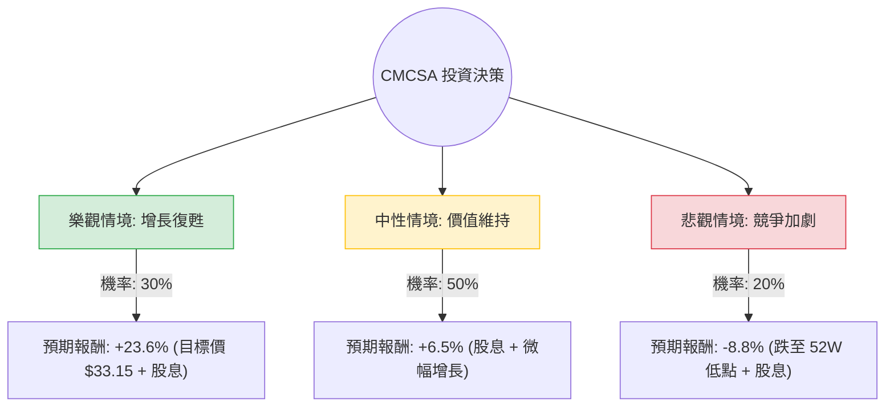

這份分析將結合您提供的基本面數據與最新的市場動態（如 2024 年第三季財報、Epic Universe 樂園進展、寬頻競爭態勢），利用**決策樹（Decision Tree）**與**期望值分析（Expected Value Analysis）**評估 Comcast (CMCSA) 的投資價值。

---

### 一、 市場動態與核心假設補充

在進入計算前，根據最新搜尋資訊，CMCSA 目前面臨以下關鍵轉折：
1.  **寬頻業務壓力**：受固定無線接入（FWA，如 T-Mobile/Verizon）競爭影響，寬頻用戶數增長放緩甚至流失，但 ARPU（每用戶平均收入）持續提升。
2.  **內容與串流媒體**：Peacock 虧損正在縮小，2024 巴黎奧運帶來顯著的廣告與訂閱增長。
3.  **主題樂園**：奧蘭多「Epic Universe」預計 2025 年開幕，被視為長期增長引擎。
4.  **資本回報**：公司維持強大的現金流，積極進行股票回購與派息（殖利率約 4.5%）。
5.  **估值低廉**：目前 P/E 僅約 4.6（遠低於歷史均值），顯示市場已反映大部分悲觀預期。

---

### 二、 決策樹分析圖 (Decision Tree)

我們將未來一年的表現分為三種情境：**樂觀（牛市）**、**中性（基準）**、**悲觀（熊市）**。

---

### 三、 期望值計算過程

#### 1. 核心假設與報酬率設定
*   **當前股價 (P0)**：$27.82 (參考提供數據)
*   **股息收益率**：4.53%
*   **情境 1：樂觀 (Bull Case) - 機率 30%**
    *   **假設**：Peacock 提前轉盈，Epic Universe 預期推升股價，寬頻用戶流失停止。
    *   **目標價**：$33.15 (參考提供之 Target Price)。
    *   **報酬率**：$[($33.15 - $27.82) / $27.82] + 4.53% = 19.1% + 4.5% = \mathbf{23.6\%}$
*   **情境 2：中性 (Base Case) - 機率 50%**
    *   **假設**：寬頻業務持平，靠漲價維持營收；回購支撐股價。股價維持在 SMA50 附近。
    *   **報酬率**：$2.0\% (資本利得) + 4.5\% (股息) = \mathbf{6.5\%}$
*   **情境 3：悲觀 (Bear Case) - 機率 20%**
    *   **假設**：FWA 競爭導致寬頻用戶大幅流失，經濟衰退影響樂園收入。
    *   **目標價**：$24.12 (參考 52W Low)。
    *   **報酬率**：$[($24.12 - $27.82) / $27.82] + 4.53% = -13.3% + 4.5% = \mathbf{-8.8\%}$

#### 2. 期望值 (Expected Value, EV) 計算
$$EV = (P_{Bull} \times R_{Bull}) + (P_{Base} \times R_{Base}) + (P_{Bear} \times R_{Bear})$$
$$EV = (0.30 \times 23.6\%) + (0.50 \times 6.5\%) + (0.20 \times -8.8\%)$$
$$EV = 7.08\% + 3.25\% - 1.76\%$$
$$EV = \mathbf{8.57\%}$$

---

### 四、 綜合評估與最終結論

#### 1. 基本面數據分析總結
*   **優勢 (Pros)**：
    *   **極低估值**：P/E 4.6 與 P/S 0.82 顯示股價極其便宜，安全邊際高。
    *   **高盈利能力**：ROE 24.7% 表現優異，顯示管理層資本運用效率高。
    *   **現金流強勁**：P/FCF 僅 4.82，足以支撐 4.5% 的股息與持續回購。
*   **劣勢 (Cons)**：
    *   **增長停滯**：EPS next Y (-4.52%) 與 Sales Q/Q (-2.72%) 顯示短期內缺乏營收動能。
    *   **債務壓力**：Debt/Eq 1.02，雖在電信業屬正常，但在高利率環境下仍需關注。

#### 2. 最終判斷：適合投資 (適合價值型/收息投資者)

**判斷理由：**
1.  **期望值為正 (8.57%)**：在保守估計下，預期報酬率優於現金儲蓄，且考慮到目前股價已接近 52 週低點區域，下行風險相對受限。
2.  **安全邊際充足**：P/E 4.6 意味著市場對其預期極低，任何微小的利多（如 Peacock 虧損縮小或樂園利潤超預期）都容易引發估值修復（Mean Reversion）。
3.  **強大的防禦性**：4.5% 的股息率與穩定的自由現金流，使其在市場波動中具有較強的抗跌性。

**建議策略：**
*   **分批進場**：由於 SMA200 仍為負值 (-7.63%)，顯示長期趨勢尚未完全反轉，建議在 $27-$28 區間分批布局。
*   **長期持有**：重點關注 2025 年 Epic Universe 開幕對 NBCUniversal 部門的提振效應。

**風險提示：** 若寬頻用戶流失速度意外加快，或 Peacock 虧損持續擴大，股價可能回測 $24 支撐位。