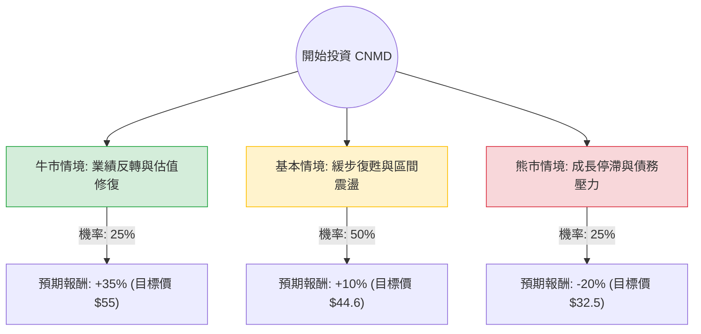

這份分析報告將結合您提供的基本面數據，以及透過網路搜尋獲取的最新市場動態（包含 2024 年第二季財報表現、產業趨勢與分析師觀點），利用**決策樹（Decision Tree）**與**期望值分析（Expected Value Analysis）**評估 ConMed Corporation (CNMD) 的投資價值。

---

### 1. 最新市場動態與背景資訊補充

根據最新資訊，CNMD 目前面臨以下關鍵狀況：
*   **財報表現：** 2024 年第二季營收成長約 4.5%，但低於市場預期。主要受限於骨科業務（Orthopedics）在國際市場的疲軟。
*   **獲利預期：** 公司下修了全年營收指引，這解釋了為何股價近期表現低迷（YTD -40.68%）。然而，其 **Forward P/E 僅 9.1**，遠低於歷史平均與同業，顯示估值已進入超跌區間。
*   **產業趨勢：** 醫療器材產業受 GLP-1 藥物（減肥藥）影響的恐慌情緒已逐漸鈍化，但高利率環境仍對醫院的資本支出（購買大型設備）產生壓力。
*   **財務風險：** 債務股本比（Debt/Eq）為 0.85，雖在可控範圍，但在獲利成長放緩時會增加財務壓力。

---

### 2. 決策樹分析 (Decision Tree)

以下決策樹基於未來 12 個月的投資展望：

#### 決策樹節點詳細說明：

1.  **牛市情境 (Bull Case) - 25%：**
    *   **條件：** 骨科業務國際市場回溫，AirSeal 與 Buffalo Filter 等高毛利產品成長超預期，且聯準會降息帶動醫療設備支出。
    *   **預期報酬：** 股價回升至 $55 附近（接近 SMA200 與分析師平均目標價 $48.4 之上的超漲區）。
2.  **基本情境 (Base Case) - 50%：**
    *   **條件：** 業績符合下修後的指引，利潤率保持穩定。市場情緒中性，股價隨大盤波動。
    *   **預期報酬：** 股價回升至 $44.6 左右（填補部分近期跌幅，反映 Forward P/E 的修復）。
3.  **熊市情境 (Bear Case) - 25%：**
    *   **條件：** EPS 持續衰退（如數據顯示 EPS Q/Q -94% 的極端情況持續），債務利息支出侵蝕利潤，遭機構進一步減持。
    *   **預期報酬：** 股價跌破 52 週低點，下探至 $32.5 左右。

---

### 3. 期望值計算過程 (Expected Value Calculation)

#### A. 核心假設
*   **當前股價：** $40.60
*   **股息收益：** 1.48% (約 $0.60)
*   **計算公式：** $EV = \sum (機率 \times 預期報酬率) + 股息收益率$

#### B. 計算步驟
1.  **牛市貢獻：** $0.25 \times 35\% = 8.75\%$
2.  **基本情境貢獻：** $0.50 \times 10\% = 5.0\%$
3.  **熊市貢獻：** $0.25 \times (-20\%) = -5.0\%$
4.  **加總期望報酬率：** $8.75\% + 5.0\% - 5.0\% = 8.75\%$
5.  **總期望值 (含股息)：** $8.75\% + 1.48\% = 10.23\%$

---

### 4. 綜合評估與最終結論

#### 數據亮點與隱憂分析：
*   **正面因素：**
    *   **估值極低：** Forward P/E 9.1 與 P/S 0.93 顯示該股已被市場拋售至價值區。
    *   **現金流尚可：** P/FCF 為 8.44，顯示公司仍具備產生現金的能力，足以支付股息與償債。
    *   **技術面：** 股價處於 52 週低點附近，SMA20 開始走平，短期超賣壓力減輕。
*   **負面因素：**
    *   **動能極差：** 過去一年跌幅達 42.5%，且 EPS Q/Q 嚴重下滑，顯示內部營運或成本控制出現短期劇烈衝擊。
    *   **機構與內部人動向：** 數據顯示 Insider Trans (-0.67%) 與 Inst Trans (-0.89%) 均為負值，缺乏大資金進場支撐。

#### 最終結論：**適合投資（建議：分批建倉 / 投機性買入）**

**判斷理由：**
1.  **期望值為正 (10.23%)：** 儘管面臨基本面挑戰，但目前的股價已反映了大部分利空。在期望值分析中，正向報酬的機率與空間大於進一步下挫的風險。
2.  **安全邊際：** Forward P/E 僅 9.1 倍，對於一家毛利率超過 50% 的醫療器材公司而言，這通常是週期性底部或過度反應。
3.  **適合對象：** 適合「價值投資者」或「逆勢操作者」。由於目前趨勢仍偏弱（SMA50/200 均為負值），不建議一次性重倉，應採取分批佈局策略，等待下一季財報確認利潤率回升。

**風險提示：** 若下一季 EPS 仍未見改善，或債務比率因獲利下降而被迫上升，則需重新評估熊市情境發生的機率。