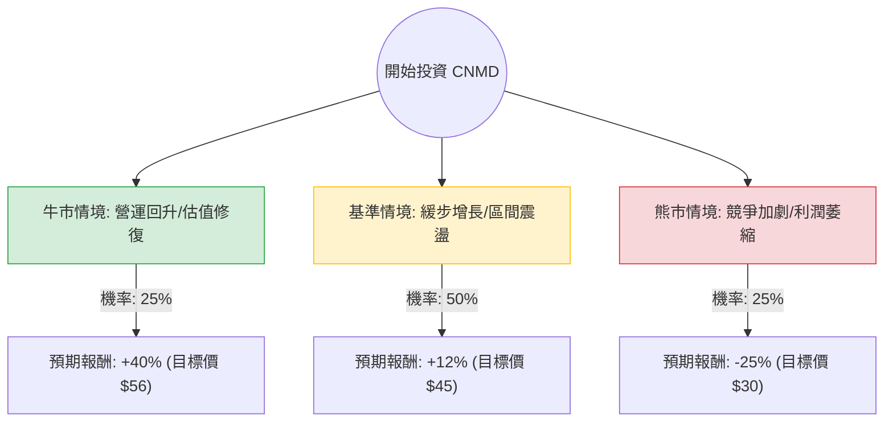

針對美股醫療器材公司 **CONMED Corporation (CNMD)**，我結合了您提供的基本面數據以及最新的市場動態（包含 2024 年第三季財報表現與產業趨勢）進行深度分析。

---

### 1. 最新市場動態與背景分析 (Web Search Summary)

在進行決策樹分析前，整合最新資訊如下：
*   **財報表現 (Q3 2024)**：CNMD 近期股價低迷主因是營收成長未達市場預期，且公司下修了全年指引。雖然骨科（Orthopedics）業務穩定，但一般外科（General Surgery）在部分地區面臨競爭壓力。
*   **估值陷阱 vs. 價值投資**：目前 **Forward P/E 僅約 9 倍**，遠低於醫療器材行業平均（約 18-22 倍）。這反映了市場對其成長停滯與債務壓力（Debt/Eq 0.85）的擔憂。
*   **技術面**：股價處於 52 週低點附近，且所有均線（SMA20, 50, 200）呈空頭排列，顯示短期內缺乏上攻動能。
*   **產業趨勢**：手術量（Procedure volume）整體回升對 CNMD 有利，但 GLP-1 藥物對減重手術的潛在長期影響仍讓部分投資人觀望（儘管 CNMD 產品線受影響程度較小）。

---

### 2. 決策樹分析 (Decision Tree)

我們以 **12 個月** 為投資期限，設定三種主要情境：

#### 決策樹節點詳細說明：

1.  **牛市情境 (Bull Case) - 25%**：
    *   **條件**：供應鏈完全正常化，一般外科產品線市佔率回升，且公司成功利用自由現金流（P/FCF 8.36 顯示現金流尚可）償還債務。
    *   **預期報酬**：估值回歸至歷史平均 P/E 15x，股價挑戰 $56。
2.  **基準情境 (Base Case) - 50%**：
    *   **條件**：營收維持個位數增長（Sales Q/Q 7%），利潤率持平。市場情緒轉向中性。
    *   **預期報酬**：股價回升至分析師平均目標價 $45-$48 附近。
3.  **熊市情境 (Bear Case) - 25%**：
    *   **條件**：EPS 持續衰退（EPS Q/Q -94% 的負面影響擴大），高利率環境增加債務利息負擔，或發生大規模商譽減損。
    *   **預期報酬**：股價跌破支撐，下探 $30。

---

### 3. 期望值分析 (Expected Value Analysis)

#### 核心假設：
*   **當前股價**：$40.17
*   **牛市報酬 ($R_{bull}$)**：+40%
*   **基準報酬 ($R_{base}$)**：+12%
*   **熊市報酬 ($R_{bear}$)**：-25%

#### 計算過程：
$$EV = (P_{bull} \times R_{bull}) + (P_{base} \times R_{base}) + (P_{bear} \times R_{bear})$$
$$EV = (0.25 \times 0.40) + (0.50 \times 0.12) + (0.25 \times -0.25)$$
$$EV = 0.10 + 0.06 - 0.0625$$
$$EV = 0.0975 = 9.75\%$$

**分析結果**：
在考慮了各種風險權重後，CNMD 的年度預期報酬率約為 **9.75%**。

---

### 4. 最終結論與投資建議

#### **判斷：暫不適合投資 (Neutral / Avoid)**

#### **理由：**
1.  **期望值吸引力不足**：9.75% 的預期報酬率在當前高利率環境下（無風險利率約 4%）並不具備足夠的「風險溢酬」。考慮到其極高的波動性（一年跌幅 41%），此報酬率無法補償其下行風險。
2.  **基本面惡化**：雖然 Forward P/E 9.01 看似便宜，但 **EPS Q/Q 下跌 94%** 是一個極其嚴重的警訊，顯示核心獲利能力正在受蝕。
3.  **技術面極弱**：股價低於所有主要均線，且 Insider Trans（內部人交易）為負值 (-0.67%)，顯示公司內部對短期反彈信心不足。
4.  **債務壓力**：Debt/Eq 0.85 雖非致命，但在獲利能力下降時，會限制公司研發與擴張的空間。

#### **建議觀察點：**
*   若股價在 $38 附近放量止跌，且下一季財報顯示 **Operating Margin (目前 9.4%)** 有所改善，屆時才是較好的左側交易（逆勢投資）時機。
*   目前 CNMD 更像是一個「價值陷阱（Value Trap）」，建議將資金轉向成長動能更明確或利潤率更穩定的醫療器材龍頭（如 BSX 或 SYK）。