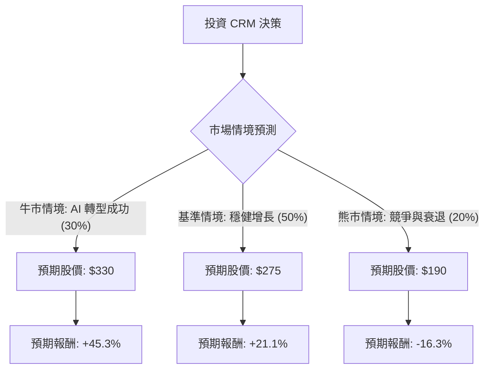

這份分析報告將結合您提供的數據與最新的市場動態（包含 2025 財年第一季與第二季財報表現、AI 策略轉型及宏觀環境），利用**決策樹分析**與**期望值分析**評估 Salesforce (CRM) 的投資價值。

---

### 1. 核心假設與市場背景分析

在繪製決策樹前，我們必須建立以下核心假設：

*   **當前股價基準**：以您提供的 **$227.11** 為基準（註：此價格反映了先前財報營收指引不如預期後的超跌狀態）。
*   **AI 轉型（Agentforce）**：Salesforce 正從軟體服務轉向「AI Agent」模式。其 Data Cloud 的增長是未來能否重新加速營收的關鍵。
*   **利潤率優化**：公司已從單純追求增長轉向追求利潤，目前 22% 的營業利益率與 17.9% 的淨利率顯示其獲利能力穩健。
*   **宏觀壓力**：企業軟體支出因高利率環境而縮減，導致成交週期延長。

---

### 2. 決策樹分析 (Decision Tree)

以下是針對未來 12 個月 CRM 股價走勢的決策樹模型：

#### 節點詳細說明：

1.  **牛市情境 (Bull Case) - 30% 機率**：
    *   **描述**：AI Agent (Agentforce) 快速變現，Data Cloud 營收貢獻超預期，企業重啟數位轉型預算。
    *   **目標價**：$330 (接近分析師平均目標價 $329.63)。
    *   **期望值貢獻**：$330 \times 0.3 = \$99$。

2.  **基準情境 (Base Case) - 50% 機率**：
    *   **描述**：核心 CRM 業務保持個位數至低雙位數增長，利潤率持續改善，回購股票支撐股價。
    *   **目標價**：$275 (回歸歷史平均 Forward P/E 約 25-27 倍)。
    *   **期望值貢獻**：$275 \times 0.5 = \$137.5$。

3.  **熊市情境 (Bear Case) - 20% 機率**：
    *   **描述**：AI 變現進度緩慢，Microsoft Dynamics 競爭加劇，宏觀經濟衰退導致企業大幅砍單。
    *   **目標價**：$190 (回測 52 週低點並考慮估值下修)。
    *   **期望值貢獻**：$190 \times 0.2 = \$38$。

---

### 3. 期望值分析 (Expected Value Analysis) 計算過程

根據上述決策樹，我們計算 CRM 的**加權預期股價 (Expected Price)**：

$$E(Price) = (330 \times 0.3) + (275 \times 0.5) + (190 \times 0.2)$$
$$E(Price) = 99 + 137.5 + 38 = \mathbf{\$274.5}$$

#### 預期報酬率計算：
*   **當前價格**：$227.11
*   **預期報酬**：$\frac{274.5 - 227.11}{227.11} \approx \mathbf{20.86\%}$

#### 核心財務指標支持：
*   **PEG 1.25**：對於一家具有護城河的龍頭企業，PEG 接近 1 代表估值並未過熱。
*   **Forward P/E 17.37**：相較於過去五年平均 P/E，目前的預估本益比處於歷史低位區間，具備安全邊際。
*   **債務比 (Debt/Eq 0.19)**：財務結構極其穩健，足以應對高利率環境。

---

### 4. 最終結論

**判斷：適合投資 (Suitable for Investment)**

#### 理由總結：

1.  **估值具備吸引力**：在 $227 左右的價位，CRM 的 Forward P/E 僅約 17 倍，這對於一家毛利率高達 70% 且擁有強大訂閱制收入的公司來說，屬於「價值區間」。
2.  **期望值為正且報酬率高**：經過機率加權後的預期報酬率約為 **20.86%**，遠高於市場平均預期報酬，且下行風險（熊市情境）已被部分反映在近期的跌幅中。
3.  **AI 轉型催化劑**：雖然短期營收指引疲軟，但 Salesforce 擁有的客戶數據是 AI 時代最核心的資產。隨著 Data Cloud 成為增長最快的產品，未來 12 個月內有極大機會觸發估值修復。
4.  **技術面超跌**：數據顯示 SMA20/50/200 均為負值，且股價接近 52 週低點，這通常是長線投資者分批建倉的良機。

**建議策略**：
由於目前技術面仍處於空頭排列（SMA 指標皆負），建議採取**分批買進 (Dollar Cost Averaging)** 策略，首批資金於 $220-$230 區間介入，若股價進一步回測 $210 則加大倉位，長期持有以等待 AI 轉型成果顯現。