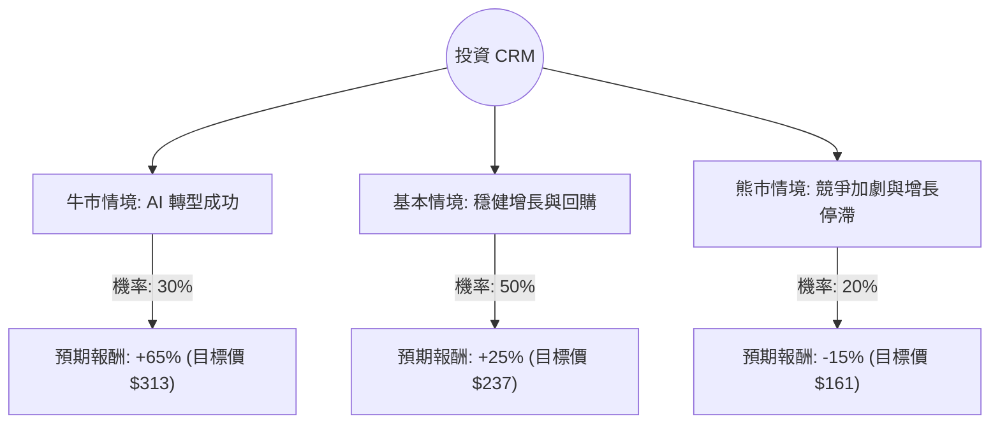

這份分析將結合您提供的數據與最新的市場動態（特別是 Salesforce 2025 財年第一季財報後的市場反應與 AI 轉型進度），利用**決策樹（Decision Tree）**與**期望值分析（Expected Value Analysis）**來評估 CRM 的投資價值。

---

### 1. 核心假設與市場背景分析

在建立模型前，我們先釐清當前 CRM 的關鍵變數：
*   **基本面優勢**：毛利率高（70%）、債務股本比低（0.19）、PEG 接近 1（顯示相對於增長速度，股價並未過度高估）。
*   **近期利空**：Q1 營收指引疲軟，企業軟體支出放緩，導致股價近期大幅修正（Perf Month -20.8%）。
*   **AI 轉型**：Salesforce 正在從「人頭計費」轉向「AI Agent（Agentforce）」模式，這是未來 12-18 個月最大的增長動能或風險。
*   **估值水平**：目前 Forward P/E 約 14.42，遠低於歷史平均，顯示市場已消化大部分悲觀預期。

---

### 2. 決策樹分析圖 (Decision Tree)

我們以 **12 個月持有期**為基準，設定三種主要情境：

#### 節點詳細說明：

1.  **牛市情境 (Bull Case) - 30%**：
    *   **描述**：Data Cloud 增長超預期，AI Agent 成功變現，企業數位轉型預算回流。
    *   **預期報酬**：參考分析師平均目標價 $326，保守取 $313（約回到 52W 高點附近）。
    *   **計算**：$(313 - 189.72) / 189.72 \approx +65\%$。

2.  **基本情境 (Base Case) - 50%**：
    *   **描述**：營收維持 8-10% 穩定增長，利潤率持續改善，大規模股票回購支撐 EPS。
    *   **預期報酬**：估值修復至 Forward P/E 20x 左右。
    *   **計算**：$(237 - 189.72) / 189.72 \approx +25\%$。

3.  **熊市情境 (Bear Case) - 20%**：
    *   **描述**：微軟 (MSFT) 與 ServiceNow (NOW) 強力競爭，AI 導致客戶減少席位訂閱，宏觀經濟衰退。
    *   **預期報酬**：股價跌破 52W 低點，下探支撐位。
    *   **計算**：$(161 - 189.72) / 189.72 \approx -15\%$。

---

### 3. 期望值計算過程 (Expected Value Calculation)

我們將各情境的「機率」乘以「預期報酬率」來計算總體期望值：

*   **公式**：$EV = (P_{Bull} \times R_{Bull}) + (P_{Base} \times R_{Base}) + (P_{Bear} \times R_{Bear})$
*   **計算步驟**：
    1.  牛市貢獻：$0.30 \times 0.65 = 0.195$
    2.  基本貢獻：$0.50 \times 0.25 = 0.125$
    3.  熊市貢獻：$0.20 \times (-0.15) = -0.03$
*   **總期望報酬率**：$0.195 + 0.125 - 0.03 = 0.29$ (**29%**)

**期望值分析結論**：
在當前價格（$189.72）下，未來一年的預期報酬率為 **29%**。這是一個相當吸引人的風險回報比（Risk/Reward Ratio），因為潛在的上行空間遠大於下行風險。

---

### 4. 綜合評估與最新動態補充

*   **技術面**：目前股價遠低於 SMA200 (-24.45%)，處於超賣區間。歷史數據顯示，CRM 在偏離 SMA200 如此之大時，通常具備強大的反彈動能。
*   **財務健康度**：0.19 的債務率與 13.79 的 P/FCF（股價自由現金流比）顯示該公司現金流極其強勁，有能力通過派息（雖然目前僅 0.88%）和回購來回饋股東。
*   **最新新聞**：Salesforce 最近推出的 **Agentforce** 平台被視為遊戲規則改變者，它允許企業部署自主 AI 代理。如果 2024 年下半年的試用數據良好，將成為股價催化劑。

---

### 5. 最終結論

**判斷：適合投資 (Buy / Overweight)**

#### 理由：
1.  **估值窪地**：Forward P/E 僅 14.4 倍，對於一家擁有 70% 毛利率且在 CRM 領域具備壟斷地位的龍頭公司來說，目前股價顯著被低估。
2.  **正向期望值**：29% 的期望報酬率顯示，即使考慮到 20% 的惡劣情境，整體的投資勝率依然很高。
3.  **安全邊際**：股價已從高點修正超過 40%（Perf Year -42.48%），大部分關於增長放緩的利空已反映在股價中。
4.  **AI 轉型潛力**：雖然短期內席位計費受挑戰，但 Data Cloud 的高速增長（最新財報顯示增長約 25%）是支撐未來 AI 應用的核心基石。

**建議操作**：
由於目前技術面仍處於空頭排列（SMA20/50/200 皆為負），建議採取**分批進場（Dollar Cost Averaging）**策略，以規避短期內可能出現的進一步市場波動。