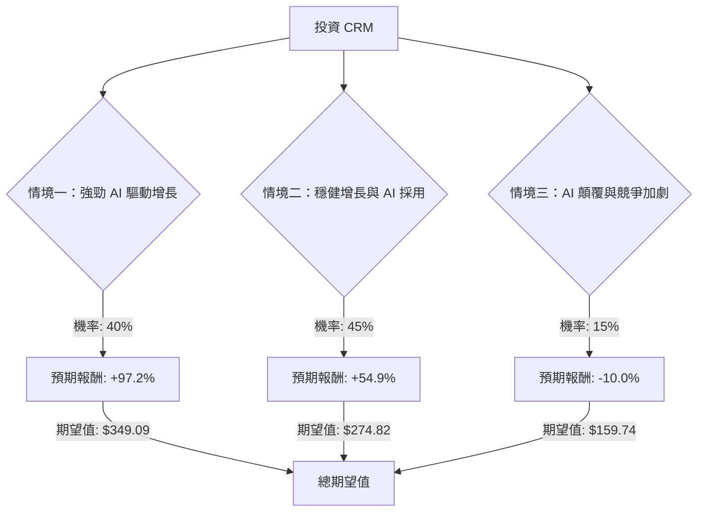

為了評估美股公司 CRM (Salesforce) 目前是否適合投資，我們將運用決策樹分析和期望值分析，並結合其基本面數據與最新的市場資訊。

### 核心假設

在進行決策樹分析之前，我們需要建立以下核心假設：

1.  **市場趨勢 (Market Trends)**：
    *   全球 CRM 市場持續增長，但增速可能因宏觀經濟不確定性而波動。
    *   AI 和生成式 AI 技術是當前及未來企業軟體市場的主要驅動力，對 CRM 產業影響深遠。
    *   投資者對 SaaS 模式的估值可能因 AI 顛覆性擔憂而波動，即使公司基本面強勁。
2.  **財務表現 (Financial Performance)**：
    *   Salesforce 將繼續保持其在 CRM 市場的領導地位，並透過其 Data Cloud 和 Agentforce 等 AI 產品線實現增長。
    *   公司將維持健康的營運利潤率和現金流，並持續透過股息和股票回購回饋股東。
    *   分析師的平均目標價和盈利預期是衡量未來潛在回報的重要參考。
3.  **產業競爭 (Industry Competition)**：
    *   Salesforce 將面臨來自 Microsoft Dynamics、SAP 等主要競爭對手以及新興 AI 解決方案提供商的持續競爭。
    *   公司能否有效整合 AI 技術並保持創新，是其維持競爭優勢的關鍵。

### 最新資訊摘要

根據網路搜尋結果，以下是 CRM 的最新動態：

*   **分析師評級與目標價**：分析師普遍給予「適度買入 (Moderate Buy)」至「買入 (Buy)」的共識評級。平均 12 個月目標價介於 $265.55 至 $283.03 之間，相較於目前股價 $177.49，預期有 46.05% 至 57.27% 的上漲空間。最高目標價為 $430.00，最低為 $194.00。
*   **近期財報表現**：
    *   **2025 財年第一季 (截至 2024 年 4 月 30 日)**：營收 91.3 億美元，年增 11%，略低於預期；非 GAAP 稀釋後每股盈餘 (EPS) 2.44 美元，超出預期。財報公布後股價曾下跌 20%。
    *   **2026 財年第一季 (截至 2025 年 4 月 30 日)**：營收 98.3 億美元，年增 8%，超出預期；EPS 2.58 美元，超出預期。非 GAAP 營運利潤率 32.3%。Data Cloud 和 AI 相關的年度經常性收入 (ARR) 超過 10 億美元，年增超過 120%。
    *   **2026 財年第四季 (截至 2026 年 1 月 31 日)**：營收 112 億美元，年增 12%。全年自由現金流增長 16% 至 144 億美元。Agentforce ARR 達到 8 億美元，年增 169%。AI 相關 ARR 總計超過 29 億美元，增長超過 200%。
*   **AI 戰略與產品**：Salesforce 正積極將 AI 和機器學習整合到其平台中 (Einstein, Agentforce, Data Cloud)，並將 AI 視為主要的增長催化劑。Agentic AI 是關鍵趨勢，Salesforce 將自身定位為「Agentic Enterprise 的作業系統」。
*   **市場領導地位**：Salesforce 連續 12 年保持企業 CRM 市場的領導者地位，2024 年佔全球 CRM 市場 20.7% 的份額。
*   **股東回報**：公司於 2025 財年第一季首次派發季度股息。2026 年 2 月授權 500 億美元的股票回購計畫，並於 2026 年 3 月啟動 250 億美元的加速股票回購。
*   **股價表現**：儘管業務表現強勁，CRM 股價在 2025 年表現不佳，並在 2026 年下跌超過 30%，主要歸因於對 AI 可能顛覆 SaaS 模式的擔憂。

### 決策樹分析

我們將建立一個決策樹來評估投資 CRM 的潛在結果。

**起始節點：投資 CRM**
*   **當前股價 (Current Price)**: $177.49

**情境節點 (Scenario Nodes)**:

1.  **情境一：強勁 AI 驅動增長 (Optimistic Scenario)**
    *   **預測情境名稱**：Salesforce 成功 leveraging 其 AI 產品 (Agentforce, Data Cloud) 實現超預期增長，市場對其 AI 戰略充滿信心，宏觀經濟環境改善。
    *   **機率 (Probability)**: 40% (基於分析師普遍看好 AI 潛力及公司積極佈局)
    *   **預期報酬計算**：假設股價達到分析師高目標價區間，例如 $350 (介於平均目標價和最高目標價之間，反映強勁表現)。
        *   報酬率 = ($350 - $177.49) / $177.49 = 0.972 = 97.2%
    *   **期望值 (Expected Value)**: $177.49 * (1 + 0.972) = $349.09

2.  **情境二：穩健增長與 AI 採用 (Moderate Scenario)**
    *   **預測情境名稱**：Salesforce 保持穩健增長，AI 產品逐步被市場接受，但面臨一定競爭壓力或宏觀經濟不確定性。表現符合分析師平均預期。
    *   **機率 (Probability)**: 45% (基於分析師共識評級為「買入/適度買入」及平均目標價)
    *   **預期報酬計算**：假設股價達到分析師平均目標價，例如 $275 (取各分析機構平均目標價的約數)。
        *   報酬率 = ($275 - $177.49) / $177.49 = 0.549 = 54.9%
    *   **期望值 (Expected Value)**: $177.49 * (1 + 0.549) = $274.82

3.  **情境三：AI 顛覆與競爭加劇 (Pessimistic Scenario)**
    *   **預測情境名稱**：Salesforce 在 AI 競爭中面臨挑戰，AI 產品採用不及預期，或宏觀經濟嚴重惡化導致企業支出緊縮，市場份額受侵蝕。
    *   **機率 (Probability)**: 15% (基於對 AI 顛覆 SaaS 模式的擔憂，以及少數分析師的「持有/賣出」評級)
    *   **預期報酬計算**：考慮到近期股價已下跌超過 30%，且最低分析師目標價仍高於現價，但為反映悲觀情境，假設股價在現有基礎上再下跌 10%。
        *   目標價 = $177.49 * (1 - 0.10) = $159.74
        *   報酬率 = ($159.74 - $177.49) / $177.49 = -0.10 = -10.0%
    *   **期望值 (Expected Value)**: $177.49 * (1 - 0.10) = $159.74

---

**決策樹 (Decision Tree)**

### 期望值分析 (Expected Value Analysis)

現在我們計算投資 CRM 的整體期望值：

**總期望值 (Overall Expected Value)** = (情境一期望值 \* 情境一機率) + (情境二期望值 \* 情境二機率) + (情境三期望值 \* 情境三機率)

**計算過程：**
*   情境一期望值 = $349.09
*   情境二期望值 = $274.82
*   情境三期望值 = $159.74

總期望值 = ($349.09 * 0.40) + ($274.82 * 0.45) + ($159.74 * 0.15)
總期望值 = $139.636 + $123.669 + $23.961
**總期望值 = $287.266**

### 最終結論

根據決策樹分析和期望值計算，投資 CRM 的整體期望值為 **$287.27**。

*   **適合投資 / 不適合投資**：**適合投資**

*   **簡短理由**：
    Salesforce (CRM) 目前的股價為 $177.49，而根據我們的期望值分析，其預期價值為 $287.27。這表明投資 CRM 具有顯著的潛在上漲空間。儘管近期股價因對 AI 顛覆 SaaS 模式的擔憂而承壓，但 Salesforce 在 AI 領域的積極佈局 (Agentforce, Data Cloud) 和其在 CRM 市場的領導地位 為其未來增長提供了堅實基礎。公司穩健的財務表現、健康的現金流以及透過股息和股票回購回饋股東的策略，進一步增強了其投資吸引力。分析師普遍的「買入」評級和較高的平均目標價也支持了這一結論。因此，儘管存在一定的市場風險，但從期望值角度來看，CRM 仍是一個值得考慮的投資標的。