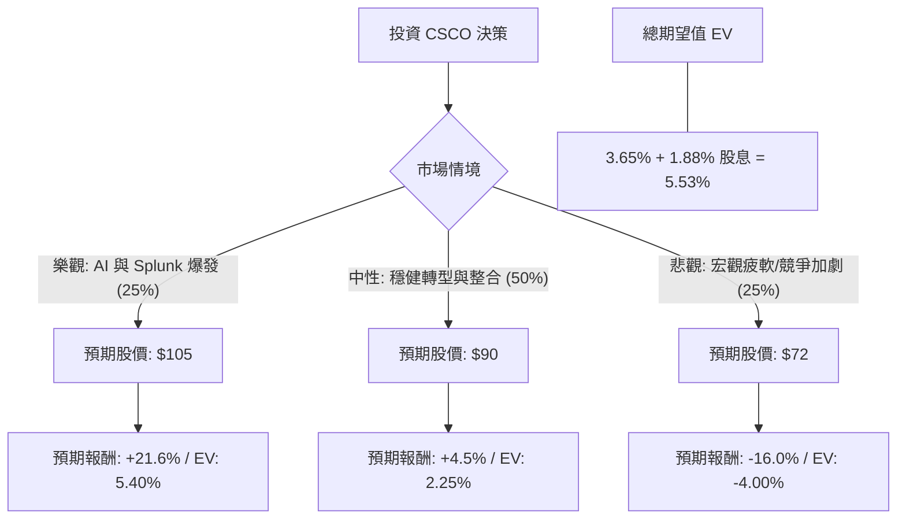

這份分析將結合您提供的 **CSCO（思科系統）** 基本面數據，以及當前市場對思科在 **AI 基礎設施轉型**與 **Splunk 收購整合**後的最新動態進行評估。

### 1. 核心假設與市場背景分析

在建立決策樹之前，我們基於數據與最新市場趨勢（包含 2024/2025 財報展望）設定以下核心假設：

*   **AI 驅動增長（牛市關鍵）：** 思科正從傳統硬體轉向 AI 數據中心網路（如以太網交換機）與軟體訂閱。若 AI 訂單超預期，估值將從傳統硬體股轉向科技成長股。
*   **Splunk 整合效應：** 思科完成對 Splunk 的收購，旨在強化安全與觀測業務。整合成功將大幅提升「經常性收入（ARR）」。
*   **估值壓力：** 根據您提供的數據，CSCO 目前 P/E 為 **30.85**，遠高於其歷史平均（約 15-18 倍）。Forward P/E 為 **19.4**，顯示市場預期未來一年盈餘將大幅增長。
*   **技術面：** 目前股價（$87.71）極度接近 52 週高點（僅差 -0.54%），且遠高於 SMA200（+18.35%），顯示短期內有超買風險。

---

### 2. 決策樹分析（Decision Tree）

我們將未來一年的投資回報分為三種情境：**樂觀（Bull）**、**中性（Base）**、**悲觀（Bear）**。

#### 決策樹節點詳細說明：

1.  **樂觀情境 (Probability: 25%)**
    *   **描述：** AI 乙太網路需求超預期，Splunk 協同效應帶動毛利提升至 65% 以上。
    *   **預期股價：** $105 (基於 Forward P/E 22x)。
    *   **預期報酬：** +19.7% (價差) + 1.88% (股息) = **21.58%**。

2.  **中性情境 (Probability: 50%)**
    *   **描述：** 業績符合預期，企業 IT 支出緩步復甦。股價維持在分析師平均目標價（$90.11）附近。
    *   **預期股價：** $90。
    *   **預期報酬：** +2.6% (價差) + 1.88% (股息) = **4.48%**。

3.  **悲觀情境 (Probability: 25%)**
    *   **描述：** 宏觀經濟衰退導致企業縮減開支，Nvidia 或 Arista Networks 在 AI 領域競爭壓力加大，估值回歸歷史均值。
    *   **預期股價：** $72 (回測 SMA200 支撐位並修正估值)。
    *   **預期報酬：** -17.9% (價差) + 1.88% (股息) = **-16.02%**。

---

### 3. 期望值分析（Expected Value Analysis）計算過程

我們計算未來一年的總期望報酬率（Expected Return）：

$$EV = (P_{Bull} \times R_{Bull}) + (P_{Base} \times R_{Base}) + (P_{Bear} \times R_{Bear})$$

*   **計算：**
    *   $0.25 \times 21.58\% = 5.395\%$
    *   $0.50 \times 4.48\% = 2.24\%$
    *   $0.25 \times (-16.02\%) = -4.005\%$
*   **總期望報酬率 (EV)：** $5.395\% + 2.24\% - 4.005\% = \mathbf{3.63\%}$

---

### 4. 綜合評估與最終結論

#### 基本面數據亮點：
*   **獲利能力強：** ROE 24.34% 與 Gross Margin 63.97% 顯示其在產業中仍具備極強的競爭護城河。
*   **轉型信號：** Forward P/E (19.4) 遠低於 Current P/E (30.85)，代表分析師預期未來盈餘將有顯著增長（EPS next Y 預期增長 8.77%）。
*   **財務穩健：** Debt/Eq 0.67 處於健康水平，且有穩定的 1.88% 股息提供下行保護。

#### 潛在風險：
*   **估值過高：** 目前股價已反映了大部分利多（Perf Year +57.3%），且極度接近目標價（$90.11），向上空間受限。
*   **短期超買：** 股價高於所有移動平均線（SMA20, 50, 200），短期回調壓力大。

#### **最終結論：不適合立即「追高」投資 (Rating: Hold / Neutral)**

**理由：**
1.  **期望值過低：** 經過計算，整體的期望報酬率僅為 **3.63%**（含股息約 **5.5%**）。在當前高利率環境下，此報酬率相對於承擔的股市風險（Beta）並不具備吸引力，甚至低於許多無風險債券或高利存款。
2.  **風險回報比不佳：** 股價距離 52 週高點僅 0.54%，而距離分析師目標價僅剩不到 3% 的空間。若發生宏觀經濟波動，下行空間（回測 $72-$75）遠大於上行空間。
3.  **建議策略：** 建議等待股價回落至 **SMA50 ($80 附近)** 或更低位置時再行分批佈局。目前 CSCO 適合「長期持有領息」的投資者，但不適合追求資本利得的「新進場」投資者。

**判斷：觀望 / 等待回調再買入。**