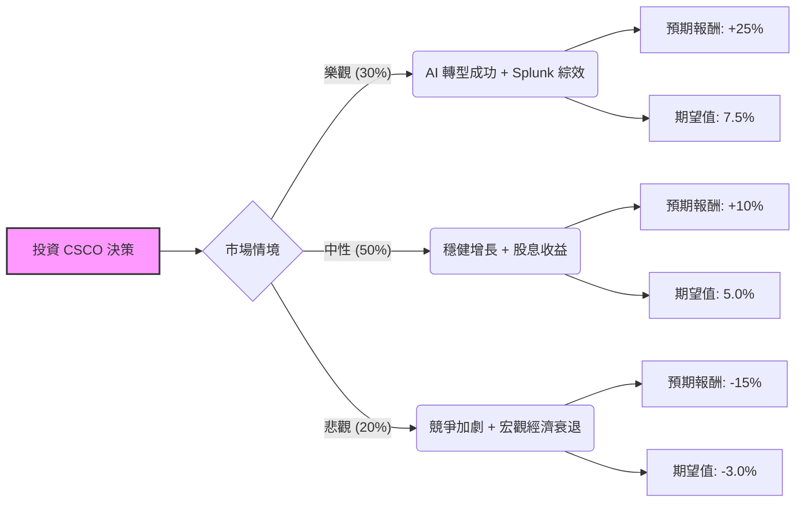

這份分析將結合您提供的數據與最新的市場動態（包含 2024 年財報表現、Splunk 收購進度及 AI 佈局），利用**決策樹（Decision Tree）**與**期望值分析（Expected Value Analysis）**評估 Cisco (CSCO) 的投資價值。

---

### 一、 市場背景與最新動態搜尋

根據最新市場資訊（2024 Q3/Q4 財報與產業趨勢）：
1.  **AI 基礎設施需求**：Cisco 正積極轉型，其 Silicon One 晶片與乙太網路交換機在 AI 資料中心領域開始獲取份額，預計 2025 年 AI 相關訂單將貢獻超過 10 億美元。
2.  **Splunk 收購整合**：Cisco 已完成對 Splunk 的收購，這將大幅提升其軟體訂閱收入（ARR）與網路安全能力，減少對硬體週期性的依賴。
3.  **庫存消化結束**：先前困擾 Cisco 的客戶庫存過剩問題已基本解決，訂單需求開始回升。
4.  **估值分析**：您提供的數據顯示 P/E 為 27.62，但 Forward P/E 僅 17.37，顯示市場預期明年獲利將有顯著增長（EPS next Y 預期增長）。

---

### 二、 決策樹分析 (Decision Tree)

我們將未來一年的投資表現分為三種情境：**樂觀（Bull）**、**中性（Base）**、**悲觀（Bear）**。

#### 節點詳細說明：

1.  **樂觀情境 (Probability: 30%)**
    *   **描述**：AI 訂單超預期，Splunk 整合帶動軟體毛利大幅上升，股價衝向 Target Price ($89.82) 以上。
    *   **預期報酬**：+25% (含股息)。
    *   **期望值**：$0.30 \times 25\% = 7.5\%$

2.  **中性情境 (Probability: 50%)**
    *   **描述**：公司維持穩健增長，庫存回補帶動營收微增，維持 2.09% 的股息發放。
    *   **預期報酬**：+10% (股價小漲 + 股息)。
    *   **期望值**：$0.50 \times 10\% = 5.0\%$

3.  **悲觀情境 (Probability: 20%)**
    *   **描述**：Arista Networks (ANET) 等競爭對手蠶食份額，企業 IT 支出因高利率持續萎縮。
    *   **預期報酬**：-15%。
    *   **期望值**：$0.20 \times (-15\%) = -3.0\%$

---

### 三、 期望值計算與核心假設

#### 1. 總期望值計算 (Total Expected Value)
$$EV = (0.30 \times 25\%) + (0.50 \times 10\%) + (0.20 \times -15\%)$$
$$EV = 7.5\% + 5.0\% - 3.0\% = 9.5\%$$

#### 2. 核心假設
*   **估值修復**：假設 Forward P/E 17.37 倍是合理的，隨著 EPS 增長（EPS Q/Q 達 31.46%），股價具備向 Target Price $89.82 靠攏的動力。
*   **財務穩健性**：ROE 24.34% 與 Gross Margin 63.97% 顯示公司具備極強的獲利能力與護城河。
*   **安全邊際**：目前股價 $78.51 距離 Target Price 仍有約 14.4% 的上漲空間，且 Short Float 極低 (1.51%)，顯示市場空頭勢力較弱。
*   **現金流**：P/FCF 為 25.33，雖然不算極度便宜，但考慮到其軟體轉型，此估值尚屬合理。

---

### 四、 最終結論

**判斷：適合投資 (Buy / Hold)**

#### 理由：
1.  **正向期望值**：經過風險加權後的預期報酬率為 **9.5%**，優於許多傳統價值股，且具備抗跌屬性（股息率 2.09%）。
2.  **轉型拐點**：Cisco 正從單純的硬體商轉型為「AI 網路 + 安全軟體」公司。Splunk 的加入將顯著改善其營收結構，提高經常性收入比例。
3.  **財務指標強勁**：高 ROE (24%) 與優異的毛利率 (64%) 提供了良好的下行保護。雖然 Current Ratio (0.91) 略低，但考慮到其強大的現金流產生能力，短期償債風險不高。
4.  **技術面支撐**：股價目前位於 SMA200 之上 (+8.23%)，顯示長期趨勢偏多，且距離 52 週高點仍有回升空間。

**建議操作：**
適合尋求「穩健增長 + 股息」的投資者。建議在 $75 - $78 區間分批佈局，首要目標價看 $89.82，若 AI 訂單在下一季財報有爆發性增長，可上調至 $95 以上。

---
*免責聲明：以上分析僅供參考，不構成具體投資建議。投資股票具有風險，入市前請務必自行審慎評估。*