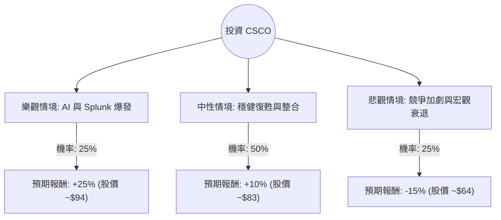

這份分析報告結合了您提供的基本面數據，以及針對 **Cisco Systems (CSCO)** 最新市場動態（如 2024 年 11 月發布的 2025 財年第一季財報、AI 基礎設施需求、Splunk 整合進度）的網路搜尋資訊。

---

### 一、 核心假設與市場背景分析

在建立決策樹之前，我們設定以下核心假設：

1.  **AI 轉型與訂單成長**：Cisco 預計 2025 財年來自大型雲端供應商（Hyperscalers）的 AI 基礎設施訂單將超過 10 億美元。
2.  **Splunk 整合效應**：收購 Splunk 後，Cisco 的軟體訂閱收入佔比提升，有助於估值倍數（P/E Ratio）的擴張。
3.  **宏觀環境**：企業網路設備庫存去化已接近尾聲，需求開始回溫。
4.  **估值參考**：目前股價約 $75.19，分析師平均目標價約 $87.00（潛在漲幅約 15.7%），Forward P/E 為 16.68x，處於歷史合理區間。

---

### 二、 決策樹分析 (Decision Tree Analysis)

我們將未來一年的投資表現分為三種情境：**樂觀（Bull）**、**中性（Base）**、**悲觀（Bear）**。

#### 節點詳細說明：

1.  **樂觀情境 (Bull Case) - 25% 機率**
    *   **條件**：AI 相關訂單超預期，Splunk 協同效應顯著提升毛利率，市場給予更高 P/E（回升至 20x 以上）。
    *   **預期報酬**：+25%（含股息）。

2.  **中性情境 (Base Case) - 50% 機率**
    *   **條件**：企業支出穩健成長，符合公司調升後的 2025 財年指引。股價向目標價 $87 靠攏。
    *   **預期報酬**：+10%（含股息）。

3.  **悲觀情境 (Bear Case) - 25% 機率**
    *   **條件**：Arista Networks (ANET) 等競爭對手蠶食市佔率，全球經濟放緩導致企業推遲更新設備。
    *   **預期報酬**：-15%（股價回測 52 週低點區域）。

---

### 三、 期望值分析 (Expected Value Analysis)

#### 1. 計算過程
期望值 (EV) = $\sum (機率 \times 預期報酬)$

*   **樂觀情境**：$0.25 \times 25\% = 6.25\%$
*   **中性情境**：$0.50 \times 10\% = 5.00\%$
*   **悲觀情境**：$0.25 \times (-15\%) = -3.75\%$

**總期望報酬率 (Total EV) = 6.25% + 5.00% - 3.75% = 7.5%**

#### 2. 考慮股息後的總回報
根據數據，CSCO 的股息率（Dividend %）約為 **2.19%**。
*   **總期望回報 (Total Expected Return) = 7.5% (價差) + 2.19% (股息) = 9.69%**

---

### 四、 綜合評估與數據解讀

*   **財務穩健度**：ROE 23% 表現優異，Gross Margin 63.9% 顯示其在硬體市場仍具備強大定價權。
*   **估值分析**：Forward P/E 16.68x 低於標普 500 平均水平，也低於許多科技成長股，具備防禦性。
*   **技術面**：目前股價高於 SMA200 (9.23%)，顯示中長期趨勢偏多，但短期 SMA20 與 SMA50 呈現微幅負值，代表近期處於高檔震盪整理。
*   **風險點**：Insider Trans (內部人交易) 為 -11.81%，顯示內部人近期有減持動作，需留意高層對短期股價漲幅的看法。

---

### 五、 最終結論

**判斷：適合投資 (建議：逢低分批佈局 / 持有)**

#### 理由：
1.  **正向期望值**：經風險加權後的期望回報率約為 **9.69%**，優於現金定存且風險相對可控。
2.  **轉型催化劑**：Cisco 不再只是傳統交換器廠商，Splunk 的加入使其轉型為「軟體與安全」驅動的公司，這將帶動估值重估（Re-rating）。
3.  **下行保護**：2.19% 的股息與強大的現金流（P/FCF 23.19）為股價提供了良好的支撐，適合追求穩健成長與收益的投資者。
4.  **目標價空間**：目前股價 $75.19 距離目標價 $87 仍有約 15% 的上漲空間。

**操作建議**：
由於近期股價已有一波漲幅（Perf Year +24.59%），且短期均線（SMA20/50）顯示震盪，建議不要在今日一次性追高，可於股價回測 **$70 - $72** 區間時分批進場，以優化風險報酬比。