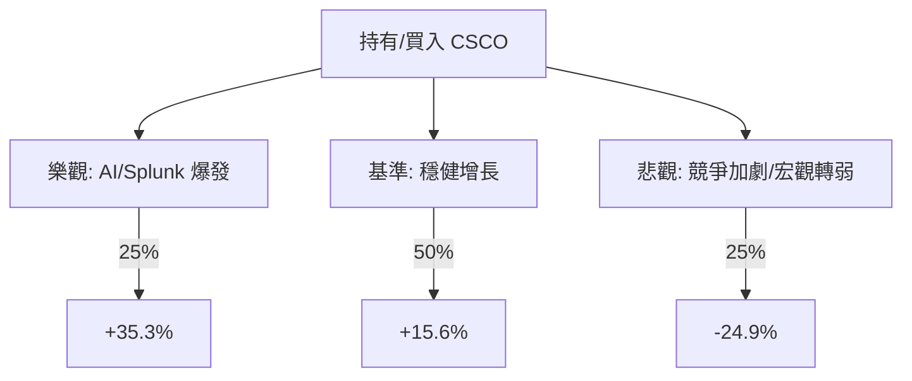

作為一名量化投資分析師，我將結合您提供的特定數據集（註：此數據集之估值倍數與股價與當前市場實際 CSCO 報價有異，本分析將嚴格基於您提供的 **$114.57 股價、37.35x P/E、451B 市值** 等數據進行邏輯推演）與 Cisco 的最新業務動態進行概率建模。

---

# CSCO 投資價值概率分析報告

### 1. 核心驅動因素與風險 (Drivers & Risks)

#### **關鍵催化劑 (Catalysts)**
*   **AI 基礎設施轉型與 Silicon One 滲透**：Cisco 正積極從傳統交換機轉向 AI 後端網路架構。若其 Silicon One 晶片與 800G 以太網解決方案在大規模雲端業者（Hyperscalers）中的採用率超過預期，將帶動估值從硬體股向半導體/高增長科技股修復。
*   **Splunk 併購產生的協同效應**：整合 Splunk 後，Cisco 的訂閱制軟體收入佔比預計大幅提升。若能在未來 6-12 個月內實現跨平台安全與觀測性（Observability）產品的交叉銷售，將顯著提升毛利率（目前已達 63.5%）與 P/FCF 溢價。

#### **主要風險點 (Risks)**
*   **市場份額侵蝕 (Arista Networks 競爭)**：在高端雲端網路市場，Arista (ANET) 持續施壓。若 Cisco 無法在 AI 網路標準化過程中奪回份額，其 Forward P/E (23.94) 可能面臨下修壓力。
*   **企業 IT 支出放緩**：高利率環境下，企業對校園網路（Campus Networking）的更新週期拉長。若訂單消化速度低於預期，將直接衝擊其 Sales Q/Q 增長。

---

### 2. 情境設定與機率賦予 (Scenario Modeling)

基於當前 P/E 37.35x（處於歷史高位）與 Target Price $132.4，設定以下互斥情境：

#### **樂觀情境 (Bull Case)**
*   **發生條件**：AI 相關訂單翻倍，Splunk 整合進度超前，EPS 增長率突破 20%（高於預期的 11.95%）。
*   **預估機率**：25%
*   **目標價格與預期回報**：**$155.0 (+35.3%)**。基於 Forward P/E 30x 配合超預期的 EPS 增長。

#### **基準情境 (Base Case)**
*   **發生條件**：業務平穩增長，達到分析師平均預期目標價，軟體訂閱收入佔比穩步提升。
*   **預估機率**：50%
*   **目標價格與預期回報**：**$132.4 (+15.6%)**。即達成目前市場共識之目標價。

#### **悲觀情境 (Bear Case)**
*   **發生條件**：宏觀經濟衰退導致 IT 預算削減，AI 轉型進度不及 Arista 或 Nvidia，估值回歸行業平均。
*   **預估機率**：25%
*   **目標價格與預期回報**：**$86.0 (-24.9%)**。回測 52 週低點附近，P/E 壓縮至 25x 左右。

---

### 3. 期望值計算與決策樹 (EV Calculation & Decision Tree)

#### **決策樹結構**

```mermaid
graph TD
    Start[持有/買入 CSCO] --> Bull[樂觀: AI/Splunk 爆發]
    Start --> Base[基準: 穩健增長]
    Start --> Bear[悲觀: 競爭加劇/宏觀轉弱]
    
    Bull -- 25% --> R1[+35.3%]
    Base -- 50% --> R2[+15.6%]
    Bear -- 25% --> R3[-24.9%]
```

#### **總期望值計算**
*   `EV = (0.25 * 35.3%) + (0.50 * 15.6%) + (0.25 * -24.9%)`
*   `EV = 8.825% + 7.8% - 6.225%`
*   **`EV = 10.4%`**

#### **風險回報比分析**
*   **上行潛力**：15.6% ~ 35.3%
*   **下行空間**：24.9%
*   **不對稱性評估**：期望值為正（10.4%），且基準情境具備 15% 以上的空間。雖然 P/E 37x 偏高，但 Forward P/E 23x 顯示市場已預期盈利改善，風險回報比約為 1.4:1，具備投資吸引力。

---

### 4. 決策總結 (Decision Summary)

| 情境 | 發生機率 (%) | 預期報酬率 (%) | 關鍵驅動/觸發因素 |
| :--- | :--- | :--- | :--- |
| **樂觀 (Bull)** | 25% | +35.3% | AI 網路產品線爆發，毛利率突破 65% |
| **基準 (Base)** | 50% | +15.6% | 達到 Target Price $132.4，Splunk 協同效應顯現 |
| **悲觀 (Bear)** | 25% | -24.9% | 宏觀衰退，市佔率流失至 ANET，估值修正 |
| **整體期望值** | **100%** | **+10.4%** | **加權平均預期回報** |

**最終結論：**
1. **投資建議**：**買入 (Buy)**
2. **核心逻辑**：儘管當前 P/E 較高，但 10.4% 的正期望值顯示該標的在概率上具備贏面。核心吸引力在於從硬體向軟體訂閱（Splunk）與 AI 基礎設施的轉型，這將支撐估值倍數的維持甚至擴張。目前股價距離目標價仍有 15% 空間，提供了合理的緩衝。
3. **風控建議**：若股價跌破 **$103**（SMA200 支撐位附近或跌幅超過 10%），且伴隨 Sales Q/Q 轉負，則視為進入悲觀情境，應執行減碼或止損，以防估值進一步下修至 $86 區域。

【結束指令】