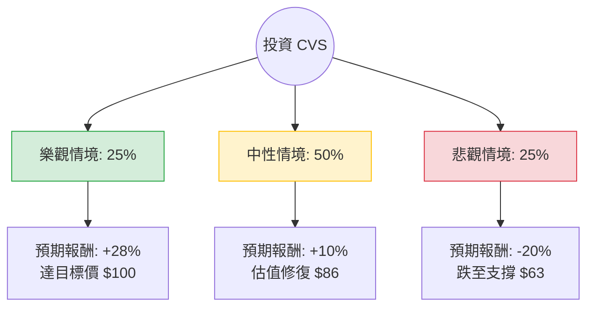

這份分析報告將結合您提供的基本面數據與最新的市場動態（包含 2024 年財報指引下修、醫療成本上升等現況），利用**決策樹（Decision Tree）**與**期望值分析（Expected Value Analysis）**評估 CVS Health (CVS) 的投資價值。

---

### 一、 核心背景與市場動態分析（最新資訊補充）

在進行定量分析前，必須考慮以下影響 CVS 股價的關鍵變數：
1.  **醫療成本壓力（Aetna 業務）**：CVS 近期多次下修 2024 年 EPS 指引，主因是其保險部門（Aetna）面臨 Medicare Advantage（聯邦醫療保險優惠計畫）利用率超預期增長，導致醫療成本比例（MLR）上升。
2.  **PBM 監管風險**：美國國會對藥品福利管理（PBM）業務的透明度審查持續，可能影響 CVS 旗下的 Caremark 利潤。
3.  **零售轉型**：CVS 正在關閉低效門市，並轉向提供更多醫療服務（如 Oak Street Health），這屬於長期轉型，短期內資本支出較大。
4.  **估值吸引力**：Forward P/E 僅約 9.59 倍，PEG 0.81，顯示市場已反映大部分利空，股價處於歷史相對低位。

---

### 二、 決策樹分析圖 (Decision Tree)

我們將未來一年的投資情境分為三種：**樂觀（轉型成功/成本受控）**、**中性（維持現狀/緩步復甦）**、**悲觀（醫療成本失控/監管重擊）**。

---

### 三、 期望值計算過程

#### 1. 核心假設
*   **當前股價**：$78.48
*   **股利收益 (Dividend Yield)**：約 **3.4%** (固定計入總報酬)。
*   **情境機率與報酬率設定**：
    *   **樂觀 (25%)**：醫療成本壓力在下半年顯著緩解，Aetna 獲利回升，市場給予 Forward P/E 12倍。目標價 $100（價差 +27.4% + 股利 3.4% = **30.8%**）。
    *   **中性 (50%)**：醫療成本維持高檔但不再惡化，零售業務穩定，股價回歸至 SMA200 附近。目標價 $86（價差 +9.6% + 股利 3.4% = **13%**）。
    *   **悲觀 (25%)**：Medicare Advantage 成本持續失控，政府進一步削減補貼，股價回測 52 週低點。目標價 $63（價差 -19.7% + 股利 3.4% = **-16.3%**）。

#### 2. 期望值 (EV) 計算
$$EV = (P_{Bull} \times R_{Bull}) + (P_{Base} \times R_{Base}) + (P_{Bear} \times R_{Bear})$$

*   **樂觀貢獻**：$0.25 \times 30.8\% = 7.7\%$
*   **中性貢獻**：$0.50 \times 13.0\% = 6.5\%$
*   **悲觀貢獻**：$0.25 \times (-16.3\%) = -4.075\%$

**總期望報酬率 (Total Expected Return) = 7.7% + 6.5% - 4.075% = 10.125%**

---

### 四、 綜合評估與基本面數據解讀

1.  **估值面 (Valuation)**：
    *   **Forward P/E (9.59)** 與 **PEG (0.81)** 顯示股價極其便宜。
    *   **P/S (0.25)** 顯示營收規模巨大，只要利潤率（目前僅 0.44%）稍微改善，EPS 將有巨大彈性。
2.  **財務健康度 (Financial Health)**：
    *   **Debt/Eq (1.06)** 偏高，但考慮到其穩定的現金流（P/FCF 12.79），債務風險尚在可控範圍。
    *   **Current Ratio (0.84)** 偏低，顯示短期流動性略緊，需關注其利息支出。
3.  **技術面 (Technical)**：
    *   股價目前在 SMA200 (0.0814) 之上，顯示中長期趨勢已開始轉強。
    *   52 週高點跌幅僅 -7.8%，顯示近期已從低點大幅反彈，正在消化上方壓力。

---

### 五、 最終結論

**判斷：適合投資 (建議：分批買入 / 價值投資導向)**

#### 理由：
1.  **正向期望值**：經計算後的年化期望報酬率約為 **10.1%**，優於無風險利率（美債約 4-5%），且具備安全邊際。
2.  **下行風險已部分反映**：CVS 之前的股價重挫已充分反映了 Medicare Advantage 的利空。目前的 Forward P/E 低於行業平均，提供了良好的防禦性。
3.  **高股息支撐**：3.4% 的股息率在等待公司轉型期間提供了穩定的現金流補償。
4.  **轉型潛力**：CVS 不再只是藥局，而是整合了保險、PBM 與基層醫療的垂直巨頭。隨著 Oak Street Health 等收購案開始產生協同效應，長期獲利能力有望修復。

**風險提示**：
*   若未來一季財報顯示醫療成本比例（MLR）持續攀升且無放緩跡象，需重新評估「悲觀情境」的機率。
*   需密切關注 2024 年美國大選對醫療保險政策的潛在影響。