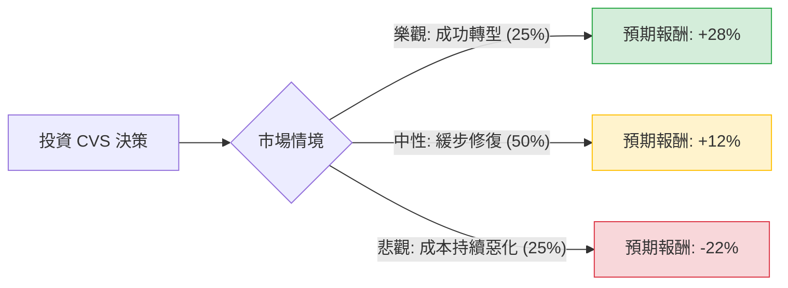

這份分析報告結合了您提供的基本面數據與最新的市場動態（包含 2024 年第三季財報後的市場反應、管理層更換及醫療保險成本壓力），利用**決策樹（Decision Tree）**與**期望值分析（Expected Value Analysis）**評估 CVS Health (CVS) 的投資價值。

---

### 一、 核心假設與市場現況分析

在建立模型前，我們必須考慮以下關鍵因素：

1.  **醫療成本壓力（核心風險）**：CVS 旗下的 Aetna 保險業務正受困於 Medicare Advantage（聯邦醫療保險優惠計畫）利用率過高，導致醫療成本比率（MCR）上升，利潤遭到嚴重侵蝕。
2.  **管理層變動（轉機/不確定性）**：2024 年 10 月，CVS 更換了 CEO（由 David Joyner 接任），並面臨激進投資者 Glenview Capital 的壓力，這可能導致公司分拆或激進的成本削減。
3.  **估值極低**：目前 Forward P/E 僅約 9.38 倍，遠低於歷史平均，且 PEG 為 0.8，顯示市場已反映了大部分利空。
4.  **股息安全性**：目前殖利率約 3.47%，儘管利潤承壓，但現金流（P/FCF 12.48）尚能支撐股息。

---

### 二、 決策樹分析模型

我們將未來一年的表現分為三種情境：**樂觀（成功轉型）**、**中性（緩步修復）**、**悲觀（成本失控）**。

#### 決策樹節點詳細說明：

| 情境節點 | 發生機率 (P) | 預期股價目標 | 預期報酬率 (R) | 說明 |
| :--- | :--- | :--- | :--- | :--- |
| **樂觀情境** | 25% | $98.00 | +28% (含股息) | 醫療成本穩定，新 CEO 成功削減 20 億美元成本，分析師目標價 $94.96 達成。 |
| **中性情境** | 50% | $85.00 | +12% (含股息) | 零售藥局表現穩健，保險業務止跌回穩，股價回歸 SMA200 水準。 |
| **悲觀情境** | 25% | $60.00 | -22% (含股息) | Medicare 利用率持續超標，再度下修財測，甚至面臨信用評等調降風險。 |

---

### 三、 期望值 (Expected Value) 計算過程

期望值計算公式：$EV = \sum (P_i \times R_i)$

1.  **樂觀情境貢獻**：$0.25 \times 28\% = 7.0\%$
2.  **中性情境貢獻**：$0.50 \times 12\% = 6.0\%$
3.  **悲觀情境貢獻**：$0.25 \times (-22\%) = -5.5\%$

**總期望報酬率 (Total EV) = 7.0% + 6.0% - 5.5% = 7.5%**

#### 計算備註：
*   **現價**：$76.58
*   **股息收益**：約 3.5% 已計入各情境的總報酬中。
*   **下行風險**：參考 52 週低點 $58.35，悲觀情境設定在 $60 附近具備技術支撐參考價值。

---

### 四、 綜合評估與最終結論

#### 1. 財務數據亮點與隱憂
*   **優勢**：**P/S 0.24** 顯示營收規模極大但市值被低估；**Forward P/E 9.38** 顯示若獲利回歸正常，股價極具吸引力。
*   **劣勢**：**ROE (2.35%)** 與 **Profit Margin (0.44%)** 極低，顯示目前正處於獲利低谷。**Debt/Eq 1.06** 債務尚可，但需注意利息支出對現金流的壓力。

#### 2. 投資判斷：**適合投資 (分批佈局 / 價值投資)**

**最終結論：適合投資 (Recommend: Buy / Hold)**

#### 3. 判斷理由：
1.  **期望值為正 (7.5%)**：儘管面臨醫療成本的逆風，但目前的股價已反映了極度悲觀的預期。期望值分析顯示，上行空間大於下行風險。
2.  **安全邊際 (Margin of Safety)**：P/B 僅 1.29，且 PEG 0.8 顯示股價相對於長期增長潛力已被低估。
3.  **催化劑 (Catalysts)**：新任 CEO David Joyner 擁有豐富的 PBM（藥品福利管理）經驗，這正是 CVS 目前最需要優化的核心領域。此外，激進投資者的介入通常會迫使公司釋放價值（如分拆或回購）。
4.  **防禦性**：3.47% 的股息提供了一定的下行保護，適合追求長期價值修復的投資者。

**建議策略**：
由於醫療成本的不確定性可能導致短期股價波動（SMA20/50/200 均在現價附近糾結），建議採取**分批進場**策略，重點觀察下一季財報中 Aetna 的醫療成本比率（MCR）是否改善。

---
*風險提示：美股投資受市場波動影響，本文分析僅供參考，不構成具體投資建議。投資前請務必自行評估風險承受能力。*