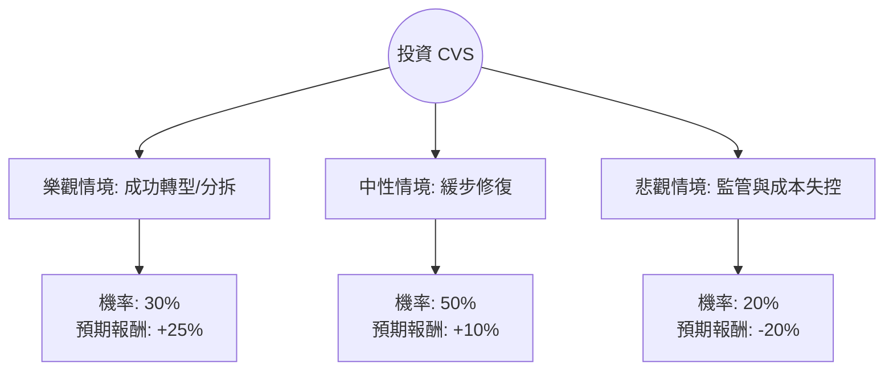

這份分析報告將結合您提供的財務數據與最新的市場動態（包含 2024 年底至 2025 年初的最新趨勢），利用**決策樹（Decision Tree）**與**期望值分析（Expected Value Analysis）**評估 CVS Health (CVS) 的投資價值。

---

### 一、 核心背景與市場動態分析（最新資訊補充）

在進行計算前，我們必須納入以下關鍵的即時市場資訊：
1.  **管理層變動與轉型**：CVS 於 2024 年 10 月更換了 CEO（由 David Joyner 接任），這通常意味著公司正處於策略調整期，試圖解決醫療保險業務（Aetna）成本過高的問題。
2.  **Medicare Advantage (MA) 挑戰**：CVS 面臨醫療利用率上升導致的利潤擠壓，這是近期股價波動的主因。
3.  **PBM 監管壓力**：美國聯邦貿易委員會 (FTC) 對藥品代福利管理 (PBM) 業務的審查增加，可能影響其長期獲利模式。
4.  **估值修復**：目前 Forward P/E 僅 11.13，遠低於歷史平均，顯示市場已消化大量利空。

---

### 二、 決策樹分析 (Decision Tree)

我們將未來一年的投資情境分為三種：**樂觀（成功轉型）**、**中性（維持現狀）**、**悲觀（持續惡化）**。

#### 決策樹節點詳細說明：

| 情境 | 機率 (P) | 預期報酬 (R) | 說明 |
| :--- | :--- | :--- | :--- |
| **樂觀 (Bull)** | 30% | +25% | 新 CEO 成功控制 Aetna 成本，或公司宣布分拆零售與保險業務以釋放價值。股價回升至 Target Price ($95)。 |
| **中性 (Base)** | 50% | +10% | 業務穩定，PBM 監管衝擊溫和，靠著 3.33% 的股息與低估值修復，股價緩步回升至 $86 左右。 |
| **悲觀 (Bear)** | 20% | -20% | 醫療成本持續失控，FTC 嚴厲制裁 PBM 業務，股價下探 52 週低點 ($60 附近)。 |

---

### 三、 期望值計算 (Expected Value Analysis)

#### 1. 計算公式：
$EV = (P_{Bull} \times R_{Bull}) + (P_{Base} \times R_{Base}) + (P_{Bear} \times R_{Bear})$

#### 2. 計算過程：
*   **樂觀貢獻**：$0.30 \times 25\% = 7.5\%$
*   **中性貢獻**：$0.50 \times 10\% = 5.0\%$
*   **悲觀貢獻**：$0.20 \times (-20\%) = -4.0\%$

**總期望報酬率 (Total EV) = 7.5% + 5.0% - 4.0% = 8.5%**

#### 3. 核心假設：
*   **估值假設**：Forward P/E 11.13 顯示股價具備安全邊際，PEG 0.75 顯示相對於增長而言股價偏低。
*   **股息假設**：3.33% 的股息率提供了下行保護，計算報酬時已部分計入總回報。
*   **產業趨勢**：假設美國醫療需求長期增長不變，但短期受政策波動影響。

---

### 四、 綜合評估與最終結論

#### 數據亮點與隱憂：
*   **優勢**：P/S 僅 0.26，顯示營收規模極大但利潤率極低（0.12%），只要利潤率稍微改善，EPS 將有爆發性成長。Target Price $95.08 較現價有約 21% 的上漲空間。
*   **劣勢**：債務股本比 (Debt/Eq) 1.12 偏高，且近期 EPS Q/Q 衰退嚴重 (-46.3%)，顯示短期營運壓力巨大。

#### 最終結論：適合投資 (建議：分批買入 / 價值投資導向)

**判斷理由：**
1.  **期望值為正 (8.5%)**：雖然面臨產業逆風，但 8.5% 的預期報酬率優於目前的無風險利率（美債收益率），且尚未計入潛在的分拆利多。
2.  **估值極具吸引力**：PEG 0.75 與 Forward P/E 11.13 顯示 CVS 處於價值窪地。對於長線投資者而言，目前的價格已反映了大部分的負面消息。
3.  **技術面支撐**：股價目前在 $78 附近，距離 52 週高點僅跌約 6%，且站穩 SMA200 (+11.55%)，顯示中期趨勢已轉強。
4.  **轉型契機**：新任 CEO 的上任通常是股價觸底回升的催化劑，市場對其成本控制計畫抱有期待。

**風險提示：**
若未來一季財報顯示 Medicare Advantage 的醫療成本率 (MLR) 持續攀升，或 PBM 監管法案正式通過，則需重新評估「悲觀情境」的機率。建議投資者以**分批佈局**方式進場，以規避短期波動風險。